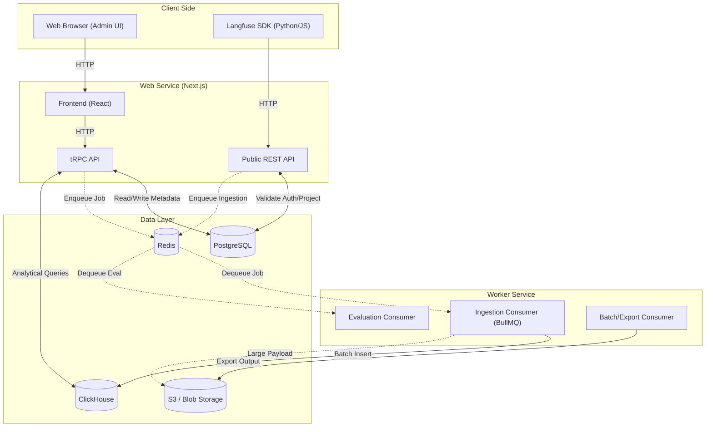
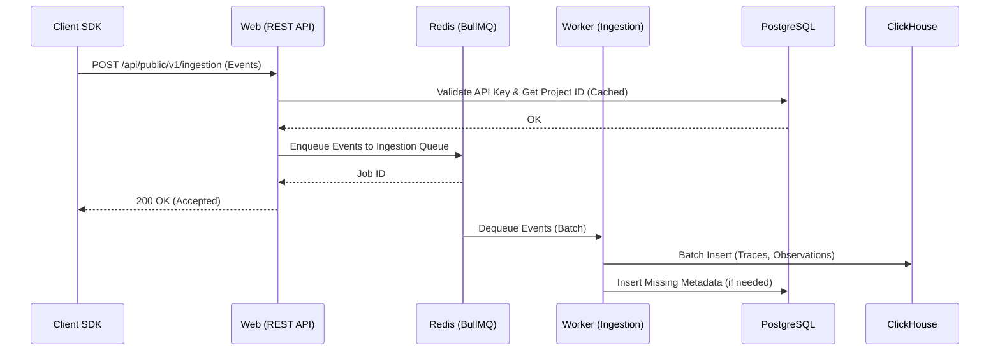
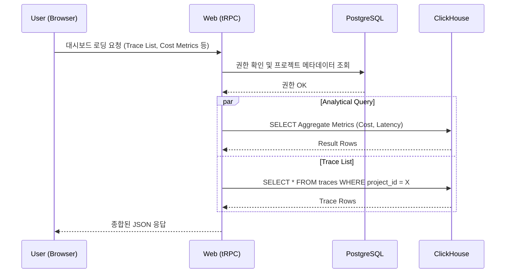

# 03 Architecture

이 문서는 Langfuse의 시스템 경계, 전체 아키텍처 계층 및 주요 트래픽/데이터 플로우를 설명합니다. 이 아키텍처는 고부하 환경에서도 안정적인 Observability 데이터 수집 및 조회를 보장하기 위해 설계되었습니다.

## 전체 시스템 컴포넌트

Langfuse 시스템은 크게 4가지 주요 런타임 애플리케이션 컴포넌트와 3가지의 백엔드 스토리지로 구성됩니다.

1. **Web (Next.js App)**
   - **UI & Dashboard**: React(Next.js) 기반의 프론트엔드. 사용자 대시보드, 프로젝트 설정, API Key 관리 등을 담당.
   - **tRPC & REST API**: 사용자 UI를 위한 tRPC API와 외부 클라이언트(SDK)를 위한 Public REST API를 서빙. 인증, 프로젝트 메타데이터 조회 등을 처리.
2. **Worker (Background Job Processor)**
   - Node.js 기반 백그라운드 워커.
   - 대량의 이벤트(Trace, Observation, Score) 수집, 분석 데이터의 ClickHouse 적재 처리.
   - 평가(Eval), Webhook 연동, 데이터 내보내기(Export) 등 비동기 무거운 작업을 담당.
3. **Storage 인프라**
   - **PostgreSQL**: 사용자 정보(User, Organization), 프로젝트, API 키 설정 등 트랜잭션 데이터(Relational Data) 저장. (Prisma ORM 사용)
   - **ClickHouse**: Trace, Observation, Score 등 이벤트 기반 빅데이터 저장 및 분석 쿼리 최적화 수행.
   - **Redis**: 캐싱, Rate Limiting, 그리고 Worker로 작업을 전달하기 위한 BullMQ 메시지 브로커로 사용.
   - **Blob Storage (S3 등)**: 대용량 페이로드, 프롬프트 파일 및 내보내기 결과물을 저장.

## 전체 시스템 흐름도 (Architecture Diagram)

## 주요 Sequence

### 1. 와이드 이벤트 데이터(Trace/Observation) 수집 Sequence

고부하 트래픽에 대응하기 위해 수집 로직은 Web API에서 직접 DB로 쓰지 않고, 큐를 거쳐 Worker에서 일괄(Batch) 처리합니다.

### 2. 대시보드 분석 데이터 조회 Sequence

UI에서 대시보드 로딩 시, 메타데이터와 분석 데이터(Aggregated Metrics)를 병렬로 조회합니다.

## 아키텍처 핵심 원칙 (Architecture Principles)

Langfuse는 대규모 분석 및 관측 가능성을 위해 다음과 같은 핵심 원칙을 따릅니다.

1. **와이드 이벤트 최우선**: 조각난 로그나 메트릭 대신 쿼리 가능한 와이드 이벤트(Observation) 중심의 데이터 모델링을 지향합니다. Trace는 이들을 묶어주는 역할만 합니다.
2. **비동기 Ingestion**: 시스템 부하를 분산하기 위해 데이터 수집과 저장을 분리합니다. 
3. **읽기 최적화 (Columnar DB)**: ClickHouse를 통해 대규모 데이터를 스캔하고 필터링하는 쿼리 성능을 극대화합니다. Join을 최소화하고 Denormalization을 적극 활용합니다.
4. **Scale-aware API**: API는 무한 스캔을 방지하기 위해 기간(Time Windows) 제한 및 토큰 기반 페이지네이션을 필수적으로 적용합니다.
