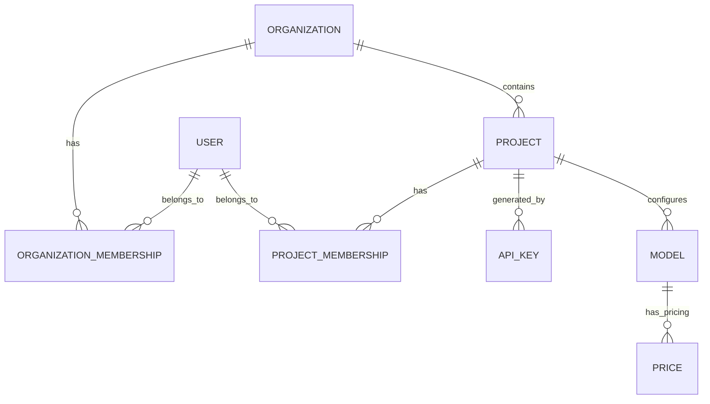
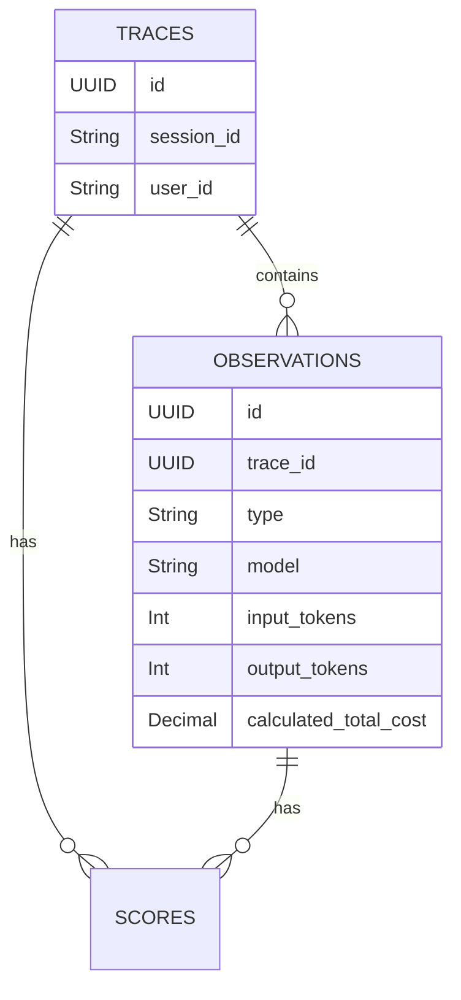
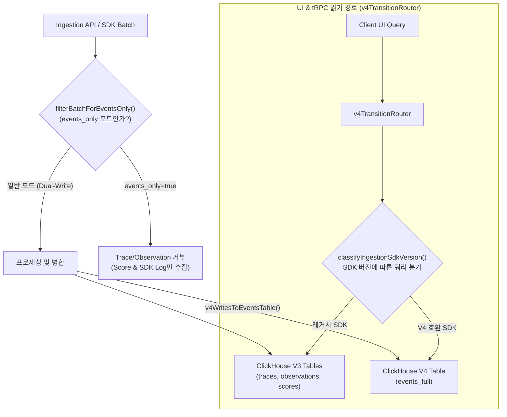

# 04 Data Model and Storage

Langfuse는 트랜잭션 데이터와 대용량 분석 데이터의 성격이 매우 다름을 인지하고, 이를 두 가지 다른 스토리지 엔진(PostgreSQL, ClickHouse)에 분리하여 저장하는 **Dual Storage Architecture**를 채택했습니다.

## 1. 관계형 데이터 모델 (PostgreSQL via Prisma)

PostgreSQL은 시스템 메타데이터, 사용자 계정, 프로젝트 설정 등 변경이 빈번하고 무결성이 보장되어야 하는 트랜잭션 데이터를 관리합니다. ORM으로는 **Prisma**를 사용하며, 스키마 정의는 `packages/shared/prisma/schema.prisma` 파일이 단일 진실 공급원(Single Source of Truth)으로 동작합니다.

### 주요 모델

- **Organization & Project**: 사내 부서 단위는 Organization으로 매핑하고, 단위 애플리케이션이나 서비스는 Project로 매핑합니다.
- **User & Memberships**: 사용자 계정, 프로필, SSO 인증 세션과 각 Project/Organization에 대한 소속(Role)을 관리.
- **ApiKey**: REST API 요청 인증을 위한 Public/Private 키.
- **Model & Price**: 토큰당 비용 계산을 위한 LLM 모델 메타데이터 테이블. 사내 모델 비용 정책도 여기에 병합될 수 있습니다.

## 2. 와이드 이벤트 모델 (ClickHouse)

ClickHouse는 대용량 시계열(Time-series) 데이터와 고차원(High-cardinality)의 분석형 데이터를 저장하는 데 특화된 컬럼형(Columnar) 데이터베이스입니다. Langfuse의 관측 데이터 대부분은 이곳에 저장됩니다.

스키마 정의 및 마이그레이션 파일은 `packages/shared/clickhouse/migrations` 폴더에서 관리됩니다.

### 분석의 중심: Observation

**Trace**보다 **Observation**을 기본 분석 단위로 삼습니다. Trace는 단순히 연관된 여러 Observation을 묶어주는 논리적인 상관관계 ID(Correlation Handle) 역할을 수행합니다. 모든 이벤트를 파편화하지 않고, 와이드 이벤트(Wide, richly attributed events) 형태로 하나의 Observation 레코드에 필요한 메타데이터(Prompt, Token Count, Model, latency 등)를 모두 기록합니다.

### 주요 테이블 및 뷰

- **`traces`**: 단일 사용자 요청이나 워크플로우 단위.
- **`observations`**: 개별 LLM 호출, span 분기, 이벤트 기록. (가장 데이터 볼륨이 큼)
- **`scores`**: 특정 Trace나 Observation에 대해 사람이 평가하거나(Human Eval) 자동 평가(LLM-as-a-judge)된 점수 기록.
- **`events_full`**: V4 아키텍처 전용 이벤트 테이블. Trace/Observation/Score 등의 원본 이벤트를 통합 저장하며, 기존 개별 테이블 기반의 레거시 구조를 대체하는 역할. `v4WritesToEventsTable()` 환경 함수에 의해 쓰기 여부가 결정됨.
- **`observations_batch_staging`**: 워커의 배치 처리 과정에서 Observation을 스테이징하는 중간 테이블.
- **`blob_storage_file_log`**: S3에 저장된 이벤트 파일의 메타데이터(경로, 프로젝트, 엔티티 ID 등)를 기록. 데이터 보존(Retention) 만료 시 S3 파일 일괄 삭제에 활용.
- **`dataset_run_items`**: 데이터셋 런 아이템의 ClickHouse 레플리카.
- **Materialized Views (`traces_all_amt`, `traces_7d_amt`, `traces_30d_amt` 등)**: 
  - 읽기 쿼리를 최적화하기 위해, 원본 데이터가 Insert될 때 백그라운드에서 실시간으로 AggregatingMergeTree 등을 사용해 지표를 미리 집계(Roll-up)해두는 뷰입니다.

## 3. V4 통합 이벤트 모델 (`events_full`) 및 마이그레이션 아키텍처

Langfuse 최신 버전은 V3의 파편화된 테이블 구조(`traces`, `observations`, `scores`)에서 **V4 통합 이벤트 모델 (`events_full`)**로 전환하는 마이그레이션 단계를 거치고 있습니다.

### V4 전환의 3대 핵심 메커니즘
1. **`events_full` 와이드 통합 테이블**: Trace, Observation, Score의 모든 컨텍스트를 단일 시계열 이벤트 레코드로 통합하여 ClickHouse의 Join 오버헤드를 완전 제거.
2. **`filterBatchForEventsOnly()` 사전 필터링**: V4 클러스터 전용 마이그레이션 시 수집 진입점에서 Trace/Observation 쓰기를 차단하여 수집 노드의 스토리지 및 CPU 사용량을 절감.
3. **`v4TransitionRouter`를 통한 하위 호환성 유지**: SDK 버전을 자동 분류(`classifyIngestionSdkVersion`)하여 구형 SDK 사용 부서는 V3 구조로, 신형 SDK 적용 부서는 V4 구조로 투명하게 쿼리를 라우팅.

## 4. 데이터 보존 및 설계 원칙

1. **불변성(Immutability) 우선**: ClickHouse의 분석 데이터는 가급적 UPDATE가 발생하지 않는 Append-only 패턴을 지향합니다. 읽기 시점의 중복 제거(Deduplication)를 강제하는 UPDATE 작업은 대규모 환경에서 보이지 않는 쿼리 비용을 유발합니다.
2. **Denormalization(비정규화)**: 쿼리 성능을 높이기 위해 ClickHouse 내부에서는 잦은 Join을 피합니다. 자주 필터링 조건으로 사용되는 속성은 Observation에 중복해서 저장합니다.
3. **읽기와 쓰기 최적화 분리**: 데이터 쓰기는 대규모 Ingestion Queue(BullMQ)를 통한 배치 Insert로 처리하고, 읽기는 Materialized View를 활용해 응답 속도를 극대화합니다.

---

| | |
|---|---|
| ⬅️ 이전 | [15 Source Code Architecture](../10-architecture/15-source-code-architecture.md) |
| ➡️ 다음 | [05 Internal Observability Customization](../30-customization/05-internal-observability.md) |
| 🏠 색인 | [README](../README.md) |
