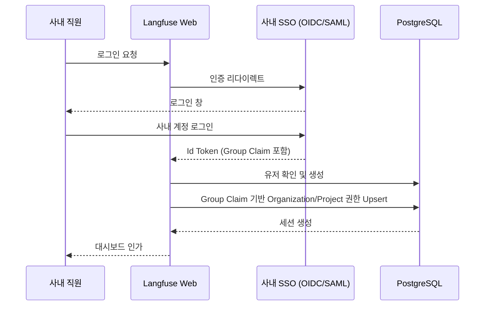

# 05 Internal Observability Customization

Langfuse를 단순한 오픈소스 도구에서 전사 표준 Observability 플랫폼으로 전환하기 위해서는 사내 인프라 및 보안/운영 정책에 맞춘 커스터마이징이 필요합니다.

## 1. 사내 SSO (Single Sign-On) 및 권한 통합

Langfuse의 기본 NextAuth 기반 인증 시스템을 사내 IdP(Identity Provider)와 통합하여 자동 프로비저닝 및 보안을 강화해야 합니다.

### 커스텀 방향
- **SSO 연동**: SAML 또는 OIDC를 통해 사내 직원 계정으로만 접근 가능하도록 설정.
- **역할 및 조직 매핑 (Auto-Provisioning)**: 
  - IdP의 Group Claim 정보를 기반으로 Langfuse의 `Organization` 및 `Project` 멤버십을 자동 할당.
  - 사내 부서 단위는 `Organization`에 매핑, 개별 서비스 및 개발 환경은 `Project`에 매핑.

## 2. 사내 LLM 모델 및 비용 정산 (Cost Accounting)

사내에 프라이빗하게 호스팅된 오픈소스 LLM(예: Llama 3)이나 전용 계약 단가로 이용 중인 클라우드 모델(Azure OpenAI 등)의 비용을 정확히 추적해야 합니다.

### 커스텀 방향
- **가격 테이블 관리**: 
  - 기본 Langfuse 가격 산정 로직(`worker/src/constants/default-model-prices.json` 및 `packages/shared/src/server/llm/types.ts`)에 사내 모델 가격을 병합.
  - 또는 Prisma의 `Model`, `Price` 테이블에 Admin UI를 통해 사내 모델과 비용을 직접 등록하도록 하여, 하드코딩 없이 유연하게 비용을 관리.
- **내부 부서별 과금 (Chargeback)**: 
  - `Project` 메타데이터 혹은 `Tags` 필드에 부서 비용 코드(Cost Center)를 주입.
  - ClickHouse에서 `analytics_observations` 데이터를 활용해 부서별/모델별 토큰 사용량과 예상 과금액을 산출하는 커스텀 Metabase 대시보드 구성.

## 3. 알람 및 사내 메신저(Slack/Teams) 연동

비정상적인 LLM 호출(높은 Latency, 에러율 상승 등)이 발생했을 때 사내 운영 파이프라인으로 알람을 전달해야 합니다.

### 커스텀 방향
- **Evaluation / Score 알림 연동**: 
  - 커스텀 평가자(LLM-as-a-judge)가 특정 점수 이하를 주거나, 사용자 피드백(Score)이 낮게 수집된 경우.
- **Webhook 확장**: 
  - Worker 노드에서 알람 조건을 만족할 경우 사내 메신저(Slack, Teams 등)의 Webhook 엔드포인트로 JSON 페이로드를 전송하도록 커스터마이징.

## 4. 백업 및 데이터 보존 정책 (Retention)

사내 데이터 거버넌스 및 보안 규정에 따라 분석 데이터의 보존 주기를 통제해야 합니다.

### 커스텀 방향
- **ClickHouse TTL (Time-To-Live)**: 
  - 로그성 데이터인 `traces`와 `observations` 테이블에 대해 사내 정책(예: 3개월, 6개월)에 맞게 ClickHouse TTL 설정을 적용.
- **S3 Cold Storage 백업**: 
  - 3개월이 지난 중요 감사(Audit) 데이터는 Worker의 Batch Export 기능을 확장하여 사내 S3 호환 Object Storage로 자동 압축 백업(Parquet/JSONL 등)하도록 구성.

---

| | |
|---|---|
| ⬅️ 이전 | [04 Data Model and Storage](../20-core-domain/04-data-model-and-storage.md) |
| ➡️ 다음 | [06 Ingestion Pipeline](../40-anatomy-deep-dive/06-ingestion-pipeline.md) |
| ⬇️ 소스 딥다이브 | [13 Customization Source Breakdown](../50-source-analysis/13-customization-source-breakdown.md) |
| 🏠 색인 | [README](../README.md) |
