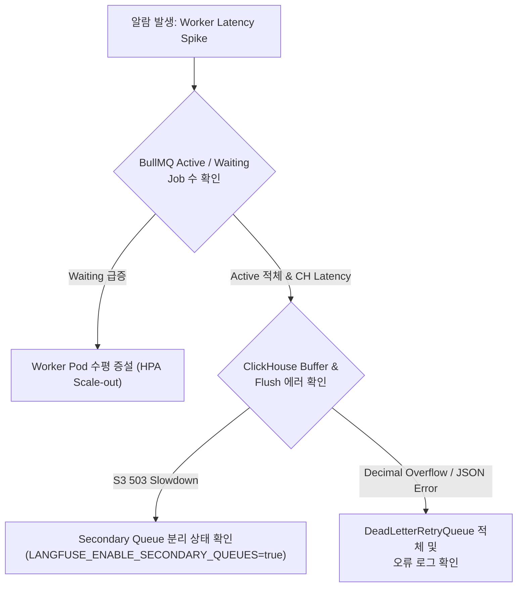

# 06 Operations and Troubleshooting Guide

> **선행 문서**: [05 Internal Observability Customization](./05-internal-observability.md)
>
> **관련 해부 문서**: [15 Batch Actions and Async Framework](../40-anatomy-deep-dive/15-batch-actions-and-async-framework.md)

---

## 1. 개요 (Overview)

이 문서는 Langfuse를 사내 프라이빗 환경에 도입한 후 **운영 엔지니어 및 SRE팀이 즉시 참고할 수 있는 트러블슈팅 매뉴얼, 커스텀 모델 가격 주입 매뉴얼, 사내 SSO(Keycloak/Authentik 등) 연동 플레이북**을 제공합니다.

---

## 2. 장애 조치 및 트러블슈팅 매뉴얼 (Troubleshooting Matrix)

### 2.1 큐 병목 및 처리 지연 (Worker Bottleneck)



| 증상 | 원인 | 감지 메트릭 / 확인 로그 | 조치 방법 |
|---|---|---|---|
| Trace 반영 실시간 지연 | Worker 처리 속도 부족 | `langfuse.worker.job.duration` 상승 | Worker 컨테이너 수평 확장 (`pnpm run dev:worker` 인스턴스 추가) |
| S3 수집 실패 | AWS/Ceph S3 503 Slowdown | `s3_storage_service_error` 로그 | `IngestionSecondaryQueue` 자동 릴레이 상태 점검 |
| ClickHouse Insert 실패 | Decimal64 오버플로 또는 스키마 불일치 | `rows_dropped`, `ClickhouseWriter error` | `clampDecimal64Fields()` 로그 확인 및 입력값 정제 |
| 큐 무한 재시도 | 외부 LLM API 타임아웃 / DB Connection 부족 | `retryCount` 상한 도달 | `DeadLetterRetryQueue`에서 원인 분석 후 DLQ Re-queue 처리 |

---

## 3. 사내 커스텀 LLM 모델 및 가격(Pricing Tier) 주입 절차

사내에서 미세조정(Fine-tuned)된 프라이빗 LLM 또는 사내 자체 모델을 사용하는 경우, 토큰 당 단가 및 토크나이저를 수동으로 등록해야 대시보드 비용 집계가 동작합니다.

### 3.1 `default-model-prices.json` 추가 절차

🔗 [`worker/src/constants/default-model-prices.json`](file:///Users/dhsshin/Documents/LLMOps/langfuse/worker/src/constants/default-model-prices.json)

```json
{
  "modelName": "company-internal-llm-v1",
  "matchPattern": "(?i)^(company-llm|internal-gpt-v1)",
  "startDate": "2026-01-01T00:00:00.000Z",
  "unit": "TOKENS",
  "inputPrice": 0.0000015,
  "outputPrice": 0.0000030,
  "tokenizerId": "claude",
  "pricingTiers": []
}
```

1. **`modelName`**: 대시보드 및 리포트에 표시될 모델 이름
2. **`matchPattern`**: SDK에서 전송하는 `provided_model_name`과 매칭할 정규식 (대소문자 무시 `(?i)`)
3. **`unit`**: `TOKENS` (토크나이저 필요), `CHARACTERS`, `IMAGES`, `REQUESTS` 중 선택
4. **`tokenizerId`**: `openai` (tiktoken), `claude` (anthropic), `llama` 등 빌트인 토크나이저 식별자 지정

---

## 4. 사내 SSO (Keycloak / Authentik / OIDC) 실전 연동 플레이북

### 4.1 Keycloak 연동 설정

🔗 [`web/src/server/auth.ts`](file:///Users/dhsshin/Documents/LLMOps/langfuse/web/src/server/auth.ts)

Keycloak이 반환하는 `refresh_expires_in`, `not-before-policy` 등 확장 OIDC 필드는 NextAuth 스키마와 충돌할 수 있으므로, Langfuse는 자동으로 이를 정제하여 연동합니다.

```env
# Keycloak 연동 환경변수 (.env)
AUTH_KEYCLOAK_CLIENT_ID="langfuse-client"
AUTH_KEYCLOAK_CLIENT_SECRET="your-client-secret"
AUTH_KEYCLOAK_ISSUER="https://sso.company.internal/realms/master"
AUTH_KEYCLOAK_ALLOW_ACCOUNT_LINKING="true"

# 가입 시 자동 조직/프로젝트 배정
LANGFUSE_DEFAULT_ORG_ID="org-internal-id"
LANGFUSE_DEFAULT_ORG_ROLE="MEMBER"
LANGFUSE_DEFAULT_PROJECT_ID="proj-internal-id"
LANGFUSE_DEFAULT_PROJECT_ROLE="DEVELOPER"
```

---

| | |
|---|---|
| ⬅️ 이전 | [15 Batch Actions and Async Framework](../40-anatomy-deep-dive/15-batch-actions-and-async-framework.md) |
| ➡️ 다음 | [10 Ingestion Source Breakdown](../50-source-analysis/10-ingestion-source-breakdown.md) |
| 🏠 색인 | [README](../README.md) |
