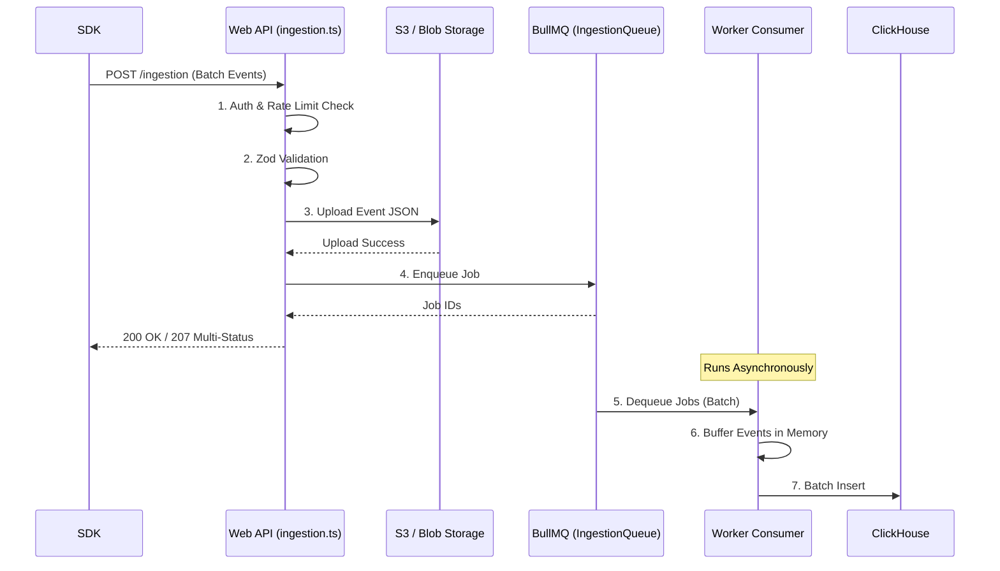

# 06 Ingestion Pipeline Anatomy

Langfuse 시스템에서 가장 높은 트래픽 부하를 견뎌야 하는 부분은 애플리케이션 로그(Traces, Observations)를 수집하는 **Ingestion 파이프라인**입니다. 단순 API 호출로 DB에 바로 쓰는 방식이 아닌, 고가용성과 데이터 유실 방지를 위한 3단계 구조를 가집니다.

## 1. 진입점: Next.js API Route (`ingestion.ts`)

수집 엔드포인트는 `web/src/pages/api/public/v1/ingestion` 등에 위치합니다. SDK가 이 API를 호출하면 다음 작업이 동기적으로 수행됩니다.

1. **Authentication & Authorization (`ApiAuthService`)**:
   - HTTP 헤더의 Public/Secret API Key를 확인.
   - 키 유효성 검사, 해당 키가 속한 `projectId` 및 플랜(Plan) 기반의 이용 권한(Access Scope) 확인.
2. **Rate Limiting (`RateLimitService`)**:
   - 프로젝트별 Ingestion 한도를 확인. 초과 시 429 Too Many Requests 반환 및 백그라운드로 로깅하여 Fail-open 또는 제한 적용.
3. **Zod Validation**:
   - `req.body`를 Zod 스키마로 검사하여 악의적이거나 잘못 포맷된 페이로드 필터링.

## 2. 1차 비동기 분기: `processEventBatch.ts`

검증이 통과되면 실제 저장은 `@langfuse/shared/src/server/ingestion/processEventBatch.ts` 함수를 통해 처리됩니다. 이 함수는 핵심 비즈니스 로직을 포함합니다.

### A. S3 / Blob Storage 캐싱 (Blocking)
- `processEventBatch`는 먼저 요청된 이벤트 배치들을 `eventBodyId` 단위로 묶어 **S3(또는 호환 Object Storage)에 업로드(UploadJson)** 합니다.
- **목적**: 대용량 페이로드(예: 매우 긴 프롬프트나 결과값)로 인해 ClickHouse나 Redis가 멈추는 것을 방지하고, 나중에 데이터를 재처리해야 하거나 에러 복구 시 활용하기 위한 원본 캐시.
- S3 응답 지연(SlowDown Error) 발생 시 Secondary Queue(우선순위 낮은 큐)로 트래픽을 넘기는 보호 로직도 포함되어 있습니다.

### B. BullMQ 큐 삽입 (Enqueueing)
- S3 저장이 성공하면 각 이벤트는 `IngestionQueue` (Redis 기반 BullMQ)에 삽입됩니다.
- **Sharding Key**: `projectId-eventBodyId`를 기준으로 샤딩되어 큐에 들어갑니다.
- **Delay 처리**: 자정이나 날짜 변경선 부근(23:45 ~ 00:15)에서는 이벤트 중복 처리 방지 및 순서 조정을 위해 의도적인 지연(Delay, 기본 약 5초)을 주입하여 Enqueue합니다.

이 시점에서 Web 서버는 클라이언트(SDK)에게 `207 Multi-Status` 또는 `200 OK`를 반환하며 연결을 종료합니다.

## 3. Worker 처리: ClickHouse 일괄 저장 (Batch Insert)

`worker/src/queues/ingestionQueue.ts` (또는 관련 컨슈머)가 BullMQ에서 메시지를 소비(Dequeue)합니다.

- **Batching**: 워커는 메시지를 하나씩 ClickHouse에 Insert하지 않습니다. 일정한 시간(예: 수 초) 또는 버퍼 사이즈(예: 수천 건)만큼 메모리에 쌓아둔 뒤, ClickHouse Node Client를 통해 일괄(Batch) Insert를 수행합니다.
- **ClickHouse의 특성**: ClickHouse는 초당 수만 번의 작은 Insert보다는 초당 한두 번의 대규모 Batch Insert 성능이 압도적으로 높습니다. 워커의 존재 이유는 이 Batch Insert를 만들기 위함입니다.
- **메타데이터 폴백**: 만약 이벤트 처리 과정에서 PostgreSQL에 저장되어야 하는 관련 메타데이터(새로운 모델명 발견 등)가 필요하다면 워커가 Postgres와 통신하여 데이터를 갱신합니다.

## 전체 인제스션 시퀀스 요약

