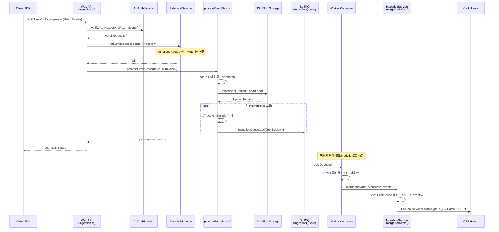
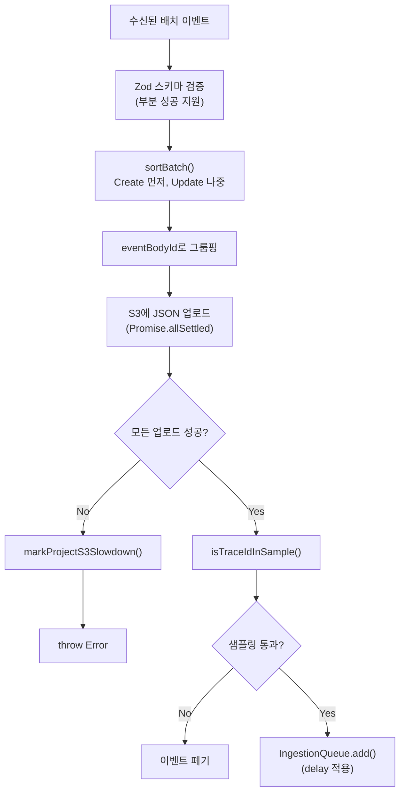

# 06 Ingestion Pipeline Anatomy

> **선행 문서**: [03 Architecture](../10-architecture/03-architecture.md) · [15 Source Code Architecture](../10-architecture/15-source-code-architecture.md)
> **소스 딥다이브**: [10 Ingestion Source Breakdown](../50-source-analysis/10-ingestion-source-breakdown.md)

---

Langfuse 시스템에서 가장 높은 트래픽 부하를 견뎌야 하는 부분은 애플리케이션 로그(Traces, Observations)를 수집하는 **Ingestion 파이프라인**입니다. 단순 API 호출로 DB에 바로 쓰는 방식이 아닌, 고가용성과 데이터 유실 방지를 위한 3단계 비동기 구조를 가집니다.

## End-to-End 시퀀스

> **분석 대상 소스**:
> | 파일 | 줄 수 | 역할 |
> |---|---|---|
> | [`web/src/pages/api/public/ingestion.ts`](file:///Users/dhsshin/Documents/LLMOps/langfuse/web/src/pages/api/public/ingestion.ts) | ~287 | HTTP 진입점, 인증·Rate Limit, V4 이벤트 필터링 |
> | [`packages/shared/src/server/ingestion/processEventBatch.ts`](file:///Users/dhsshin/Documents/LLMOps/langfuse/packages/shared/src/server/ingestion/processEventBatch.ts) | ~525 | 핵심 비즈니스 로직 전체 |
> | [`packages/shared/src/server/ingestion/types.ts`](file:///Users/dhsshin/Documents/LLMOps/langfuse/packages/shared/src/server/ingestion/types.ts) | — | Zod 이벤트 스키마 팩토리 |
> | [`packages/shared/src/server/ingestion/sampling.ts`](file:///Users/dhsshin/Documents/LLMOps/langfuse/packages/shared/src/server/ingestion/sampling.ts) | — | 샘플링 결정 로직 |

## 1단계: 진입점 — Next.js API Route

🔗 [`web/src/pages/api/public/ingestion.ts`](file:///Users/dhsshin/Documents/LLMOps/langfuse/web/src/pages/api/public/ingestion.ts)

| 처리 순서 | 함수 | 역할 |
|---|---|---|
| 1 | `ApiAuthService.verifyAuthHeaderAndReturnScope()` | API Key 검증, projectId 추출, 이용 중단(suspend) 여부 확인 |
| 2 | `RateLimitService.rateLimitRequest()` | 프로젝트별 초당 수집 한도 확인 (Fail-open) |
| 3 | `batchType.safeParse(req.body)` | Zod로 요청 본문 구조 검증 |
| 4 | `filterBatchForEventsOnly()` | V4 `events_only` 모드 시 trace/observation 이벤트를 거부 (Score/SDK Log만 통과) |
| 5 | `processEventBatch()` | 핵심 비즈니스 로직 위임 (`createIngestionAttribution()`으로 SDK 귀속 정보 전달) |

## 2단계: 비동기 분기 — S3 캐싱 + BullMQ 큐

🔗 [`packages/shared/src/server/ingestion/processEventBatch.ts`](file:///Users/dhsshin/Documents/LLMOps/langfuse/packages/shared/src/server/ingestion/processEventBatch.ts)

### S3 캐싱의 목적
- 대용량 페이로드(프롬프트, 응답 텍스트)가 Redis를 거치지 않도록 분리
- 에러 복구 시 원본 데이터 재처리 가능
- ClickHouse 장애 시에도 S3에 원본이 보존됨

### Delay 전략
| 조건 | 딜레이 | 이유 |
|---|---|---|
| UTC 23:45~00:15 | `LANGFUSE_INGESTION_QUEUE_DELAY_MS` | 날짜 변경선에서 이벤트 순서 보장 |
| OTel 소스 | 0ms | OTel은 자체 순서 보장 메커니즘 보유 |
| 일반 API | `min(5000, env값)` | 동일 ID의 Create/Update 순서 보장 |

## 3단계: Worker 처리 — ClickHouse Batch Insert

🔗 [`worker/src/queues/ingestionQueue.ts`](file:///Users/dhsshin/Documents/LLMOps/langfuse/worker/src/queues/ingestionQueue.ts)

| 처리 순서 | 함수 | 역할 |
|---|---|---|
| 1 | Redis `EXISTS` 체크 | 최근 5분 이내 처리 이력이 있으면 즉시 Skip |
| 2 | `hasS3SlowdownFlag()` | S3 Slowdown 마킹된 프로젝트면 Secondary Queue로 이관 |
| 3 | `s3Client.download()` | S3에서 JSON 파일 다운로드 (병렬 chunk) |
| 4 | `IngestionService.mergeAndWrite()` | 기존 ClickHouse 레코드와 병합 후 메모리 버퍼에 추가 |
| 5 | `ClickhouseWriter.flush()` | 주기적으로 메모리 버퍼를 Batch INSERT |

> **V4 전환 지원**: 워커는 `v4WritesToEventsTable()` 함수를 통해 `events_full` 테이블에 이중 기록 여부를 동적으로 결정합니다.

---

## 관련 문서

| 방향 | 문서 |
|---|---|
| ⬇️ 소스 딥다이브 | [10 Ingestion Source Breakdown](../50-source-analysis/10-ingestion-source-breakdown.md) |
| ➡️ 다음 | [07 Queue and Worker System](./07-queue-and-worker-system.md) |
| 🏠 색인 | [README](../README.md) |
