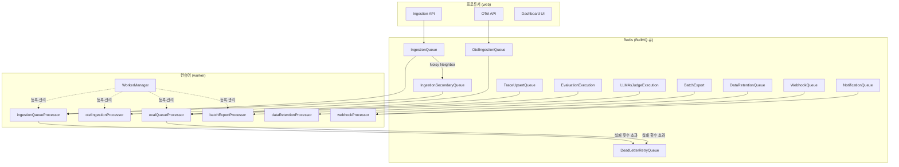
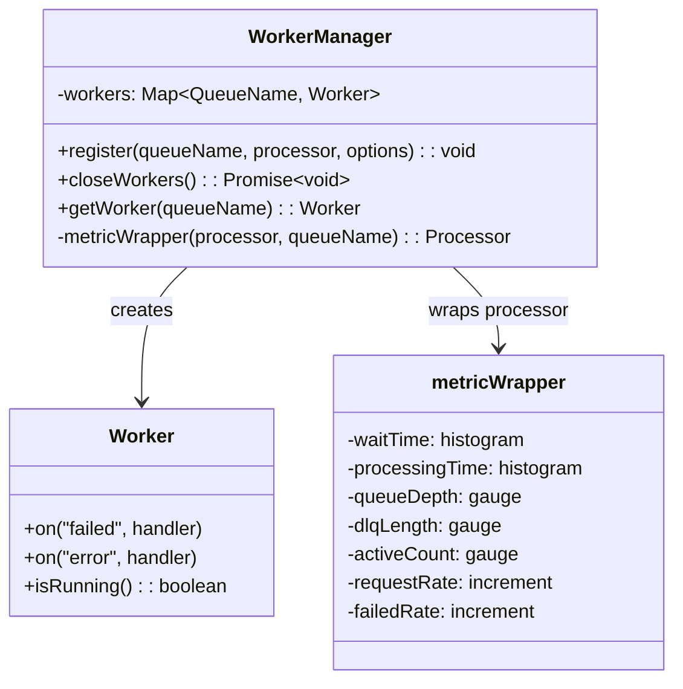
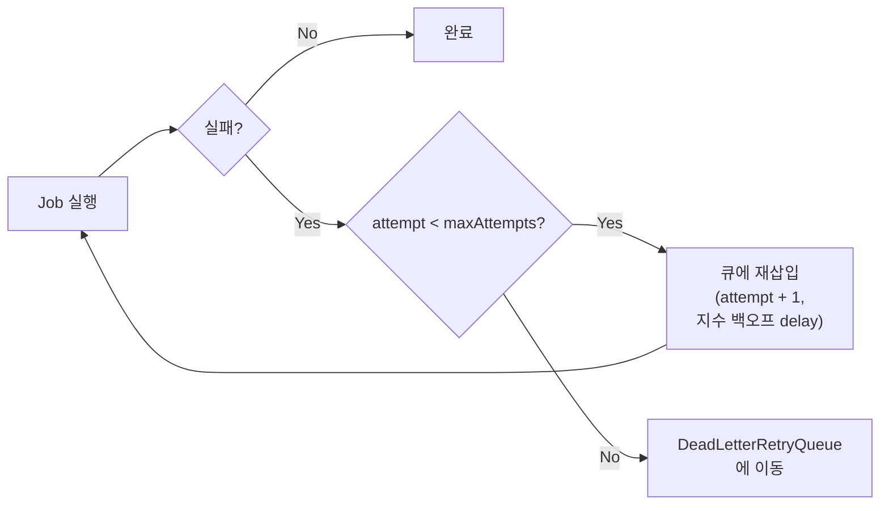

# 07 Queue and Worker System Anatomy

> **선행 문서**: [06 Ingestion Pipeline](./06-ingestion-pipeline.md) · [15 Source Code Architecture](../10-architecture/15-source-code-architecture.md)
> **소스 딥다이브**: [11 Worker Source Breakdown](../50-source-analysis/11-worker-source-breakdown.md)

---

Langfuse는 웹 서버(Next.js)가 모든 무거운 작업을 즉시 처리하지 않도록, Redis 기반의 **BullMQ**를 뼈대로 한 Queue 및 Worker 시스템을 운용합니다.

## 전체 큐 토폴로지



## 큐 스키마 및 계약 (Payload Contracts)

🔗 [`packages/shared/src/server/queues.ts`](file:///Users/dhsshin/Documents/LLMOps/langfuse/packages/shared/src/server/queues.ts) — 568줄

`web`(프로듀서)과 `worker`(컨슈머) 간의 페이로드 계약은 모두 이 파일에 **Zod 스키마**로 정의되어 있습니다.

| 큐 이름 | Zod 스키마 | 용도 |
|---|---|---|
| `IngestionQueue` | `IngestionEvent` | SDK/API로부터의 메인 이벤트 파이프라인 |
| `OtelIngestionQueue` | `OtelIngestionEvent` | OpenTelemetry 프로토콜 이벤트 |
| `IngestionSecondaryQueue` | `IngestionEvent` (동일) | S3 Slowdown 프로젝트 격리 |
| `EvaluationExecution` | `EvalExecutionEvent` | LLM-as-a-judge 평가 실행 |
| `LLMAsJudgeExecution` | `LLMAsJudgeExecutionEventSchema` | Observation 기반 평가 |
| `BatchExport` | `BatchExportJobSchema` | 대용량 S3 내보내기 |
| `DataRetentionQueue` | `DataRetentionProcessingEventSchema` | TTL 만료 데이터 삭제 |
| `TraceUpsert` | `TraceQueueEventSchema` | 트레이스 업서트 → 평가 트리거 |
| `WebhookQueue` | `WebhookInputSchema` | 외부 웹훅 발송 |
| `NotificationQueue` | `NotificationEventSchema` | 댓글 멘션 등 사내 알림 |
| `DeadLetterRetryQueue` | `DeadLetterRetryQueueEventSchema` | 실패 Job 수집 |

## Worker 아키텍처

🔗 [`worker/src/queues/workerManager.ts`](file:///Users/dhsshin/Documents/LLMOps/langfuse/worker/src/queues/workerManager.ts)



### `WorkerManager.register()` 의 동작

1. **Redis 커넥션 생성**: 각 워커마다 전용 Redis 커넥션을 할당
2. **메트릭 래핑**: 모든 Job 처리를 `metricWrapper`로 감싸서 자동 Observability 확보
3. **에러 핸들링 등록**: `failed`/`error` 이벤트에 `traceException` + `recordIncrement` 바인딩

### 수평 확장 (Horizontal Scaling)

Worker 노드는 상태를 갖지 않으며(Stateless), Redis에만 의존하므로:
- 트래픽 증가 시 `worker` 컨테이너 인스턴스를 추가로 띄우기만 하면 됩니다
- Worker가 OOM이나 네트워크 지연으로 뻗더라도 Web(사용자 UI/Ingestion)은 영향 없음

## 에러 복구 및 Resilience 설계

### Retry Baggage

🔗 [`queues.ts` L219-221](file:///Users/dhsshin/Documents/LLMOps/langfuse/packages/shared/src/server/queues.ts#L219-L221)

```typescript
export const RetryBaggage = z.object({
  originalJobTimestamp: z.date(),
  attempt: z.number(),
});
```



### Dead Letter Queue (DLQ)

`DeadLetterRetryQueue`는 반복해서 실패한 Job들이 폐기되기 전에 모이는 큐입니다. 시스템 관리자는:
1. DLQ에 모인 실패 작업의 에러 로그 분석
2. 버그 수정 후 DLQ의 작업들을 원래 큐로 복원
3. 데이터 유실 없이 복구 완료

---

## 관련 문서

| 방향 | 문서 |
|---|---|
| ⬇️ 소스 딥다이브 | [11 Worker Source Breakdown](../50-source-analysis/11-worker-source-breakdown.md) |
| ⬅️ 이전 | [06 Ingestion Pipeline](./06-ingestion-pipeline.md) |
| ➡️ 다음 | [08 ClickHouse Schema & MVs](./08-clickhouse-schema-and-mvs.md) |
| 🏠 색인 | [README](../README.md) |
