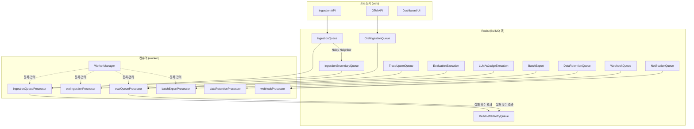
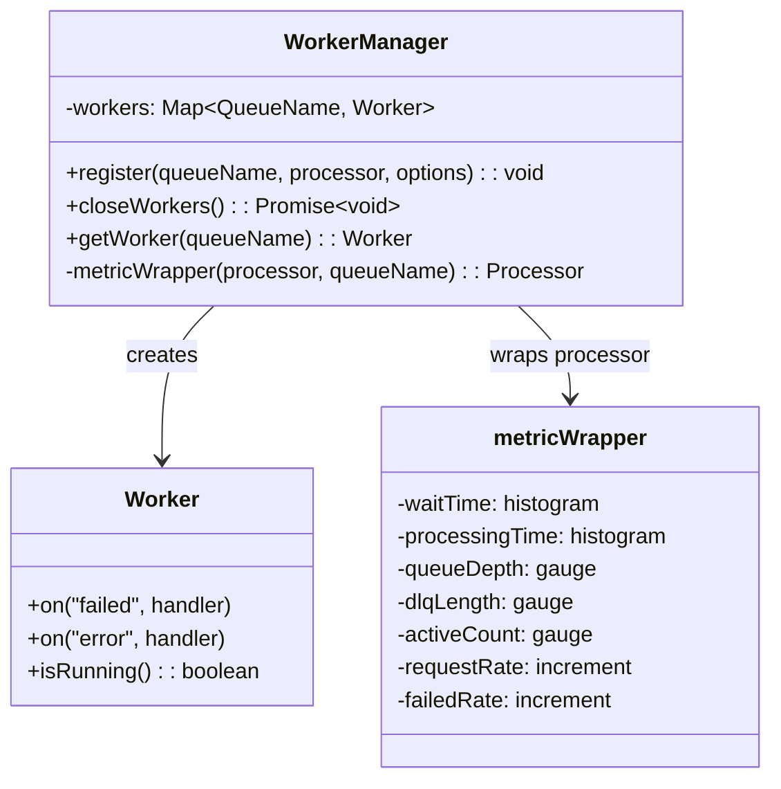
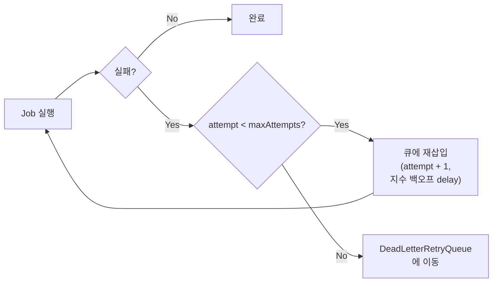
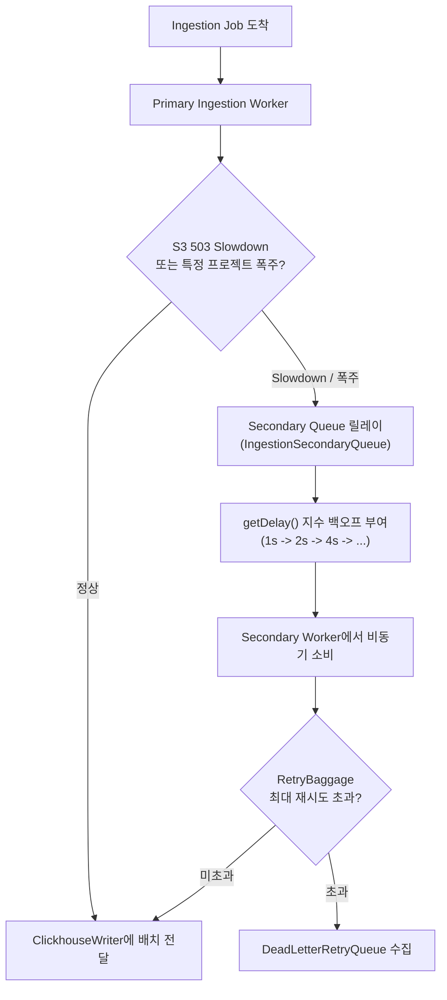

# 07 Queue and Worker System Anatomy

> **선행 문서**: [06 Ingestion Pipeline](./06-ingestion-pipeline.md) · [15 Source Code Architecture](../10-architecture/15-source-code-architecture.md)
> **소스 딥다이브**: [11 Worker Source Breakdown](../50-source-analysis/11-worker-source-breakdown.md)

---

Langfuse는 웹 서버(Next.js)가 모든 무거운 작업을 즉시 처리하지 않도록, Redis 기반의 **BullMQ**를 뼈대로 한 Queue 및 Worker 시스템을 운용합니다.

## 전체 큐 토폴로지



## 큐 스키마 및 계약 (Payload Contracts)

🔗 [`packages/shared/src/server/queues.ts`](file:///Users/dhsshin/Documents/LLMOps/langfuse/packages/shared/src/server/queues.ts) — ~633줄

`web`(프로듀서)과 `worker`(컨슈머) 간의 페이로드 계약은 모두 이 파일에 **Zod 스키마**로 정의되어 있습니다.

| 큐 이름 | Zod 스키마 | 용도 |
|---|---|---|
| `IngestionQueue` | `IngestionEvent` | SDK/API로부터의 메인 이벤트 파이프라인 |
| `OtelIngestionQueue` | `OtelIngestionEvent` | OpenTelemetry 프로토콜 이벤트 |
| `IngestionSecondaryQueue` | `IngestionEvent` (동일) | S3 Slowdown 프로젝트 격리 |
| `OtelIngestionSecondaryQueue` | `OtelIngestionEvent` (동일) | OTel 고처리량 프로젝트 격리 |
| `EvaluationExecution` | `EvalExecutionEvent` | LLM-as-a-judge 평가 실행 |
| `EvaluationExecutionSecondaryQueue` | `EvalExecutionEvent` (동일) | 평가 고처리량 프로젝트 격리 |
| `LLMAsJudgeExecution` | `ObservationEvalExecutionEventSchema` | Observation 기반 LLM 평가 |
| `CodeEvalExecution` | `ObservationEvalExecutionEventSchema` | Observation 기반 코드 평가 |
| `CreateEvalQueue` | `CreateEvalQueueEventSchema` | 평가 생성 트리거 |
| `BatchExport` | `BatchExportJobSchema` | 대용량 S3 내보내기 |
| `DataRetentionQueue` / `DataRetentionProcessingQueue` | `DataRetentionProcessingEventSchema` | TTL 만료 데이터 삭제 |
| `TraceUpsert` | `TraceQueueEventSchema` | 트레이스 업서트 → 평가 트리거 |
| `TraceDelete` | `TracesQueueEventType \| TraceQueueEventType` | 트레이스 삭제 처리 |
| `ScoreDelete` | `ScoresQueueEventSchema` | 스코어 삭제 처리 |
| `DatasetDelete` | `DatasetQueueEventSchema` | 데이터셋 삭제 처리 |
| `ProjectDelete` | `ProjectQueueEventSchema` | 프로젝트 삭제 처리 |
| `DatasetRunItemUpsert` | `DatasetRunItemUpsertEventSchema` | 데이터셋 런 아이템 업서트 |
| `BatchActionQueue` | `BatchActionProcessingEventSchema` | 배치 액션 (9가지 variant) |
| `WebhookQueue` | `WebhookInputSchema` | 외부 웹훅 발송 |
| `EntityChangeQueue` | `EntityChangeEventSchema` | 엔티티 변경 이벤트 |
| `EventPropagationQueue` | — | 이벤트 전파 |
| `NotificationQueue` | `NotificationEventSchema` | 댓글 멘션 등 사내 알림 |
| `MonitorQueue` | `MonitorQueueEventInput` | 모니터링 스케줄러 |
| `ExperimentCreate` | `ExperimentCreateEventSchema` | 실험 생성 |
| `PostHogIntegrationProcessingQueue` | `PostHogIntegrationProcessingEventSchema` | PostHog 연동 |
| `MixpanelIntegrationProcessingQueue` | `MixpanelIntegrationProcessingEventSchema` | Mixpanel 연동 |
| `BlobStorageIntegrationProcessingQueue` | `BlobStorageIntegrationProcessingEventSchema` | Blob 스토리지 연동 |
| `DeadLetterRetryQueue` | `DeadLetterRetryQueueEventSchema` | 실패 Job 수집 |

> **참고**: 위 테이블은 핵심 큐만 선별한 것입니다. 전체 38개 큐의 전수 목록은 `QueueName` enum을 직접 참조하세요.

## Worker 아키텍처

🔗 [`worker/src/queues/workerManager.ts`](file:///Users/dhsshin/Documents/LLMOps/langfuse/worker/src/queues/workerManager.ts) — ~247줄



### `WorkerManager.register()` 의 동작

1. **Redis 커넥션 생성**: 각 워커마다 전용 Redis 커넥션을 할당
2. **메트릭 래핑**: 모든 Job 처리를 `metricWrapper`로 감싸서 자동 Observability 확보
3. **에러 핸들링 등록**: `failed`/`error` 이벤트에 `traceException` + `recordIncrement` 바인딩

### 수평 확장 (Horizontal Scaling)

Worker 노드는 상태를 갖지 않으며(Stateless), Redis에만 의존하므로:
- 트래픽 증가 시 `worker` 컨테이너 인스턴스를 추가로 띄우기만 하면 됩니다
- Worker가 OOM이나 네트워크 지연으로 뻗더라도 Web(사용자 UI/Ingestion)은 영향 없음

## 에러 복구 및 Resilience 설계

### Retry Baggage

🔗 [`queues.ts` — `RetryBaggage` 정의](file:///Users/dhsshin/Documents/LLMOps/langfuse/packages/shared/src/server/queues.ts#L363-L366)

```typescript
export const RetryBaggage = z.object({
  originalJobTimestamp: z.date(),
  attempt: z.number(),
});
```



### Dead Letter Queue (DLQ) 처리

🔗 [`DeadLetterRetryQueue`](file:///Users/dhsshin/Documents/LLMOps/langfuse/packages/shared/src/server/queues.ts)

모든 워커는 `maxAttempts`를 초과하여 최종 실패한 Job을 삭제하지 않고 `DeadLetterRetryQueue`로 전달합니다. 운영자는 대시보드나 CLI를 통해 원인을 확인하고, 버그 수정 후 일괄 재처리(Re-queue)할 수 있습니다.

---

## 5. 격리 및 백프레셔 메커니즘 (Noisy-Neighbor Defense & Backpressure)

특정 부서/프로젝트의 갑작스러운 트래픽 폭주나 외부 스토리지(S3) 장애 시 전체 파이프라인 마비를 방지하기 위한 3단계 방어 체계를 가집니다.



### 3단계 방어 원리
1. **Secondary Queue 격리**: 고처리량 프로젝트나 S3 SlowDown 응답을 받은 이벤트는 `IngestionSecondaryQueue` 또는 `OtelIngestionSecondaryQueue`로 즉시 이관하여, 기본 `IngestionQueue`의 타 프로젝트 이벤트 처리가 차단되지 않도록 보호.
2. **지수 백오프 지연 (`getDelay()`)**: 재시도 횟수(retryCount)에 따라 큐 재삽입 시 `delay` 값을 동적으로 부여하여 S3 / DB의 백프레셔(Backpressure)를 완화.
3. **DeadLetterRetryQueue 격리**: 최종 실패 항목을 별도 DLQ로 이격하여 불필요한 큐 재처리가 전체 워커 CPU를 낭비하지 않도록 통제.

---

## 관련 문서

| | |
|---|---|
| ⬇️ 소스 딥다이브 | [11 Worker Source Breakdown](../50-source-analysis/11-worker-source-breakdown.md) |
| ⬅️ 이전 | [06 Ingestion Pipeline](./06-ingestion-pipeline.md) |
| ➡️ 다음 | [08 ClickHouse Schema & MVs](./08-clickhouse-schema-and-mvs.md) |
| 🏠 색인 | [README](../README.md) |
