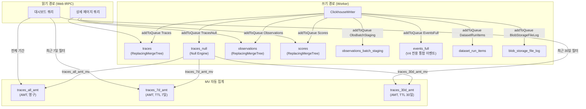
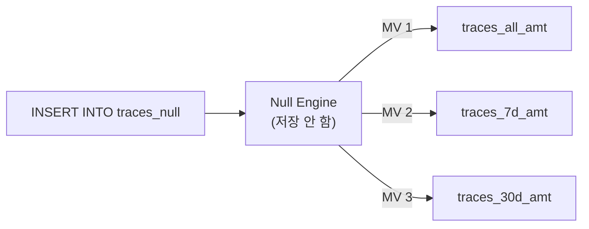
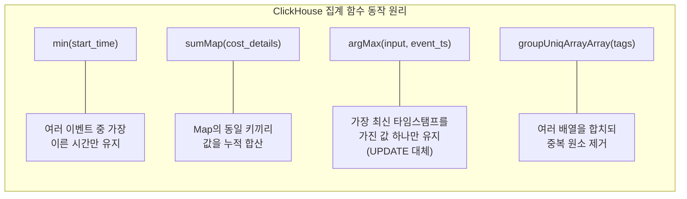
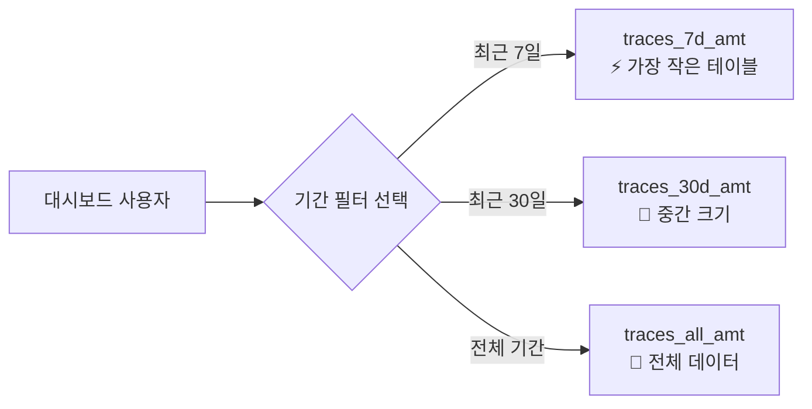

# 08 ClickHouse Schema and MVs Anatomy

> **선행 문서**: [04 Data Model and Storage](../20-core-domain/04-data-model-and-storage.md)
> **소스 딥다이브**: [12 Query Source Breakdown](../50-source-analysis/12-query-source-breakdown.md)

---

Langfuse가 대규모 LLM 이벤트 데이터를 실시간으로 집계하고 대시보드에 ms 단위로 렌더링할 수 있는 이유는 ClickHouse의 **AggregatingMergeTree(AMT)** 와 **Materialized View(MV)** 를 활용한 뷰 롤업 최적화 덕분입니다.

## 전체 ClickHouse 테이블 계층 구조



## Null 테이블을 활용한 트리거 패턴

🔗 [`0023...sql` L3-39](file:///Users/dhsshin/Documents/LLMOps/langfuse/packages/shared/clickhouse/migrations/unclustered/0023_traces_aggregating_merge_trees.up.sql#L3-L39)



- **Null Engine**: 데이터를 물리적으로 저장하지 않고 통과만 시키는 `/dev/null` 역할
- **왜 쓰는가?**: 하나의 Insert로 여러 개의 목적지 테이블(MV)에 분기하여 데이터를 가공·적재하기 위한 트리거 용도. 중간 데이터를 남기지 않아 스토리지 비용을 절약

## AggregatingMergeTree와 집계 함수

🔗 [`0023...sql` L42-87](file:///Users/dhsshin/Documents/LLMOps/langfuse/packages/shared/clickhouse/migrations/unclustered/0023_traces_aggregating_merge_trees.up.sql#L42-L87)



| 집계 함수 | 적용 컬럼 | 동작 | UPDATE 대체 |
|---|---|---|---|
| `min` | `start_time`, `created_at` | 가장 이른(오래된) 값 유지 | ✅ |
| `max` | `end_time`, `updated_at` | 가장 늦은(최신) 값 유지 | ✅ |
| `sumMap` | `cost_details`, `usage_details` | Map 키별 숫자 합산 | ✅ |
| `maxMap` | `metadata` | Map 키별 최신값 유지 | ✅ |
| `groupUniqArrayArray` | `tags`, `observation_ids`, `score_ids` | 중복 없는 유니크 배열 병합 | ✅ |
| `argMax(value, ts)` | `input`, `output`, `bookmarked` | 최신 타임스탬프의 값만 보존 | ✅ |

> **핵심 설계 원칙**: ClickHouse는 `UPDATE`/`DELETE`가 매우 비싼 작업입니다. Langfuse는 이를 완전히 회피하고, 새 이벤트를 Insert만 하면 MV가 백그라운드에서 상태를 자동 병합하는 패턴을 사용합니다.

## TTL 기반 파티셔닝 뷰

🔗 [`0023...sql` L129-174](file:///Users/dhsshin/Documents/LLMOps/langfuse/packages/shared/clickhouse/migrations/unclustered/0023_traces_aggregating_merge_trees.up.sql#L129-L174)



| 테이블 | TTL | 사내 커스터마이징 |
|---|---|---|
| `traces_all_amt` | 없음 (영구) | 전체 보존 (규정 준수 감사용) |
| `traces_7d_amt` | `toDate(start_time) + INTERVAL 7 DAY` | TTL 값을 사내 정책(예: 14일)으로 변경 가능 |
| `traces_30d_amt` | `toDate(start_time) + INTERVAL 30 DAY` | TTL 값을 사내 정책(예: 90일)으로 변경 가능 |

## 블룸 필터 인덱스

```sql
INDEX idx_trace_id id TYPE bloom_filter(0.001) GRANULARITY 1
INDEX idx_user_id user_id TYPE bloom_filter(0.001) GRANULARITY 1
INDEX idx_session_id session_id TYPE bloom_filter(0.001) GRANULARITY 1
```

ClickHouse는 컬럼 스캔에 특화되어 있지만, 대시보드에서 특정 `trace_id` 단건 조회 시에는 해시 기반의 블룸 필터가 불필요한 스토리지 블록 접근을 차단하여 응답 속도를 크게 향상시킵니다.

---

## 관련 문서

| | |
|---|---|
| ⬇️ 소스 딥다이브 | [12 Query Source Breakdown](../50-source-analysis/12-query-source-breakdown.md) |
| ⬅️ 이전 | [07 Queue and Worker System](./07-queue-and-worker-system.md) |
| ➡️ 다음 | [09 tRPC and Next.js](./09-trpc-and-nextjs.md) |
| 🏠 색인 | [README](../README.md) |
