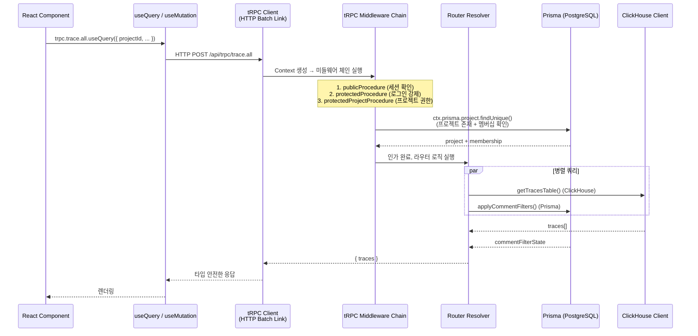
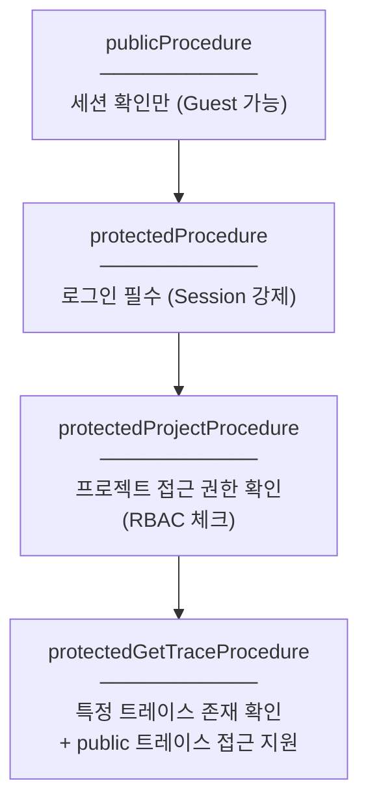
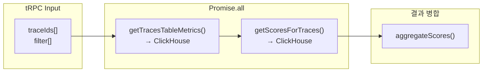

# 09 tRPC and Next.js Anatomy

> **선행 문서**: [03 Architecture](../10-architecture/03-architecture.md) · [15 Source Code Architecture](../10-architecture/15-source-code-architecture.md)
> **소스 딥다이브**: [12 Query Source Breakdown](../50-source-analysis/12-query-source-breakdown.md)

---

Langfuse의 프론트엔드(React)와 백엔드(Next.js)는 **tRPC**를 통해 타입 안전(Type-safe)한 통신을 수행합니다. REST API가 아닌 tRPC를 선택한 이유, 미들웨어 체인의 구조, 그리고 ClickHouse/Prisma 병렬 쿼리 패턴을 분석합니다.

## tRPC 요청 처리 전체 흐름



## 미들웨어 체인 (Procedure Layers)

🔗 [`web/src/server/api/trpc.ts`](file:///Users/dhsshin/Documents/LLMOps/langfuse/web/src/server/api/trpc.ts)



| Procedure | 역할 | 체크 대상 |
|---|---|---|
| `publicProcedure` | 기본 컨텍스트 생성 | 세션 유무만 확인 |
| `protectedProcedure` | 로그인 강제 | `ctx.session.user` 존재 여부 |
| `protectedProjectProcedure` | 프로젝트 RBAC | `ProjectMembership` + Role 확인 |
| `protectedGetTraceProcedure` | 트레이스 접근 | ClickHouse에서 트레이스 조회 + public 여부 |

## 라우터 구조 맵

```mermaid
flowchart TD
    Root["appRouter<br/>(63개 라우터)"] --> Trace["traceRouter"]
    Root --> Obs["observationsRouter"]
    Root --> Score["scoreRouter"]
    Root --> ScoreAnalytics["scoreAnalyticsRouter"]
    Root --> Session["sessionRouter"]
    Root --> Project["projectRouter"]
    Root --> Model["modelRouter"]
    Root --> Prompt["promptRouter"]
    Root --> Dataset["datasetRouter"]
    Root --> Eval["evalRouter"]
    Root --> Dashboard["dashboardRouter"]
    Root --> DashboardWidget["dashboardWidgetRouter"]
    Root --> BatchExport["batchExportRouter"]
    Root --> BatchAction["batchActionRouter"]
    Root --> Experiments["experimentsRouter"]
    Root --> AQ["annotationQueues/Items/Assignments"]
    Root --> Automations["automationsRouter"]
    Root --> Monitors["monitorsRouter"]
    Root --> Comments["comments/commentReactions"]
    Root --> Media["mediaRouter"]
    Root --> LLM["llmApiKey/llmSchemas/llmTools"]
    Root --> Orgs["organizations/organizationApiKeys"]
    Root --> Integrations["posthog/mixpanel/blobStorage"]
    Root --> V4["v4TransitionRouter"]
    Root --> More["...외 다수"]

    Trace --> T_All["all"]
    Trace --> T_Count["countAll"]
    Trace --> T_Metrics["metrics"]
    Trace --> T_ById["byId"]
    Trace --> T_Detail["byIdWithObservationsAndScores"]
    Trace --> T_Delete["deleteMany"]
    Trace --> T_Bookmark["bookmark"]
    Trace --> T_Publish["publish"]
    Trace --> T_Agent["getAgentGraphData"]
```



> **참고**: 전체 63개 라우터 목록은 [`web/src/server/api/root.ts`](file:///Users/dhsshin/Documents/LLMOps/langfuse/web/src/server/api/root.ts)의 `appRouter` 정의를 직접 참조하세요.

## 병렬 데이터 패칭 패턴

Langfuse의 tRPC 라우터에서 반복적으로 나타나는 핵심 패턴은 **Prisma(PostgreSQL)와 ClickHouse를 동시에 조회**하는 것입니다.

### 예시 1: `traceRouter.metrics`

🔗 [`traces.ts` — `traceRouter.metrics` 프로시저](file:///Users/dhsshin/Documents/LLMOps/langfuse/web/src/server/api/routers/traces.ts#L204)



### 예시 2: `traceRouter.filterOptions`

🔗 [`traces.ts` — `traceRouter.filterOptions` 프로시저](file:///Users/dhsshin/Documents/LLMOps/langfuse/web/src/server/api/routers/traces.ts#L286)

```typescript
const [numericScoreNames, categoricalScoreNames, traceNames, tags, userIds, sessionIds] =
  await Promise.all([
    getNumericScoresGroupedByName(...),      // CH
    getCategoricalScoresGroupedByName(...),  // CH
    getTracesGroupedByName(...),             // CH
    getTracesGroupedByTags(...),             // CH
    getTracesGroupedByUsers(...),            // CH
    getTracesGroupedBySessionId(...),        // CH
  ]);
```

> **6개의 독립 ClickHouse 쿼리**를 한 번에 실행하여 가장 느린 쿼리의 응답 시간만큼만 대기합니다. 순차 실행 시 6배 느려질 수 있는 지점입니다.

## ClickHouse 쿼리 보안 — Parameter Binding

ClickHouse Node.js 클라이언트는 **named parameter binding**을 지원합니다. Langfuse는 이를 철저히 활용하여 SQL Injection을 원천 방지합니다.

```typescript
const query = `
  SELECT id, start_time
  FROM traces_7d_amt_mv
  WHERE project_id = {projectId: String}
  ORDER BY start_time DESC
  LIMIT {limit: Int32} OFFSET {offset: Int32}
`;

await clickhouseClient().query({
  query,
  format: 'JSONEachRow',
  query_params: {
    projectId: input.projectId,  // ← 바인딩 (문자열 이스케이프 자동)
    limit: input.limit,
    offset: input.page * input.limit,
  }
});
```

| 접근 방식 | 보안 | Langfuse 사용 여부 |
|---|---|---|
| 문자열 보간 (`${input.projectId}`) | ❌ SQL Injection 취약 | 사용하지 않음 |
| Named Parameter (`{projectId: String}`) | ✅ 자동 이스케이프 | ✅ 전체 적용 |

---

## 관련 문서

| | |
|---|---|
| ⬅️ 이전 | [08 ClickHouse Schema & MVs](./08-clickhouse-schema-and-mvs.md) |
| ➡️ 다음 | [14 MCP and AI Agent Architecture](./14-mcp-and-ai-agent-architecture.md) |
| ⬇️ 소스 딥다이브 | [12 Query Source Breakdown](../50-source-analysis/12-query-source-breakdown.md) |
| 🏠 색인 | [README](../README.md) |
