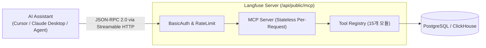
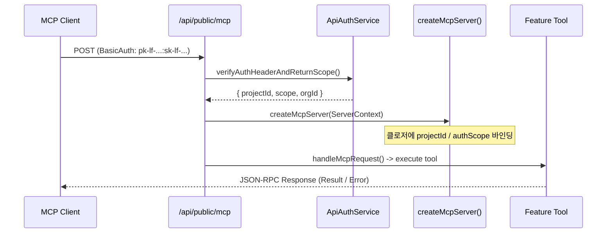

# 14 MCP and AI Agent Architecture

> **선행 문서**: [09 tRPC and Next.js](./09-trpc-and-nextjs.md)
>
> **분석 대상 소스**:
> | 파일 | 역할 |
> |---|---|
> | [`web/src/pages/api/public/mcp/index.ts`](file:///Users/dhsshin/Documents/LLMOps/langfuse/web/src/pages/api/public/mcp/index.ts) | MCP HTTP API 진입점 (Streamable HTTP / SSE 수송) |
> | [`web/src/features/mcp/server/mcpServer.ts`](file:///Users/dhsshin/Documents/LLMOps/langfuse/web/src/features/mcp/server/mcpServer.ts) | MCP 서버 인스턴스 팩토리 및 컨텍스트 클로저 생성 |
> | [`web/src/features/mcp/server/bootstrap.ts`](file:///Users/dhsshin/Documents/LLMOps/langfuse/web/src/features/mcp/server/bootstrap.ts) | 15개 MCP 피처 모듈 툴 등록 |
> | [`web/src/features/mcp/server/registry.ts`](file:///Users/dhsshin/Documents/LLMOps/langfuse/web/src/features/mcp/server/registry.ts) | 툴 등록 및 핸들러 디스패처 |
> | [`web/src/features/mcp/server/transport.ts`](file:///Users/dhsshin/Documents/LLMOps/langfuse/web/src/features/mcp/server/transport.ts) | Streamable HTTP 수송 래퍼 및 SSE 응답 처리 |

---

## 1. 개요 (Overview)

Langfuse는 **Model Context Protocol (MCP)** 표준을 준수하는 빌트인 MCP 서버를 제공합니다. 이를 통해 Claude Desktop, Cursor, Copilot 등의 외부 AI 도구 또는 사내 LLM 에이전트가 HTTP 통신으로 Langfuse 제어면(Control Plane)과 트레이스 데이터에 직접 접근할 수 있습니다.



---

## 2. 수송 및 보안 아키텍처 (Transport & Security)

### 2.1 Streamable HTTP Transport

MCP 사양(2025-03-26 spec)을 준수하며 기존 HTTP+SSE 이중 엔드포인트 방식 대신 **단일 API Route (`/api/public/mcp`)**에서 모든 요청을 처리합니다.

- **POST**: JSON-RPC 2.0 툴 실행 및 리소스 조회
- **GET**: Server-Sent Events (SSE) 이벤트 스트림 수신
- **DELETE**: 세션 종료 제어

### 2.2 인증 및 세션 무상태성 (Stateless Per-Request)



- **보안**: BasicAuth (`Public Key`:`Secret Key`)로 프로젝트 인증을 수행하며, 프로젝트 권한 범위 내로 데이터 격리됩니다.
- **클로저 인스턴스화**: 메모리 세션을 유지하지 않는 무상태(Stateless) 구조로, 요청 마다 API Key 인증 결과를 기반으로 새 `ServerContext`가 생성되어 툴 핸들러 클로저에 주입됩니다.

---

## 3. 툴 레지스트리 (Tool Registry)

`web/src/features/mcp/server/bootstrap.ts`에는 15개의 피처 모듈이 툴 레지스트리에 등록되어 등록된 모든 MCP 툴 기능을 제공합니다.

| 피처 모듈 | 대표 제공 툴 (Tool Names) | 용도 |
|---|---|---|
| `prompts` | `get_prompt`, `create_prompt`, `list_prompts` | 프롬프트 버전 조회 및 생성 |
| `observations` | `get_observation`, `list_observations` | LLM Generation / Span 상세 분석 |
| `scores` | `create_score`, `get_score_config`, `list_score_configs` | 평가점수(Score) 생성 및 라벨 설정 |
| `datasets` | `list_datasets`, `create_dataset_item` | 데이터셋 런 아이템 관리 |
| `annotationQueues` | `list_annotation_queues`, `create_queue_item` | 사람이 직접 평가하는 큐 관리 |
| `comments` | `create_comment`, `list_comments` | 트레이스 및 관찰에 사내 댓글 작성 |
| `metrics` | `get_metrics` | 대시보드 지표 추출 |
| `models` | `list_models`, `create_model` | 모델 가격 및 커스텀 모델 설정 |
| `experiments` | `list_experiments`, `run_experiment` | 실시간 실험(Experiment) 트래킹 |
| `monitors` | `list_monitors` | 알림 및 품질 모니터링 현황 |
| `evals` | `list_eval_templates` | 평가 템플릿 탐색 |
| `media` | `get_media_upload_url` | 이미지/오디오 멀티미디어 업로드 |
| `feedback` | `submit_feedback` | 피드백 제출 |
| `dashboardWidgets`| `list_dashboard_widgets` | 위젯 정보 조회 |
| `health` | `get_health` | 서버 헬스체크 |

---

## 4. 인앱 에이전트 (In-App Agent) 및 오버라이드 훅

Langfuse Enterprise (EE) 패키지와 연동 시, MCP 서버는 **Human-in-the-loop (HITL)** 오버라이드 헤더 (`IN_APP_AGENT_MCP_TOOL_OVERRIDE_HEADER`)를 수용합니다.

```typescript
const inAppAgentRunOverride = req.headers[IN_APP_AGENT_MCP_TOOL_OVERRIDE_HEADER]
  ? InAppAgentMcpRunOverrideSchema.safeParse(
      safeJsonParse(req.headers[IN_APP_AGENT_MCP_TOOL_OVERRIDE_HEADER])
    )
  : undefined;
```

이를 통해 사내 에이전트 실행 시 승인된 가드레일 조건이나 에이전트 실행 컨텍스트(Run ID)를 MCP 툴 내부에서 동적으로 검증하고 Audit Log를 남길 수 있습니다.

---

| | |
|---|---|
| ⬅️ 이전 | [09 tRPC and Next.js](./09-trpc-and-nextjs.md) |
| ➡️ 다음 | [15 Batch Actions and Async Framework](./15-batch-actions-and-async-framework.md) |
| 🏠 색인 | [README](../README.md) |
