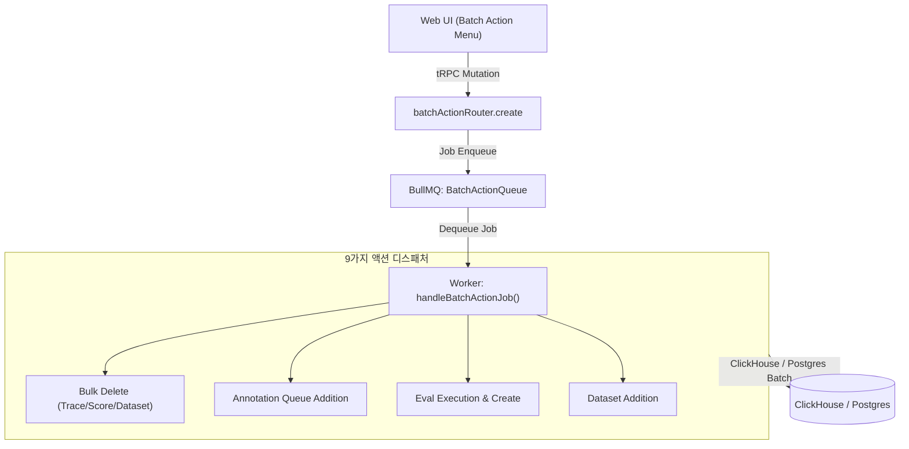
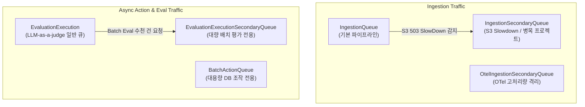

# 15 Batch Actions and Async Framework

> **선행 문서**: [14 MCP and AI Agent Architecture](./14-mcp-and-ai-agent-architecture.md)
>
> **분석 대상 소스**:
> | 파일 | 역할 |
> |---|---|
> | [`packages/shared/src/server/queues.ts`](file:///Users/dhsshin/Documents/LLMOps/langfuse/packages/shared/src/server/queues.ts) | `BatchActionQueue` 페이로드 스키마 (9개 `actionId` Discriminated Union) |
> | [`worker/src/queues/batchActionQueue.ts`](file:///Users/dhsshin/Documents/LLMOps/langfuse/worker/src/queues/batchActionQueue.ts) | `BatchActionQueue` 워커 프로세서 |
> | [`worker/src/features/batchAction/handleBatchActionJob.ts`](file:///Users/dhsshin/Documents/LLMOps/langfuse/worker/src/features/batchAction/handleBatchActionJob.ts) | 액션 핸들러 디스패처 및 작업 분기 |
> | [`web/src/server/api/routers/batchAction.ts`](file:///Users/dhsshin/Documents/LLMOps/langfuse/web/src/server/api/routers/batchAction.ts) | 프론트엔드 배치 액션 요청 & 프로그레스 조회 tRPC 라우터 |

---

## 1. 개요 (Overview)

Langfuse는 수백만 건의 트레이스/관찰 데이터에 대한 일괄 삭제, 평가 큐 추가, 자동 LLM 평가 생성, 데이터셋 추가 등의 대규모 비동기 처리를 위해 **`BatchActionQueue` 비동기 프레임워크**를 운영합니다.



---

## 2. 9가지 배치 액션 스키마 (Discriminated Union)

`packages/shared/src/server/queues.ts`의 `BatchActionProcessingEventSchema`는 `actionId`를 판별자로 하는 식별된 유니온(Discriminated Union)으로 정의되어 있습니다.

| `actionId` | 처리 대상 | 주요 동작 |
|---|---|---|
| `trace-delete` | Trace | 쿼리 조건에 부합하는 수만~수백만 건의 Trace 일괄 삭제 |
| `score-delete` | Score | 조건부 스코어 일괄 삭제 |
| `dataset-delete` | Dataset | 데이터셋과 연관 런 항목 일괄 삭제 |
| `trace-add-to-annotation-queue` | Trace | 트레이스를 사람 평가 큐(Annotation Queue)로 일괄 배정 |
| `session-add-to-annotation-queue` | Session | 세션 내 관찰 데이터를 평가 큐로 일괄 배정 |
| `observation-add-to-annotation-queue` | Observation | 특정 LLM Generation/Span을 평가 큐로 일괄 배정 |
| `eval-create` | Observation / Trace | LLM-as-a-judge 템플릿 기반 수동/스케줄 평가 일괄 생성 |
| `observation-add-to-dataset` | Observation | 검색 필터 조건의 관찰 데이터를 데이터셋 런 아이템으로 등록 |
| `observation-batch-evaluation` | Observation | 대량 관찰 데이터에 대해 다중 Evaluator 일괄 실행 |

---

## 3. 격리 및 노이즈 방어 체계 (Secondary Queues)

대용량 배치 작업이나 특정 고처리량(High-Throughput) 프로젝트의 폭주 트래픽이 메인 파이프라인 수집 성능을 낮추는 문제를 방지하기 위해 **Secondary Queue 패턴**을 적용합니다.



### 주요 노이즈 방어 장치
1. **S3 503 SlowDown 자동 우회**: 메인 Ingestion 처리 중 AWS S3 503 SlowDown 에러 감지 시, 해당 프로젝트 건을 `IngestionSecondaryQueue`로 격리 릴레이하여 타 프로젝트의 대기 시간을 보호합니다.
2. **평가 격리 (Eval Concurrency Isolation)**: UI에서 수만 건의 대량 배치 평가를 클릭해도 `EvaluationExecutionSecondaryQueue`에서 처리되므로 실시간 단건 수집/평가 파이프라인이 마비되지 않습니다.

---

## 4. 백프레셔 및 Retry Baggage 재시도 로직

네트워크 순간 장애 또는 ClickHouse 락(Lock)에 대응하기 위해, 큐 프로세서는 `RetryBaggage` 메타데이터를 유지하며 지수 백오프(Exponential Backoff) 지연을 부여합니다.

```typescript
export const RetryBaggage = z.object({
  retryCount: z.number().default(0),
  firstFailedAt: z.number().optional(),
});
```

- **백오프 지연 전략 (`getDelay()`)**: 재시도 횟수에 따라 최대 지연시간을 계산하여 큐에 재삽입(Delay Job)합니다.
- **최종 실패 복구**: 설정된 재시도 횟수를 초과한 무효 Job은 삭제되지 않고 `DeadLetterRetryQueue`로 격리되어 사내 운영자가 원인을 분석하고 복구(Re-queue)할 수 있습니다.

---

| | |
|---|---|
| ⬅️ 이전 | [14 MCP and AI Agent Architecture](./14-mcp-and-ai-agent-architecture.md) |
| ➡️ 다음 | [06 Operations and Troubleshooting Guide](../30-customization/06-operations-and-troubleshooting.md) |
| 🏠 색인 | [README](../README.md) |
