# 10 Ingestion Source Breakdown

> **선행 문서**: [06 Ingestion Pipeline Anatomy](../40-anatomy-deep-dive/06-ingestion-pipeline.md) · [03 Architecture](../10-architecture/03-architecture.md)
>
> **분석 대상 소스**:
> | 파일 | 줄 수 | 역할 |
> |---|---|---|
> | [`web/src/pages/api/public/ingestion.ts`](file:///Users/dhsshin/Documents/LLMOps/langfuse/web/src/pages/api/public/ingestion.ts) | ~287 | HTTP 진입점, 인증·Rate Limit, V4 이벤트 필터링 |
> | [`packages/shared/src/server/ingestion/processEventBatch.ts`](file:///Users/dhsshin/Documents/LLMOps/langfuse/packages/shared/src/server/ingestion/processEventBatch.ts) | ~525 | 핵심 비즈니스 로직 전체 |
> | [`packages/shared/src/server/ingestion/types.ts`](file:///Users/dhsshin/Documents/LLMOps/langfuse/packages/shared/src/server/ingestion/types.ts) | — | Zod 이벤트 스키마 팩토리 |
> | [`packages/shared/src/server/ingestion/sampling.ts`](file:///Users/dhsshin/Documents/LLMOps/langfuse/packages/shared/src/server/ingestion/sampling.ts) | — | 샘플링 결정 로직 |

---

## End-to-End 콜 시퀀스 (실제 함수명 매핑)

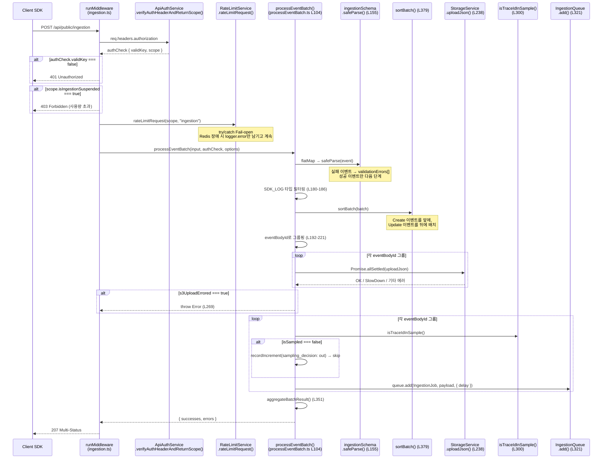

---

## Phase 1: 인증 및 사전 검증

### 1.1 API Key 인증 — `verifyAuthHeaderAndReturnScope()`

🔗 [`ingestion.ts` — API Key 검증](file:///Users/dhsshin/Documents/LLMOps/langfuse/web/src/pages/api/public/ingestion.ts#L83-L97)

```typescript
const authCheck = await new ApiAuthService(prisma, redis)
  .verifyAuthHeaderAndReturnScope(req.headers.authorization);
```

`ApiAuthService`는 **Cache-aside 패턴**으로 동작합니다:

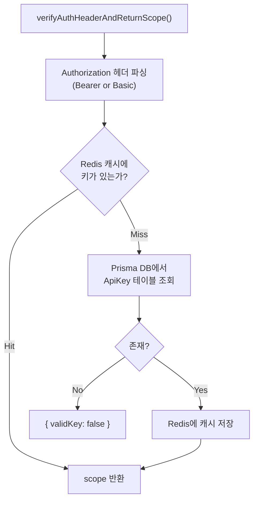

| `authCheck.scope` 속성 | 타입 | 용도 |
|---|---|---|
| `projectId` | `string` | 이벤트를 적재할 프로젝트 식별 |
| `accessLevel` | `"project"` \| `"scores"` | 전체 Ingestion 권한 vs Score 전용 권한 |
| `orgId` | `string?` | 조직 레벨 메타데이터 (메트릭 태깅용) |
| `plan` | `string?` | Cloud 요금제 (Free/Pro/Team) |
| `isIngestionSuspended` | `boolean` | 사용량 초과 시 `403` 반환 |
| `rateLimitOverrides` | `object?` | 프로젝트별 커스텀 Rate Limit 설정 |

**커스터마이징 포인트**: 사내 API 키 발급 체계를 운영할 경우, `ApiAuthService`의 내부 로직에 사내 Vault/HSM 연동 코드를 추가할 수 있습니다.

---

### 1.2 Rate Limiting — `rateLimitRequest()`

🔗 [`ingestion.ts` — Rate Limit 처리](file:///Users/dhsshin/Documents/LLMOps/langfuse/web/src/pages/api/public/ingestion.ts#L117-L131)

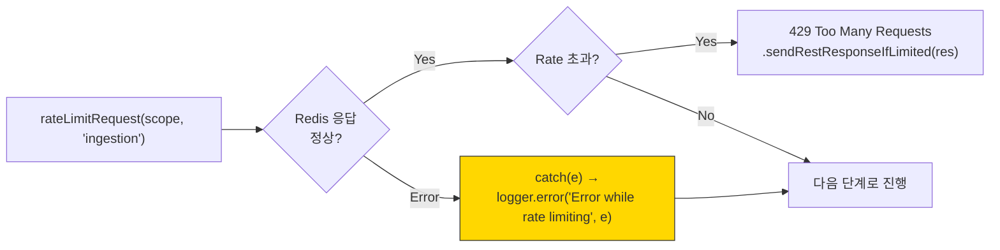

> **Fail-open 설계**: `try/catch` 블록으로 감싸져 있어 Redis 장애, 네트워크 타임아웃 등이 발생해도 Rate Limiter가 수집을 차단하지 않습니다. 이는 의도적인 가용성 우선 설계입니다.

---

## Phase 2: Zod 런타임 검증 및 정렬

### 2.1 스키마 검증 — `ingestionSchema.safeParse()`

🔗 [`processEventBatch.ts` — Zod 스키마 검증](file:///Users/dhsshin/Documents/LLMOps/langfuse/packages/shared/src/server/ingestion/processEventBatch.ts)

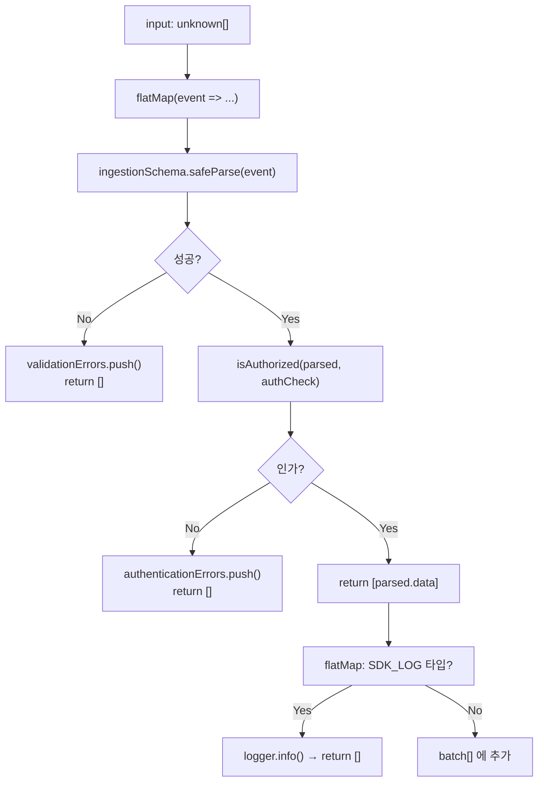

**권한 검증 — `isAuthorized()` 함수**:

🔗 [`processEventBatch.ts` — `isAuthorized()`](file:///Users/dhsshin/Documents/LLMOps/langfuse/packages/shared/src/server/ingestion/processEventBatch.ts)

```typescript
const isAuthorized = (event, authScope): boolean => {
  if (event.type === eventTypes.SDK_LOG)    return true;      // SDK 로그는 무조건 허용
  if (event.type === eventTypes.SCORE_CREATE)                 // Score는 scores 키도 가능
    return authScope.scope.accessLevel === "scores" || authScope.scope.accessLevel === "project";
  return authScope.scope.accessLevel === "project";           // 나머지는 project 키만
};
```

| API 키 레벨 | SDK_LOG | SCORE_CREATE | 나머지 (TRACE, SPAN 등) |
|---|---|---|---|
| `project` | ✅ | ✅ | ✅ |
| `scores` | ✅ | ✅ | ❌ |

### 2.2 이벤트 정렬 — `sortBatch()`

🔗 [`processEventBatch.ts` — `sortBatch()`](file:///Users/dhsshin/Documents/LLMOps/langfuse/packages/shared/src/server/ingestion/processEventBatch.ts)

```typescript
const sortBatch = (batch) => {
  const updateEvents = [GENERATION_UPDATE, SPAN_UPDATE, OBSERVATION_UPDATE];
  const updates = batch.filter(e => updateEvents.includes(e.type)).sort(byTimestamp);
  const others  = batch.filter(e => !updateEvents.includes(e.type)).sort(byTimestamp);
  return [...others, ...updates];  // Create 먼저, Update 나중
};
```

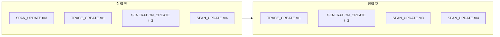

> **왜 이 순서가 중요한가?**: ClickHouse에서 `mergeAndWrite`로 이벤트를 병합할 때, Create 이벤트가 먼저 처리되어야 기본 필드(id, project_id 등)가 설정되고, 이후 Update가 추가 필드만 덮어쓸 수 있습니다.

### 2.3 eventBodyId 그룹핑

🔗 [`processEventBatch.ts` — eventBodyId 그룹핑 로직](file:///Users/dhsshin/Documents/LLMOps/langfuse/packages/shared/src/server/ingestion/processEventBatch.ts)

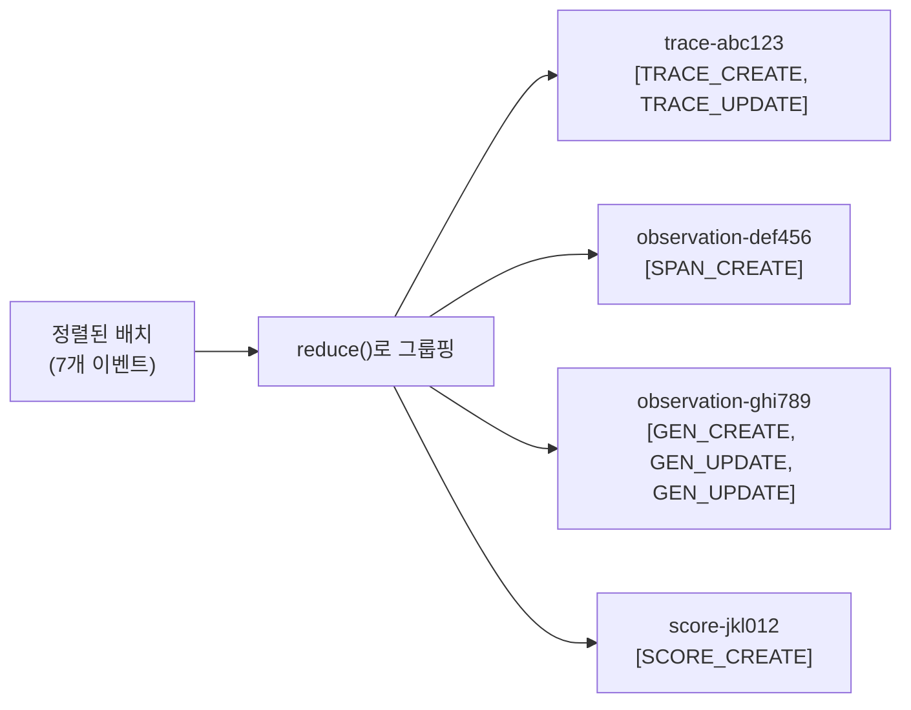

- **그룹 키**: `${clickhouseEntityType}-${event.body.id}` (예: `trace-abc123`)
- **목적**: 동일 엔티티에 대한 여러 이벤트를 **하나의 S3 파일로 묶어 저장**하여 S3 PUT 횟수를 절감

---

## Phase 3: S3 업로드 및 SlowDown 방어

### 3.1 S3 업로드

🔗 [`processEventBatch.ts` — S3 업로드 로직](file:///Users/dhsshin/Documents/LLMOps/langfuse/packages/shared/src/server/ingestion/processEventBatch.ts)

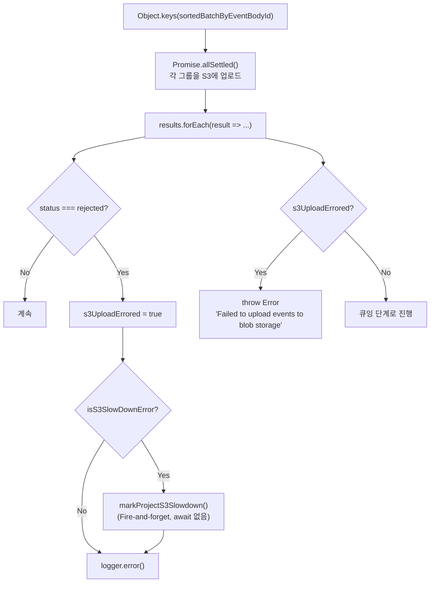

**S3 버킷 경로 구조**:
```
{LANGFUSE_S3_EVENT_UPLOAD_PREFIX}{projectId}/{entityType}/{eventBodyId}/{fileKey}.json

예시: events/proj-abc/trace/trace-123/evt-uuid-456.json
```

**S3 클라이언트 초기화** — `getS3StorageServiceClient()`:

🔗 [`processEventBatch.ts` — S3 클라이언트 설정](file:///Users/dhsshin/Documents/LLMOps/langfuse/packages/shared/src/server/ingestion/processEventBatch.ts)

| 환경변수 | 용도 | 사내 커스터마이징 |
|---|---|---|
| `LANGFUSE_S3_EVENT_UPLOAD_BUCKET` | S3 버킷 이름 | MinIO 등 호환 스토리지 가능 |
| `LANGFUSE_S3_EVENT_UPLOAD_ENDPOINT` | S3 엔드포인트 URL | 사내 Object Storage 주소 |
| `LANGFUSE_S3_EVENT_UPLOAD_REGION` | AWS 리전 | — |
| `LANGFUSE_S3_EVENT_UPLOAD_FORCE_PATH_STYLE` | Path-style 강제 여부 | MinIO 사용 시 `"true"` |
| `LANGFUSE_S3_EVENT_UPLOAD_SSE` | Server-Side Encryption | `"aws:kms"` 설정 가능 |
| `LANGFUSE_S3_EVENT_UPLOAD_SSE_KMS_KEY_ID` | KMS 키 ID | 사내 암호화 키 |

---

## Phase 4: 샘플링 및 큐 삽입

### 4.1 샘플링 — `isTraceIdInSample()`

🔗 [`processEventBatch.ts` — 샘플링 로직](file:///Users/dhsshin/Documents/LLMOps/langfuse/packages/shared/src/server/ingestion/processEventBatch.ts)

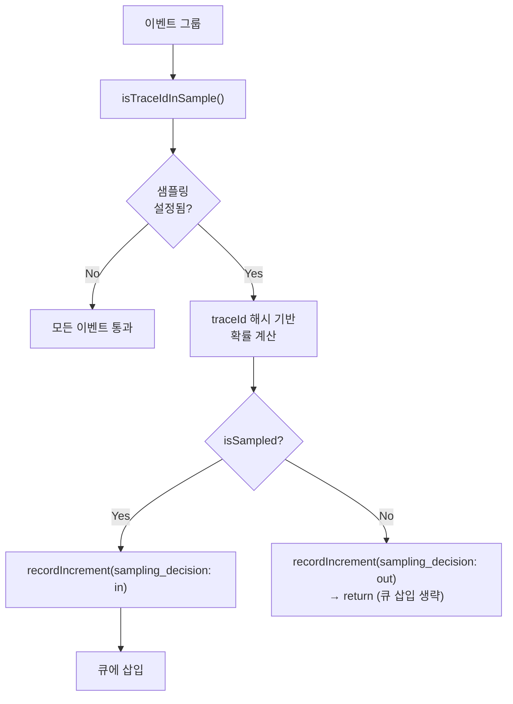

### 4.2 BullMQ 큐 삽입 — `IngestionQueue.add()`

🔗 [`processEventBatch.ts` — 큐 삽입 로직](file:///Users/dhsshin/Documents/LLMOps/langfuse/packages/shared/src/server/ingestion/processEventBatch.ts)

```typescript
queue.add(QueueJobs.IngestionJob, {
  id: randomUUID(),
  timestamp: new Date(),
  name: QueueJobs.IngestionJob,
  payload: {
    data: {
      type: eventData.type,
      eventBodyId: eventData.eventBodyId,
      fileKey: eventData.key,
      skipS3List: shouldSkipS3List,
      forwardToEventsTable,
    },
    authCheck: { validKey: true, scope: { projectId } },
  },
}, { delay: getDelay(delay, source) });
```

**skipS3List 조건** (L287-298):

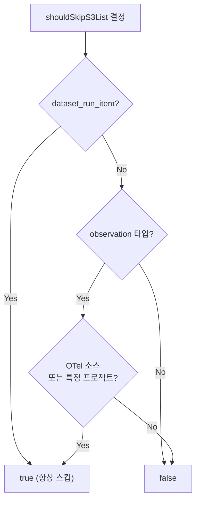

### 4.3 Delay 전략 — `getDelay()`

🔗 [`processEventBatch.ts` — `getDelay()`](file:///Users/dhsshin/Documents/LLMOps/langfuse/packages/shared/src/server/ingestion/processEventBatch.ts)

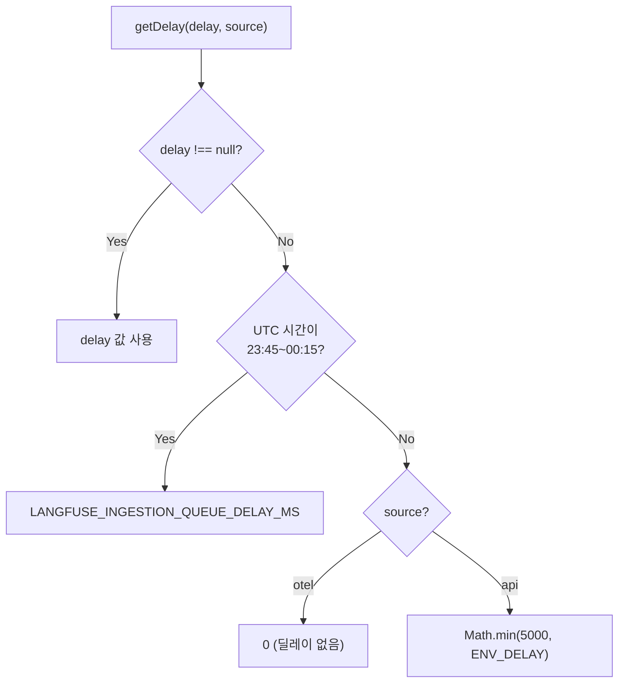

| 시간대 | OTel 소스 | API 소스 | 이유 |
|---|---|---|---|
| 일반 시간 | 0ms | min(5000, env) | API는 Create/Update 순서 보장 필요 |
| UTC 23:45~00:15 | env값 | env값 | 날짜 변경선에서의 순서 충돌 방지 |

---

## Phase 5: 응답 조립

### 5.1 `aggregateBatchResult()`

🔗 [`processEventBatch.ts` — `aggregateBatchResult()`](file:///Users/dhsshin/Documents/LLMOps/langfuse/packages/shared/src/server/ingestion/processEventBatch.ts)

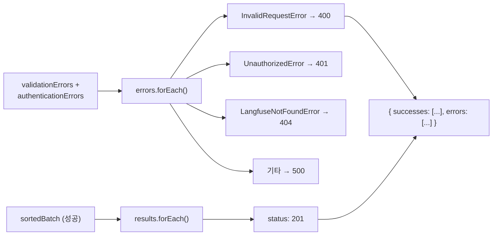

최종 HTTP 응답은 **207 Multi-Status**: 배치 내 각 이벤트별로 성공(201)/실패(400/401/404/500) 상태를 개별적으로 보고합니다.

---

## 환경변수 전체 정리

| 환경변수 | 기본값 | 설명 | 커스터마이징 |
|---|---|---|---|
| `LANGFUSE_S3_EVENT_UPLOAD_BUCKET` | — | 이벤트 S3 버킷 | **필수** 설정 |
| `LANGFUSE_S3_EVENT_UPLOAD_ENDPOINT` | — | S3 엔드포인트 (MinIO 등) | 사내 스토리지 주소 |
| `LANGFUSE_S3_EVENT_UPLOAD_PREFIX` | `""` | S3 키 prefix | 멀티 테넌트 분리용 |
| `LANGFUSE_S3_EVENT_UPLOAD_FORCE_PATH_STYLE` | `"false"` | Path-style 강제 | MinIO시 `"true"` |
| `LANGFUSE_S3_EVENT_UPLOAD_SSE` | — | Server-Side Encryption | `"aws:kms"` |
| `LANGFUSE_INGESTION_QUEUE_DELAY_MS` | `5000` | 큐 딜레이 (ms) | 순서 보장 vs 지연 트레이드오프 |
| `LANGFUSE_SKIP_S3_LIST_FOR_OBSERVATIONS_PROJECT_IDS` | — | S3 List 생략 프로젝트 | 고성능 프로젝트 최적화 |

---

---

| | |
|---|---|
| ⬅️ 이전 | [06 Operations and Troubleshooting Guide](../30-customization/06-operations-and-troubleshooting.md) |
| ➡️ 다음 | [11 Worker Source Breakdown](./11-worker-source-breakdown.md) |
| ⬆️ 개요 | [06 Ingestion Pipeline](../40-anatomy-deep-dive/06-ingestion-pipeline.md) |
| 🏠 색인 | [README](../README.md) |
