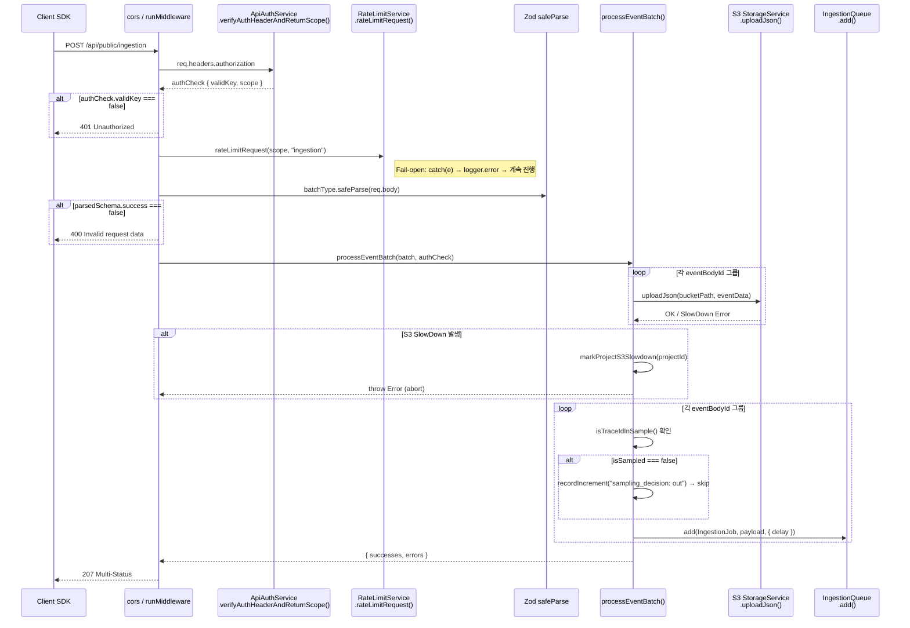
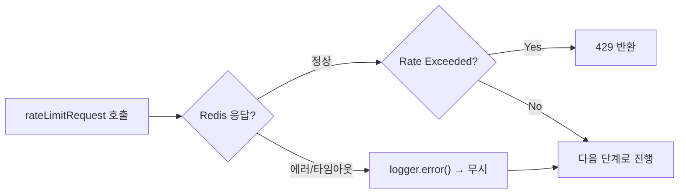
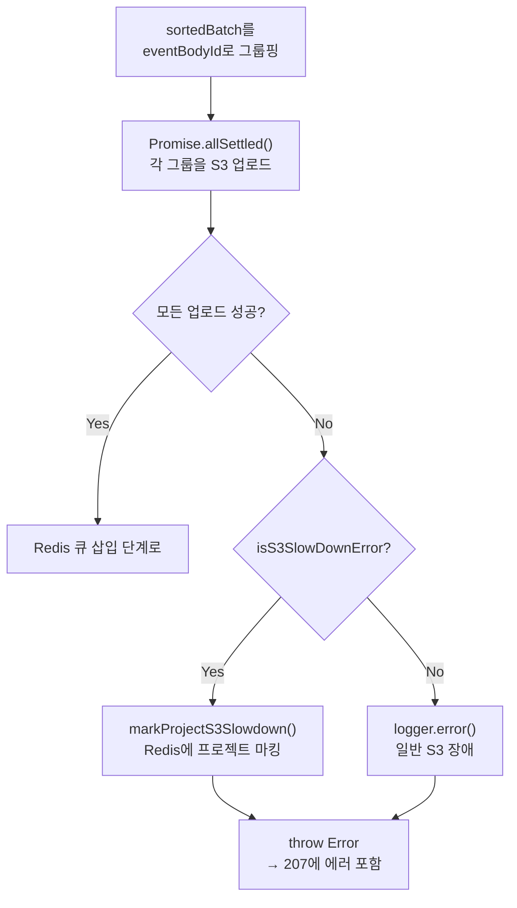

# 10 Ingestion Source Breakdown

> **선행 문서**: [06 Ingestion Pipeline Anatomy](../40-anatomy-deep-dive/06-ingestion-pipeline.md) · [03 Architecture](../10-architecture/03-architecture.md)
> **분석 대상 소스**:
> - [`web/src/pages/api/public/ingestion.ts`](file:///Users/dhsshin/Documents/LLMOps/langfuse/web/src/pages/api/public/ingestion.ts)
> - [`packages/shared/src/server/ingestion/processEventBatch.ts`](file:///Users/dhsshin/Documents/LLMOps/langfuse/packages/shared/src/server/ingestion/processEventBatch.ts)

---

## 전체 호출 시퀀스

SDK의 `POST /api/public/ingestion` 요청이 웹 서버 내부에서 어떤 함수를 어떤 순서로 호출하는지, 실제 소스코드의 함수명과 매핑한 시퀀스입니다.



---

## 소스코드 라인 바이 라인 분석

### 1단계: 인증 — `ingestion.ts` L76-88

🔗 [`ingestion.ts` L76](file:///Users/dhsshin/Documents/LLMOps/langfuse/web/src/pages/api/public/ingestion.ts#L76-L88)

```typescript
const authCheck = await new ApiAuthService(
  prisma,       // PostgreSQL ORM → API 키 조회
  redis,        // Redis → 키 캐시 조회 (Cache-aside 패턴)
).verifyAuthHeaderAndReturnScope(req.headers.authorization);
```

| 검사 항목 | 실패 시 | 코드 위치 |
|---|---|---|
| `authCheck.validKey` === false | `401 Unauthorized` | L81 |
| `authCheck.scope.projectId` 미존재 | `401 Unauthorized` ("Missing projectId") | L84 |
| `authCheck.scope.isIngestionSuspended` === true | `403 Forbidden` (사용량 초과) | L90 |

**커스터마이징 포인트**: 사내 API 키 발급 체계를 별도로 운영할 경우, `ApiAuthService` 클래스의 `verifyAuthHeaderAndReturnScope` 메서드 내부에 사내 키 저장소(Vault, HSM 등) 연동 코드를 추가할 수 있습니다.

---

### 2단계: Rate Limiting — `ingestion.ts` L103-116

🔗 [`ingestion.ts` L103](file:///Users/dhsshin/Documents/LLMOps/langfuse/web/src/pages/api/public/ingestion.ts#L103-L116)

```typescript
try {
  const rateLimitCheck = await RateLimitService.getInstance()
    .rateLimitRequest(authCheck.scope, "ingestion");
  if (rateLimitCheck?.isRateLimited()) {
    return rateLimitCheck.sendRestResponseIfLimited(res);
  }
} catch (e) {
  // ★ Fail-open 디자인: Redis 장애 시에도 수집 중단하지 않음
  logger.error("Error while rate limiting", e);
}
```



> **설계 철학**: 데이터 수집(Ingestion)은 시스템의 생명선이므로, Rate Limiter 인프라(Redis)에 장애가 발생하더라도 수집 자체를 막아서는 안 됩니다. 이것이 **Fail-open** 패턴입니다.

---

### 3단계: Zod 런타임 검증 — `processEventBatch.ts` L154-186

🔗 [`processEventBatch.ts` L154](file:///Users/dhsshin/Documents/LLMOps/langfuse/packages/shared/src/server/ingestion/processEventBatch.ts#L154-L186)

```typescript
const ingestionSchema = createIngestionEventSchema(isLangfuseInternal);

const batch = input.flatMap((event) => {
  const parsed = ingestionSchema.safeParse(event);
  if (!parsed.success) {
    validationErrors.push({ id: /* ... */, error: new InvalidRequestError(...) });
    return [];        // ← 실패한 이벤트만 걸러냄
  }
  if (!isAuthorized(parsed.data, authCheck)) {
    authenticationErrors.push({ id: parsed.data.id, error: new UnauthorizedError(...) });
    return [];
  }
  return [parsed.data]; // ← 성공한 이벤트는 통과
});
```

| 핵심 동작 | 설명 |
|---|---|
| **부분 성공(Partial Success)** | 배치 내 10개 이벤트 중 2개가 스키마 실패해도, 나머지 8개는 정상 처리 |
| **`SDK_LOG` 필터링** | `eventTypes.SDK_LOG` 타입은 서버에 로깅만 하고 ClickHouse 적재 대상에서 제외 (L180-185) |
| **정렬(Sort)** | Create 이벤트가 Update 이벤트보다 먼저 처리되도록 `sortBatch()` 적용 (L188) |

---

### 4단계: S3 업로드 & SlowDown 방어 — `processEventBatch.ts` L226-272

🔗 [`processEventBatch.ts` L226](file:///Users/dhsshin/Documents/LLMOps/langfuse/packages/shared/src/server/ingestion/processEventBatch.ts#L226-L272)



**왜 `Promise.allSettled` 인가?**: `Promise.all`과 달리, 한 파일 업로드가 실패해도 나머지 업로드의 결과를 모두 확인할 수 있습니다. 실패한 파일만 골라서 에러 처리하기 위해 `allSettled`를 사용합니다.

---

### 5단계: Sampling & 큐 삽입 — `processEventBatch.ts` L281-349

🔗 [`processEventBatch.ts` L300](file:///Users/dhsshin/Documents/LLMOps/langfuse/packages/shared/src/server/ingestion/processEventBatch.ts#L300-L349)

```typescript
const { isSampled, isSamplingConfigured } = isTraceIdInSample({
  projectId: authCheck.scope.projectId,
  event: eventData.data[0],
});

if (!isSampled) {
  recordIncrement("langfuse.ingestion.sampling", eventData.data.length, {
    sampling_decision: "out",
  });
  return; // ← 큐에 넣지 않고 즉시 폐기
}
```

샘플링을 통과한 이벤트만 최종적으로 BullMQ에 삽입됩니다:

```typescript
queue.add(QueueJobs.IngestionJob, {
  id: randomUUID(),
  timestamp: new Date(),
  name: QueueJobs.IngestionJob,
  payload: {
    data: {
      type: eventData.type,
      eventBodyId: eventData.eventBodyId,
      fileKey: eventData.key,         // S3 경로 참조 키
      skipS3List: shouldSkipS3List,   // OTel 이벤트는 List 생략 가능
    },
    authCheck: { ... },
  },
}, { delay: getDelay(delay, source) });
```

| `getDelay` 조건 | 적용 딜레이 | 이유 |
|---|---|---|
| UTC 23:45 ~ 00:15 사이 | `LANGFUSE_INGESTION_QUEUE_DELAY_MS` | 날짜 변경선에서 이벤트 순서 보장 |
| OTel 소스 | 0ms | OTel은 자체 순서 보장 메커니즘 보유 |
| 일반 API | `min(5000, env값)` | 중복 처리 방지를 위한 최소 딜레이 |

---

## 다음 문서

이 단계에서 Redis에 적재된 Job이 워커(Worker)에서 어떻게 소비되는지는 👉 [11 Worker Source Breakdown](./11-worker-source-breakdown.md)에서 이어집니다.
