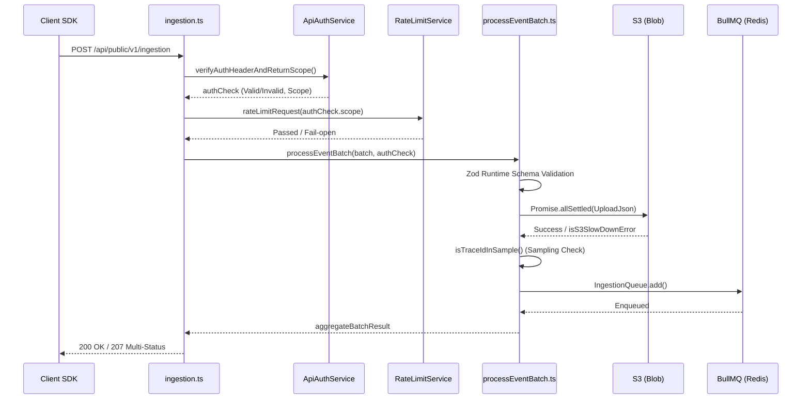

# 10 Ingestion Source Breakdown

이 문서는 Langfuse의 Ingestion 파이프라인 진입점 소스코드를 라인 바이 라인(Line-by-Line) 수준에서 분석합니다. 개발자가 직접 API를 수정하거나 버그를 추적할 때 참고할 수 있도록 실제 소스 파일과 긴밀하게 연결되어 있습니다.

> **관련 상위 아키텍처 문서**
> - 📄 [06 Ingestion Pipeline Anatomy](../40-anatomy-deep-dive/06-ingestion-pipeline.md)

---

## 전체 Ingestion 처리 시퀀스

클라이언트(SDK)로부터 넘어온 로그 트래픽이 웹 서버를 거쳐 S3와 큐로 분배되는 소스코드 레벨의 데이터 흐름입니다.



---

## 1. 진입점: `web/src/pages/api/public/ingestion.ts`

이 파일은 SDK들이 데이터를 전송하는 메인 엔드포인트이자 데이터 파이프라인의 입구입니다.
🔗 **Source File:** [`web/src/pages/api/public/ingestion.ts`](file:///Users/dhsshin/Documents/LLMOps/langfuse/web/src/pages/api/public/ingestion.ts)

### A. 인증 및 인가
```typescript
const authCheck = await new ApiAuthService(
  prisma,
  redis,
).verifyAuthHeaderAndReturnScope(req.headers.authorization);

if (!authCheck.validKey) {
  throw new UnauthorizedError(authCheck.error);
}
```
- `ApiAuthService`는 입력받은 Bearer 토큰(또는 Basic Auth)을 파싱하여 캐시(Redis)나 DB(Prisma)에서 API 키를 조회합니다.
- `scope.projectId` 유무를 체크하여 Organization 키인지 Project 키인지 구분합니다. (Ingestion은 Project 단위로만 가능)

### B. Rate Limit Fail-open 로직
```typescript
try {
  const rateLimitCheck = await RateLimitService.getInstance().rateLimitRequest(
    authCheck.scope,
    "ingestion",
  );
  if (rateLimitCheck?.isRateLimited()) return rateLimitCheck.sendRestResponseIfLimited(res);
} catch (e) {
  // If rate-limiter returns an error, we log it and continue processing.
  // This allows us to fail open instead of reject requests.
  logger.error("Error while rate limiting", e);
}
```
- `RateLimitService`를 통해 초당 수집 한도를 검사합니다.
- **Fail-open 로직**: Rate Limit 확인용 Redis 등에 장애가 발생해도 예외를 던지지 않고 로깅만 남긴 뒤 본 작업(`processEventBatch`)으로 넘어갑니다. 시스템의 수집 가용성을 100%에 가깝게 유지하기 위한 핵심 디자인입니다.

---

## 2. 핵심 로직: `processEventBatch.ts`

API 레이어를 통과한 데이터가 Zod로 검증되고 S3와 Redis로 전달되는 비즈니스 로직입니다.
🔗 **Source File:** [`packages/shared/src/server/ingestion/processEventBatch.ts`](file:///Users/dhsshin/Documents/LLMOps/langfuse/packages/shared/src/server/ingestion/processEventBatch.ts)

### A. Zod 런타임 스키마 분해 및 검증
```typescript
const ingestionSchema = createIngestionEventSchema(isLangfuseInternal);
const batch: z.infer<typeof ingestionSchema>[] = input
  .flatMap((event) => {
    const parsed = ingestionSchema.safeParse(event);
    if (!parsed.success) {
      validationErrors.push({ id: /* ... */, error: new InvalidRequestError(parsed.error.message) });
      return [];
    }
    // ...
    return [parsed.data];
  })
```
- `createIngestionEventSchema` 팩토리를 통해 `Trace`, `Observation`, `Score` 등 각각의 이벤트 타입에 맞는 Zod 스키마를 가져옵니다.
- `flatMap` 패턴을 사용하여 만약 일부 데이터 검증에 실패하면, 전체 배치를 거부(Reject)하는 대신 **실패한 개별 이벤트만 에러 배열(`validationErrors`)에 담고 성공한 이벤트들은 다음 단계로 통과**시킵니다. (부분 성공 지원)

### B. S3 Slowdown 에러 폴백
```typescript
const results = await Promise.allSettled(
  Object.keys(sortedBatchByEventBodyId).map(async (id) => {
    // S3 업로드 로직 (getS3StorageServiceClient)
  })
);

results.forEach((result) => {
  if (result.status === "rejected") {
    s3UploadErrored = true;
    if (isS3SlowDownError(result.reason)) {
      markProjectS3Slowdown(authCheck.scope.projectId!).catch(() => {});
    }
  }
});
```
- S3는 초당 PUT 요청 수가 3,500회(Prefix 당)를 초과하면 `503 Slow Down` 에러를 반환할 수 있습니다.
- `isS3SlowDownError`로 이 상황을 캐치하면, 해당 프로젝트(`projectId`)를 Redis 캐시에 `Slowdown` 상태로 마킹합니다.
- 마킹된 프로젝트의 후속 요청은 향후 큐잉 단계에서 우선순위가 낮은 `SecondaryIngestionQueue`로 강제 라우팅되어 메인 큐의 병목 현상을 막습니다.

### C. Sampling 전략 적용
```typescript
const { isSampled, isSamplingConfigured } = isTraceIdInSample({
  projectId: authCheck.scope.projectId,
  event: eventData.data[0],
});

if (!isSampled) {
  recordIncrement("langfuse.ingestion.sampling", eventData.data.length, {
    projectId: authCheck.scope.projectId ?? "<not set>",
    sampling_decision: "out",
  });
  return; // Redis 큐에 적재하지 않고 종료
}
```
- 시스템 설정이나 프로젝트 UI 설정에 따라 데이터 수집 확률(Sampling)이 구성되어 있다면, `isTraceIdInSample` 함수에서 `traceId`의 해시값을 기반으로 통과 여부(`isSampled`)를 결정합니다.
- 샘플링에서 탈락된 이벤트는 이후 로직인 `IngestionQueue.add()`를 타지 않고 즉시 무시(Drop)됩니다.
