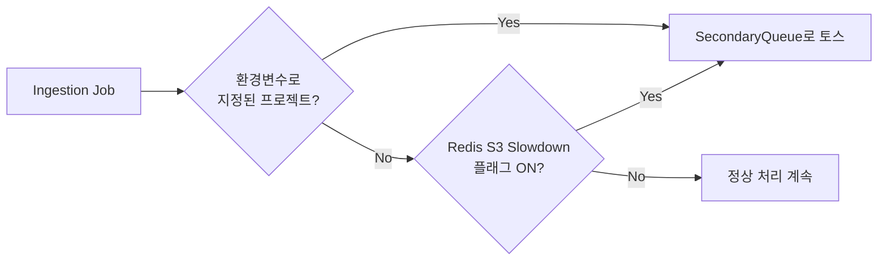
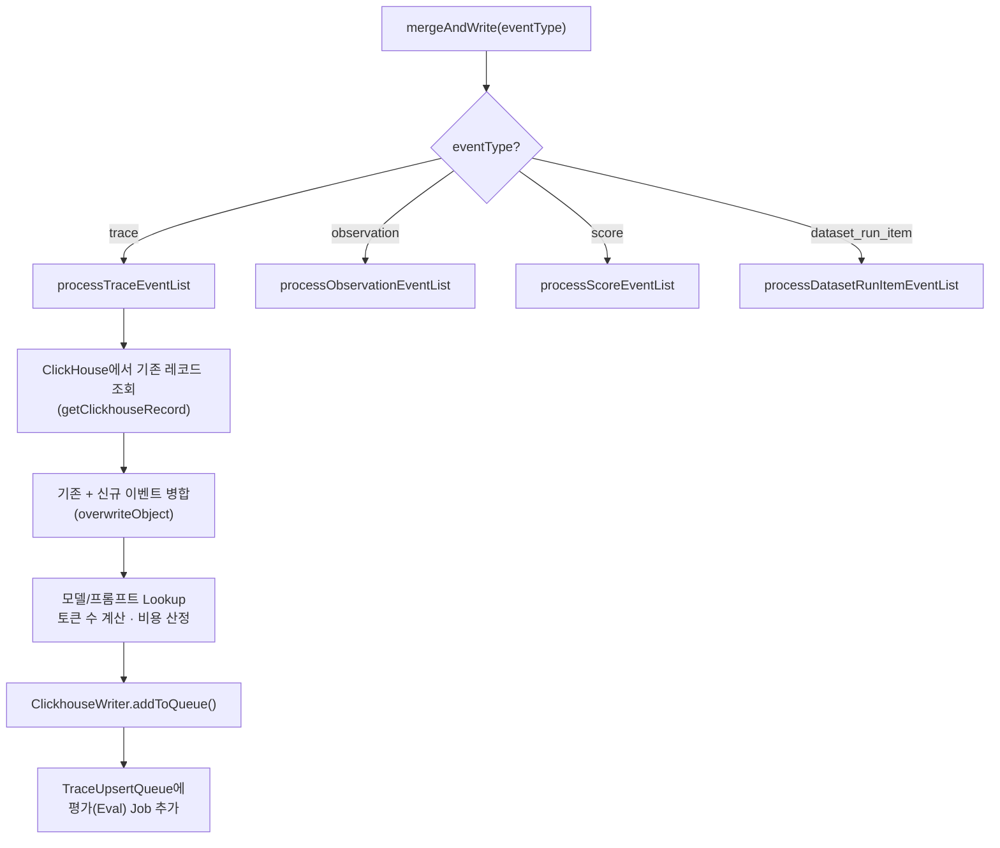
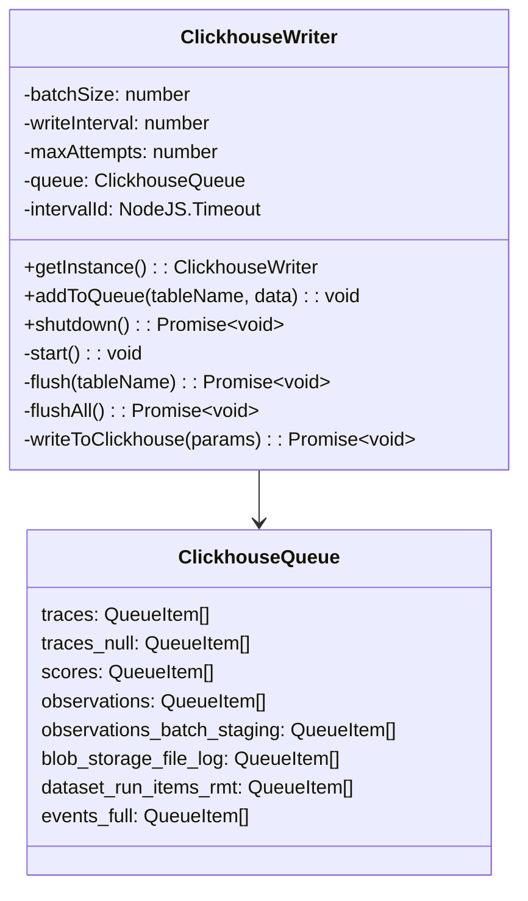
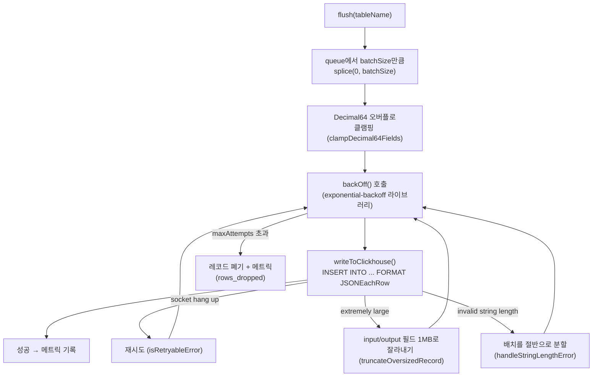

# 11 Worker Source Breakdown

> **선행 문서**: [07 Queue and Worker System Anatomy](../40-anatomy-deep-dive/07-queue-and-worker-system.md) · [10 Ingestion Source Breakdown](./10-ingestion-source-breakdown.md)
> **분석 대상 소스**:
> - [`worker/src/queues/ingestionQueue.ts`](file:///Users/dhsshin/Documents/LLMOps/langfuse/worker/src/queues/ingestionQueue.ts) — BullMQ Processor 구현체
> - [`worker/src/queues/workerManager.ts`](file:///Users/dhsshin/Documents/LLMOps/langfuse/worker/src/queues/workerManager.ts) — 워커 등록·메트릭·에러 핸들링
> - [`worker/src/services/ClickhouseWriter/index.ts`](file:///Users/dhsshin/Documents/LLMOps/langfuse/worker/src/services/ClickhouseWriter/index.ts) — 메모리 버퍼 + Batch Insert
> - [`worker/src/services/IngestionService/index.ts`](file:///Users/dhsshin/Documents/LLMOps/langfuse/worker/src/services/IngestionService/index.ts) — 이벤트 병합 및 enrichment

---

## 워커 내부 전체 흐름도

하나의 BullMQ Job이 Dequeue되어 ClickHouse에 최종 기록되기까지의 전체 의사결정 흐름입니다.

```mermaid
flowchart TD
    Dequeue["BullMQ Job Dequeue<br/>(ingestionQueueProcessorBuilder)"] --> BlobLog{ENABLE_BLOB_STORAGE<br/>_FILE_LOG?}
    BlobLog -- Yes --> WriteFileLog["ClickhouseWriter.addToQueue<br/>(BlobStorageFileLog)"]
    BlobLog -- No --> SeenCheck

    WriteFileLog --> SeenCheck{Redis에 최근<br/>처리 기록 존재?}
    SeenCheck -- Yes --> Skip["recordIncrement(skipped: true)<br/>→ return (종료)"]
    SeenCheck -- No --> SlowCheck{hasS3SlowdownFlag<br/>(projectId)?}

    SlowCheck -- Yes --> Redirect["SecondaryIngestionQueue.add()<br/>→ return (종료)"]
    SlowCheck -- No --> S3Download["S3에서 JSON 파일 다운로드<br/>(chunk 단위 병렬)"]

    S3Download --> SetSeen["Redis에 처리 완료<br/>캐시 저장 (TTL 5분)"]
    SetSeen --> MergeWrite["IngestionService<br/>.mergeAndWrite()"]

    MergeWrite --> EventSwitch{"이벤트 타입 분기<br/>(switch)"}
    EventSwitch --> Trace["processTraceEventList()"]
    EventSwitch --> Obs["processObservationEventList()"]
    EventSwitch --> Score["processScoreEventList()"]
    EventSwitch --> DSItem["processDatasetRunItemEventList()"]

    Trace --> CHWriter["ClickhouseWriter<br/>.addToQueue()"]
    Obs --> CHWriter
    Score --> CHWriter
    DSItem --> CHWriter

    CHWriter --> Buffer["메모리 버퍼 Array에 Push"]
    Buffer --> FlushCheck{배열 크기 ≥<br/>batchSize?}
    FlushCheck -- Yes --> Flush["flush() → writeToClickhouse()<br/>INSERT ... FORMAT JSONEachRow"]
    FlushCheck -- No --> Timer["setInterval 타이머 대기<br/>(writeInterval ms)"]
    Timer --> Flush
```

---

## 소스코드 라인 바이 라인 분석

### 1단계: Redis 중복 방지 캐시 — `ingestionQueue.ts` L83-106

🔗 [`ingestionQueue.ts` L83](file:///Users/dhsshin/Documents/LLMOps/langfuse/worker/src/queues/ingestionQueue.ts#L83-L106)

```typescript
if (env.LANGFUSE_ENABLE_REDIS_SEEN_EVENT_CACHE === "true" && redis && fileKey) {
  const key = `langfuse:ingestion:recently-processed:${projectId}:${type}:${eventBodyId}:${fileKey}`;
  const exists = await redis.exists(key);
  if (exists) {
    recordIncrement("langfuse.ingestion.recently_processed_cache", 1, {
      type: job.data.payload.data.type,
      skipped: "true",
    });
    return;  // ← S3 다운로드조차 하지 않고 즉시 종료
  }
}
```

| 키 포맷 | 용도 |
|---|---|
| `langfuse:ingestion:recently-processed:{projectId}:{type}:{entityId}:{fileKey}` | SDK 재시도 또는 BullMQ at-least-once 전달로 인한 중복 Job 방지 |

**왜 5분 TTL인가?** 처리 완료 후 Redis에 `EX 300` (L250)으로 캐시하여, 동일한 fileKey가 5분 이내에 다시 들어오면 S3 GET 비용과 CPU 연산을 절약합니다.

---

### 2단계: Secondary Queue 릴레이 — `ingestionQueue.ts` L108-133

🔗 [`ingestionQueue.ts` L108](file:///Users/dhsshin/Documents/LLMOps/langfuse/worker/src/queues/ingestionQueue.ts#L108-L133)



```typescript
const shouldRedirectSlowdown = await hasS3SlowdownFlag(projectId);
if (enableRedirectToSecondaryQueue && (shouldRedirectEnv || shouldRedirectSlowdown)) {
  const secondaryQueue = SecondaryIngestionQueue.getInstance({ shardingKey });
  await secondaryQueue.add(QueueName.IngestionSecondaryQueue, job.data);
  return;  // ← 메인 워커에서 즉시 이탈
}
```

> **Noisy Neighbor 방지**: 한 프로젝트가 초당 수만 건의 이벤트를 쏟아내더라도, 그 프로젝트만 별도의 느린 큐로 격리되어 다른 프로젝트의 처리 속도에 영향을 주지 않습니다.

---

### 3단계: S3 파일 다운로드 — `ingestionQueue.ts` L149-206

🔗 [`ingestionQueue.ts` L149](file:///Users/dhsshin/Documents/LLMOps/langfuse/worker/src/queues/ingestionQueue.ts#L149-L206)

두 가지 경로(Path)가 존재합니다:

| 경로 | 조건 | 동작 |
|---|---|---|
| **Direct Download** | `skipS3List === true` (OTel 이벤트 등) | 정확한 파일 경로로 바로 GET |
| **List + Download** | 그 외 | `s3Client.listFiles(prefix)` → `chunk(files, S3_CONCURRENT_READS)` → 배치별 `Promise.all(download)` |

```typescript
const S3_CONCURRENT_READS = env.LANGFUSE_S3_CONCURRENT_READS;
const batches = chunk(eventFiles, S3_CONCURRENT_READS);
for (const batch of batches) {
  const batchEvents = await Promise.all(batch.map(downloadAndParseFile));
  events.push(...batchEvents.flat());
}
```

> **성능 포인트**: `S3_CONCURRENT_READS` 값을 조절하여 S3 병렬 다운로드 수를 사내 네트워크 환경에 맞게 튜닝할 수 있습니다.

---

### 4단계: IngestionService.mergeAndWrite — 이벤트 병합의 핵심

🔗 [`IngestionService/index.ts` L149](file:///Users/dhsshin/Documents/LLMOps/langfuse/worker/src/services/IngestionService/index.ts#L149-L195)

```typescript
public async mergeAndWrite(
  eventType: IngestionEntityTypes,  // "trace" | "observation" | "score" | "dataset_run_item"
  projectId: string,
  eventBodyId: string,
  createdAtTimestamp: Date,
  events: IngestionEventType[],
  forwardToEventsTable: boolean,
): Promise<void> {
  switch (eventType) {
    case "trace":
      return await this.processTraceEventList({ ... });
    case "observation":
      return await this.processObservationEventList({ ... });
    case "score":
      return await this.processScoreEventList({ ... });
    case "dataset_run_item":
      return await this.processDatasetRunItemEventList({ ... });
  }
}
```



각 `processXxxEventList` 메서드의 핵심은:
1. ClickHouse에서 **동일 ID의 기존 레코드**를 읽어와서 (`getClickhouseRecord`)
2. 시간순으로 정렬된 새 이벤트 배열과 **병합**하고 (`mergeTraceRecords` 등)
3. `ClickhouseWriter.addToQueue`로 메모리 버퍼에 추가합니다.

---

### 5단계: ClickhouseWriter — 메모리 버퍼링 + Batch Flush

🔗 [`ClickhouseWriter/index.ts` L32](file:///Users/dhsshin/Documents/LLMOps/langfuse/worker/src/services/ClickhouseWriter/index.ts#L32-L96)



#### `addToQueue()` — L548-566

```typescript
public addToQueue<T extends TableName>(tableName: T, data: RecordInsertType<T>) {
  const entityQueue = this.queue[tableName];
  entityQueue.push({
    createdAt: Date.now(),
    attempts: 1,
    data,
  });

  if (entityQueue.length >= this.batchSize) {
    this.flush(tableName);  // ← 즉시 Flush 트리거
  }
}
```

#### `flush()` — L356-546 (에러 복구 전략)



| 에러 유형 | 복구 전략 | 코드 위치 |
|---|---|---|
| `socket hang up` | 지수 백오프 후 재시도 | L402-414 |
| `size of JSON object extremely large` | `input`/`output`/`metadata` 필드를 1MB로 잘라낸 뒤 재시도 | L446-466 |
| `invalid string length` (V8 문자열 제한) | 배치를 절반으로 나누고 나머지를 큐 앞쪽에 다시 넣음 | L415-445 |
| 모든 재시도 실패 | `maxAttempts` 초과 시 레코드 폐기 + `rows_dropped` 메트릭 | L508-544 |

---

### WorkerManager — 워커 등록 및 Observability

🔗 [`workerManager.ts` L127](file:///Users/dhsshin/Documents/LLMOps/langfuse/worker/src/queues/workerManager.ts#L127-L186)

```typescript
public static register(
  queueName: QueueName,
  processor: Processor,
  additionalOptions: Partial<WorkerOptions> = {},
): void {
  const worker = new Worker(
    queueName,
    WorkerManager.metricWrapper(processor, queueName),  // ← 메트릭 래핑
    { connection: redisInstance, prefix: getQueuePrefix(queueName), ... }
  );
  // ...
  worker.on("failed", (job, err) => { traceException(err); recordIncrement(metric + ".failed"); });
  worker.on("error", (failedReason) => { traceException(failedReason); recordIncrement(metric + ".error"); });
}
```

`metricWrapper`는 모든 Job 처리를 감싸서 **대기 시간(wait_time)**, **처리 시간(processing_time)**, **큐 깊이(queue_length)**, **DLQ 깊이(dlq_length)**, **활성 Job 수(active)** 를 자동으로 Datadog에 보고합니다.

---

## 다음 문서

ClickHouse에 적재된 데이터가 대시보드 쿼리에서 어떻게 읽히는지는 👉 [12 Query Source Breakdown](./12-query-source-breakdown.md)에서 이어집니다.
