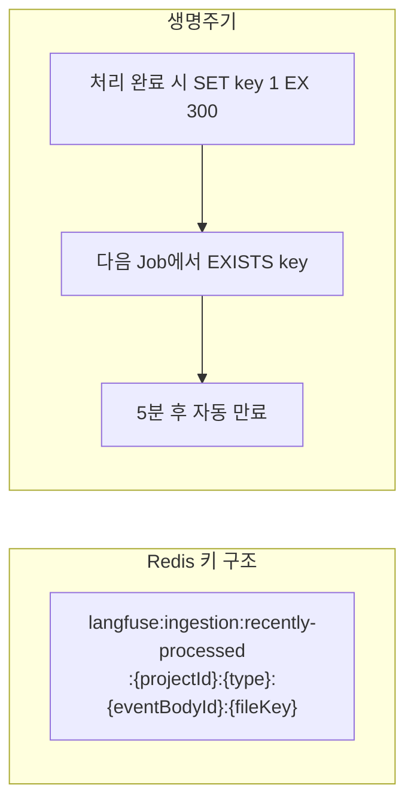
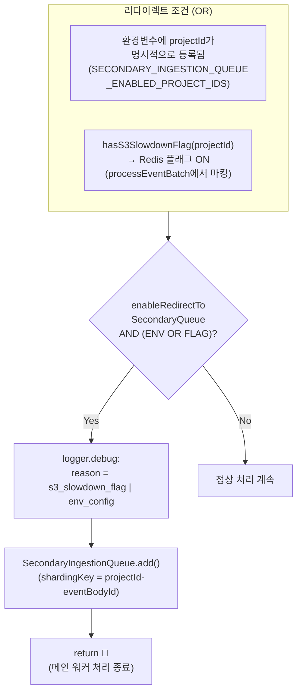
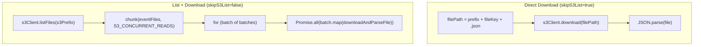
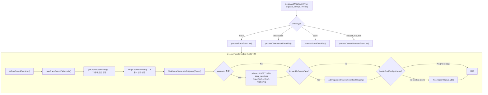
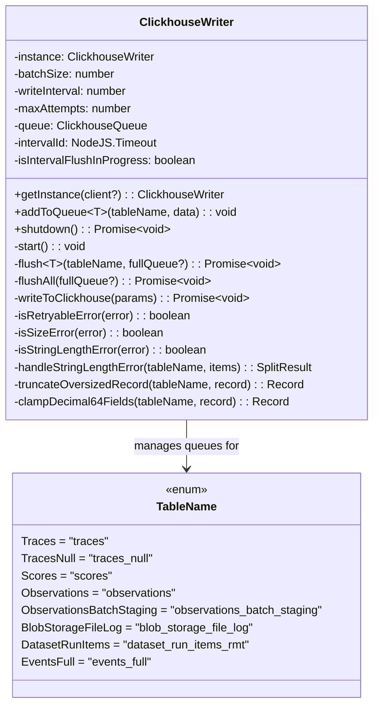
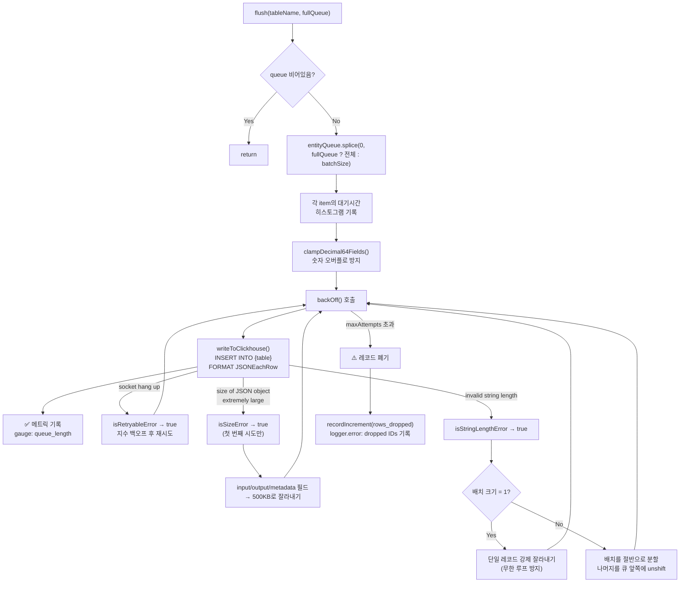

# 11 Worker Source Breakdown

> **선행 문서**: [07 Queue and Worker System Anatomy](../40-anatomy-deep-dive/07-queue-and-worker-system.md) · [10 Ingestion Source Breakdown](./10-ingestion-source-breakdown.md)
>
> **분석 대상 소스**:
> | 파일 | 줄 수 | 역할 |
> |---|---|---|
> | [`worker/src/queues/ingestionQueue.ts`](file:///Users/dhsshin/Documents/LLMOps/langfuse/worker/src/queues/ingestionQueue.ts) | 306 | BullMQ Processor — Job Dequeue부터 ClickHouse까지 |
> | [`worker/src/queues/workerManager.ts`](file:///Users/dhsshin/Documents/LLMOps/langfuse/worker/src/queues/workerManager.ts) | 187 | 워커 등록, 메트릭 래핑, 에러 핸들링 |
> | [`worker/src/services/ClickhouseWriter/index.ts`](file:///Users/dhsshin/Documents/LLMOps/langfuse/worker/src/services/ClickhouseWriter/index.ts) | 643 | 메모리 버퍼 + Batch Insert + 에러 복구 |
> | [`worker/src/services/IngestionService/index.ts`](file:///Users/dhsshin/Documents/LLMOps/langfuse/worker/src/services/IngestionService/index.ts) | 1736 | 이벤트 병합, 모델/토큰 enrichment |

---

## 워커 전체 의사결정 플로우차트

`ingestionQueueProcessorBuilder`의 return 함수(L36-304) 내부의 **모든 분기를 누락 없이** 매핑한 플로우차트입니다.

```mermaid
flowchart TD
    Dequeue["Job Dequeue<br/>(BullMQ Worker)"] --> Span["OpenTelemetry span에<br/>job.id, projectId, type 기록<br/>(L38-57)"]

    Span --> BlobCheck{"ENABLE_BLOB_STORAGE<br/>_FILE_LOG === 'true'<br/>AND fileKey 존재?<br/>(L62-81)"}
    BlobCheck -- Yes --> BlobWrite["ClickhouseWriter.addToQueue<br/>(BlobStorageFileLog)<br/>→ S3 파일 경로 메타데이터 기록"]
    BlobCheck -- No --> SeenCheck

    BlobWrite --> SeenCheck{"ENABLE_REDIS_SEEN<br/>_EVENT_CACHE === 'true'<br/>AND redis AND fileKey?<br/>(L84-106)"}

    SeenCheck -- 조건 미충족 --> SlowCheck
    SeenCheck -- 조건 충족 --> RedisExists{"redis.exists(key)?<br/>(L90)"}
    RedisExists -- exists=1 --> Skip["recordIncrement(skipped: true)<br/>→ return 🛑"]
    RedisExists -- exists=0 --> RecordMiss["recordIncrement(skipped: false)"]
    RecordMiss --> SlowCheck

    SlowCheck{"enableRedirectToSecondary<br/>Queue?<br/>(L114-133)"}
    SlowCheck -- No --> S3Download
    SlowCheck -- Yes --> SlowOr{"projectId가 환경변수<br/>목록에 있거나<br/>hasS3SlowdownFlag?"}
    SlowOr -- No --> S3Download
    SlowOr -- Yes --> Redirect["SecondaryIngestionQueue<br/>.add(job.data)<br/>→ return 🛑"]

    S3Download --> PathCheck{shouldSkipS3List?<br/>(L158-160)}
    PathCheck -- Yes --> DirectDL["Direct Download<br/>s3Client.download(filePath)<br/>(L165-179)"]
    PathCheck -- No --> ListDL["s3Client.listFiles(prefix)<br/>→ chunk(files, S3_CONCURRENT_READS)<br/>→ 배치별 Promise.all(download)<br/>(L180-206)"]

    DirectDL --> SetSeen
    ListDL --> SetSeen

    SetSeen["Redis에 처리 완료 캐시 저장<br/>redis.set(key, '1', 'EX', 300)<br/>(L241-261)"]

    SetSeen --> EmptyCheck{events.length === 0?<br/>(L231)}
    EmptyCheck -- Yes --> WarnReturn["logger.warn → return 🛑"]
    EmptyCheck -- No --> Forward["forwardToEventsTable 결정<br/>(L269-271)"]

    Forward --> MergeWrite["new IngestionService().mergeAndWrite()<br/>(L273-285)"]
    MergeWrite --> Done["처리 완료 ✅"]

    MergeWrite -- Exception --> CatchBlock{"catch(e): isS3SlowDownError?<br/>(L286-303)"}
    CatchBlock -- Yes --> MarkSlow["markProjectS3Slowdown(projectId)"]
    CatchBlock -- No --> LogThrow["logger.error → throw e"]
    MarkSlow --> LogThrow
```

---

## Phase 1: BlobStorageFileLog 기록 (L62-81)

🔗 [`ingestionQueue.ts` L62](file:///Users/dhsshin/Documents/LLMOps/langfuse/worker/src/queues/ingestionQueue.ts#L62-L81)

```typescript
if (env.LANGFUSE_ENABLE_BLOB_STORAGE_FILE_LOG === "true" && fileKey) {
  const fileName = `${job.data.payload.data.fileKey}.json`;
  clickhouseWriter.addToQueue(TableName.BlobStorageFileLog, {
    id: randomUUID(),
    project_id: projectId,
    entity_type: getClickhouseEntityType(job.data.payload.data.type),
    entity_id: job.data.payload.data.eventBodyId,
    event_id: job.data.payload.data.fileKey,
    bucket_name: env.LANGFUSE_S3_EVENT_UPLOAD_BUCKET,
    bucket_path: `${prefix}${projectId}/${entityType}/${eventBodyId}/${fileName}`,
    // ...timestamps
  });
}
```

> **왜 필요한가?**: S3에 저장된 파일의 메타데이터를 ClickHouse에도 기록해두면, 데이터 보존(Retention) 만료 시 해당 S3 파일을 일괄 삭제할 때 `blob_storage_file_log` 테이블에서 경로를 조회할 수 있습니다.

---

## Phase 2: Redis 중복 방지 캐시 (L84-106)

🔗 [`ingestionQueue.ts` L84](file:///Users/dhsshin/Documents/LLMOps/langfuse/worker/src/queues/ingestionQueue.ts#L84-L106)



**중복 발생 시나리오**:
1. SDK의 네트워크 재시도 → 동일 이벤트 2회 전송 → S3에 같은 파일 2번 업로드 → 큐에 2개 Job
2. BullMQ의 At-least-once 전달 보장 → 동일 Job이 2번 Dequeue될 수 있음
3. 워커가 Job 처리 중 OOM → BullMQ가 해당 Job을 다시 큐에 넣음

**비용 절약 효과**: Redis `EXISTS` 조회 비용 ≈ 0.1ms vs S3 `GET` + JSON 파싱 + ClickHouse 병합 비용 ≈ 50-200ms

---

## Phase 3: Secondary Queue 릴레이 (L108-133)

🔗 [`ingestionQueue.ts` L108](file:///Users/dhsshin/Documents/LLMOps/langfuse/worker/src/queues/ingestionQueue.ts#L108-L133)



> **Noisy Neighbor 방지**: 트래픽 폭주 프로젝트를 별도 큐로 격리하여 다른 프로젝트의 SLA를 보호합니다.

---

## Phase 4: S3 파일 다운로드 (L149-206)

🔗 [`ingestionQueue.ts` L149](file:///Users/dhsshin/Documents/LLMOps/langfuse/worker/src/queues/ingestionQueue.ts#L149-L206)



| 메트릭 | 용도 |
|---|---|
| `langfuse.ingestion.s3_file_size_bytes` | 다운로드된 파일 크기 히스토그램 |
| `langfuse.ingestion.count_files_distribution` | 한 Job에서 처리한 파일 개수 분포 |

---

## Phase 5: IngestionService.mergeAndWrite (1736줄의 핵심)

🔗 [`IngestionService/index.ts` L149](file:///Users/dhsshin/Documents/LLMOps/langfuse/worker/src/services/IngestionService/index.ts#L149-L195)



**이벤트 병합 규칙 (Immutable Keys)**:

🔗 [`IngestionService/index.ts` L86](file:///Users/dhsshin/Documents/LLMOps/langfuse/worker/src/services/IngestionService/index.ts#L86-L135)

```typescript
const immutableEntityKeys = {
  [TableName.Traces]:       ["id", "project_id", "timestamp", "created_at", "environment"],
  [TableName.Scores]:       ["id", "project_id", "timestamp", "trace_id", "created_at", "environment"],
  [TableName.Observations]: ["id", "project_id", "trace_id", "start_time", "created_at", "environment"],
};
```

> 이 필드들은 Update 이벤트가 와도 **절대 덮어쓰이지 않습니다**. 최초 Create 이벤트에서 설정된 값이 영구히 유지됩니다.

---

## Phase 6: ClickhouseWriter — 메모리 버퍼 & Flush

🔗 [`ClickhouseWriter/index.ts` L32](file:///Users/dhsshin/Documents/LLMOps/langfuse/worker/src/services/ClickhouseWriter/index.ts#L32-L96)

### 싱글톤 아키텍처



### Flush 메커니즘 상세 (L356-546)



### Decimal64 오버플로 방어 (L280-354)

🔗 [`ClickhouseWriter/index.ts` L280](file:///Users/dhsshin/Documents/LLMOps/langfuse/worker/src/services/ClickhouseWriter/index.ts#L280-L354)

```typescript
const DECIMAL_64_12_LIMIT = new Decimal("1e6");  // 999,999.999999999999 까지만 허용
```

ClickHouse의 `Decimal64(12)` 타입은 범위가 제한적(-10^6 ~ 10^6)입니다. SDK가 비정상적으로 큰 비용값을 보내면 ClickHouse Insert가 실패하므로, 워커가 미리 값을 클램핑합니다.

---

## 환경변수 전체 정리

| 환경변수 | 기본값 | 설명 |
|---|---|---|
| `LANGFUSE_ENABLE_BLOB_STORAGE_FILE_LOG` | `"false"` | S3 파일 메타데이터를 ClickHouse에 기록할지 여부 |
| `LANGFUSE_ENABLE_REDIS_SEEN_EVENT_CACHE` | `"false"` | Redis 중복 방지 캐시 사용 여부 |
| `LANGFUSE_SECONDARY_INGESTION_QUEUE_ENABLED_PROJECT_IDS` | — | 강제 Secondary Queue 프로젝트 ID 목록 (쉼표 구분) |
| `LANGFUSE_S3_CONCURRENT_READS` | — | S3 병렬 다운로드 수 (사내 네트워크에 맞게 튜닝) |
| `LANGFUSE_INGESTION_CLICKHOUSE_WRITE_BATCH_SIZE` | — | flush 시 한 번에 Insert할 최대 레코드 수 |
| `LANGFUSE_INGESTION_CLICKHOUSE_WRITE_INTERVAL_MS` | — | setInterval flush 주기 (ms) |
| `LANGFUSE_INGESTION_CLICKHOUSE_MAX_ATTEMPTS` | — | flush 최대 재시도 횟수 (초과 시 레코드 폐기) |
| `LANGFUSE_EXPERIMENT_INSERT_INTO_EVENTS_TABLE` | `"false"` | events_full 테이블에 이중 기록 여부 |

---

## WorkerManager — 메트릭 자동 수집

🔗 [`workerManager.ts` L41](file:///Users/dhsshin/Documents/LLMOps/langfuse/worker/src/queues/workerManager.ts#L41-L110)

`metricWrapper`가 모든 Job 처리를 감싸서 **자동으로 수집하는 메트릭 목록**:

| 메트릭 | 타입 | 태그 | 의미 |
|---|---|---|---|
| `{queue}.request` | increment | — | Job 실행 시작 |
| `{queue}.rate` | increment | type=request\|failed\|error, shard | Job 실행률 (샤드별) |
| `{queue}.wait_time` | histogram | ms | 큐 대기 시간 |
| `{queue}.processing_time` | histogram | ms | Job 처리 시간 |
| `{queue}.length` | gauge | records | 큐 대기 깊이 |
| `{queue}.dlq_length` | gauge | records | Dead Letter Queue 깊이 |
| `{queue}.active` | gauge | records | 현재 처리 중인 Job 수 |
| `{queue}.failed` | increment | — | Job 실패 |
| `{queue}.error` | increment | — | Worker 에러 |

---

## 다음 문서

ClickHouse에 적재된 데이터가 프론트엔드 쿼리에서 어떻게 읽히는지는 👉 [12 Query Source Breakdown](./12-query-source-breakdown.md)에서 이어집니다.
