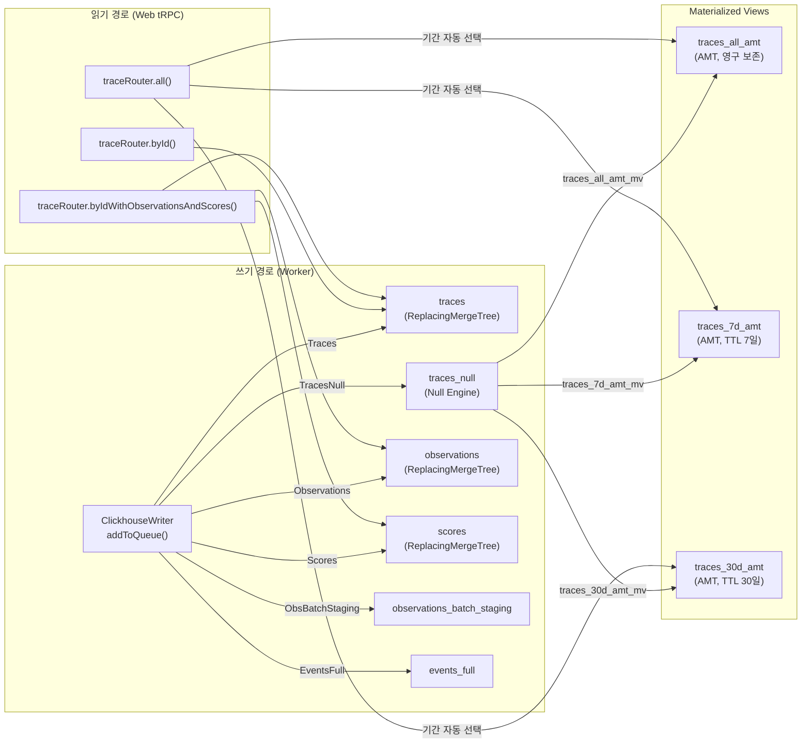
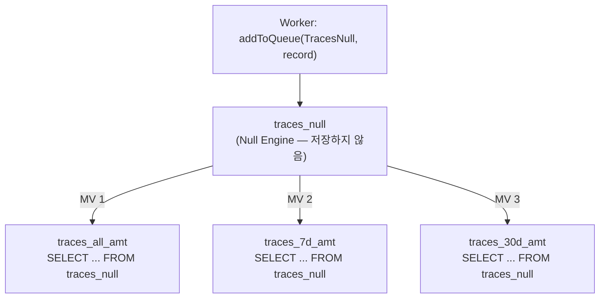
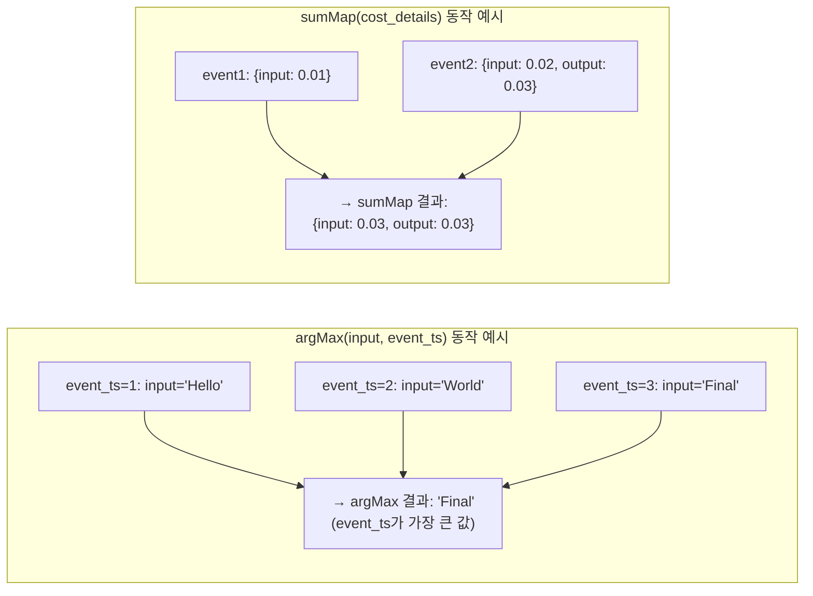
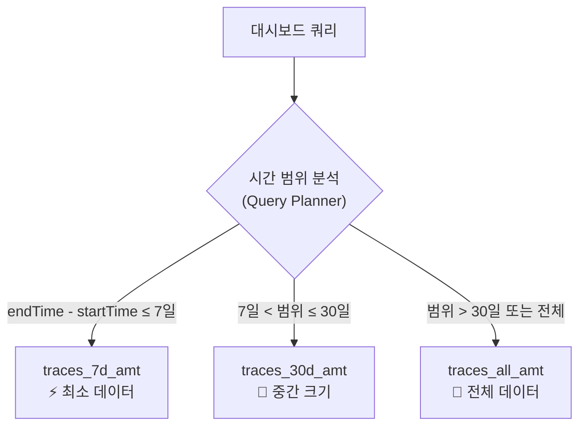
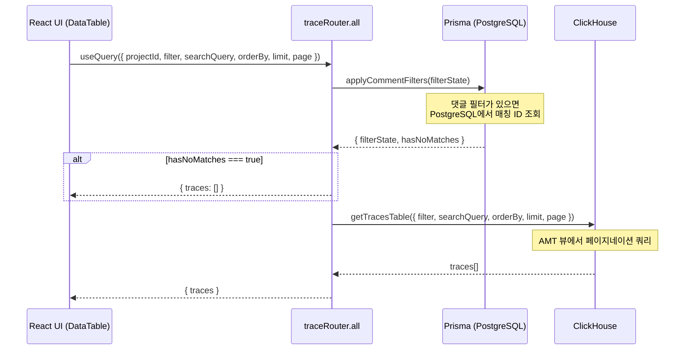
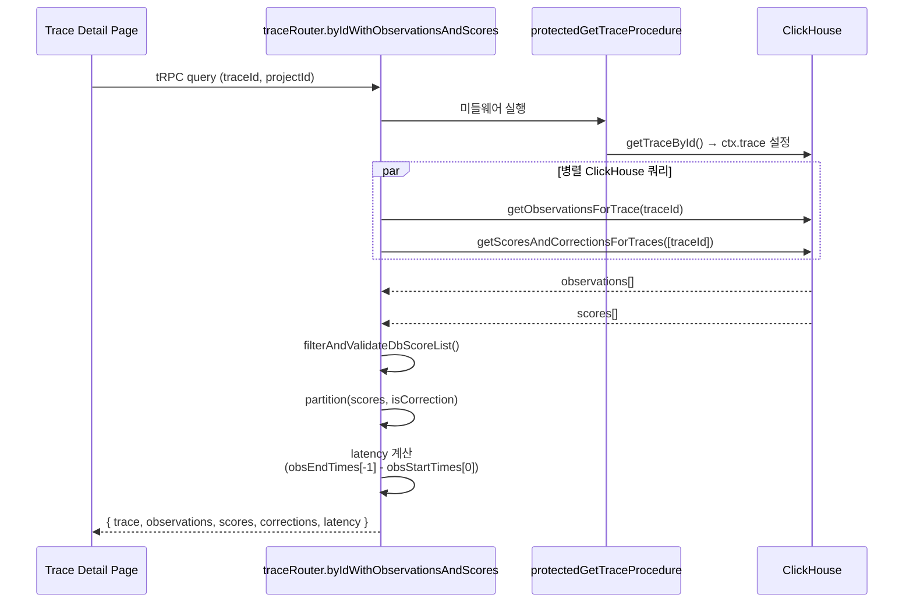
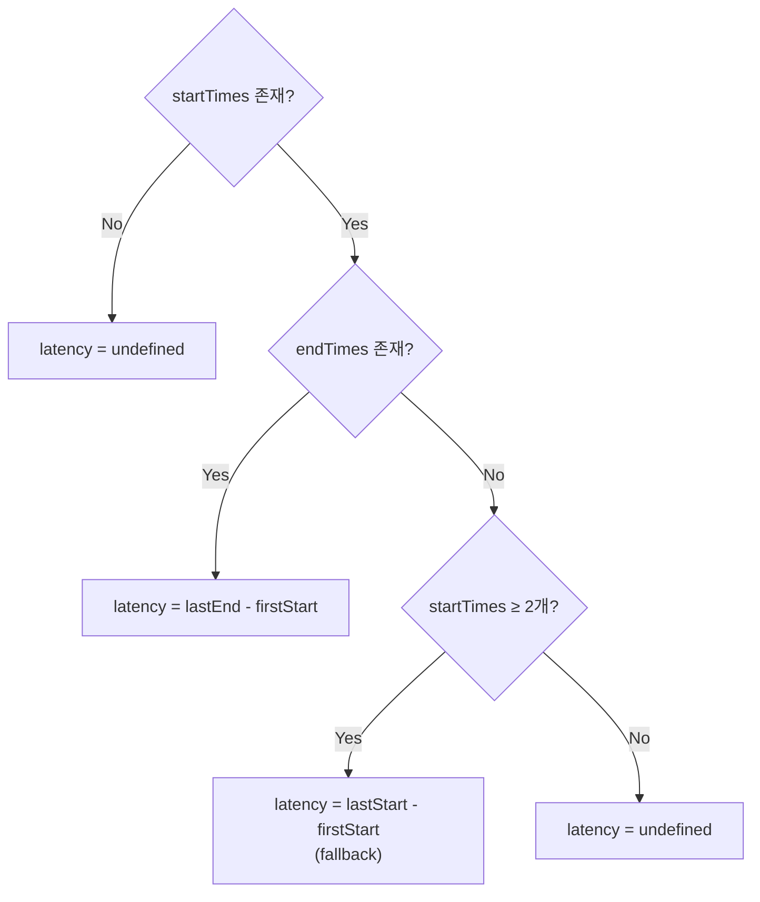
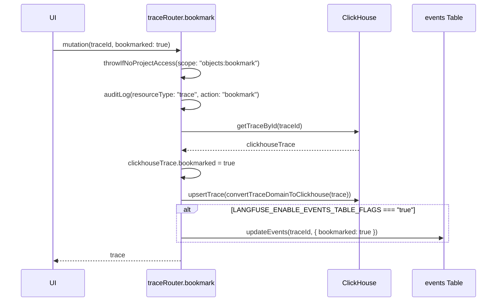
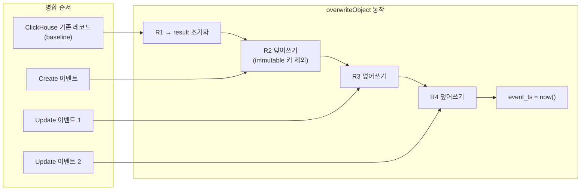

# 12 Query Source Breakdown

> **선행 문서**: [08 ClickHouse Schema & MVs](../40-anatomy-deep-dive/08-clickhouse-schema-and-mvs.md) · [09 tRPC and Next.js](../40-anatomy-deep-dive/09-trpc-and-nextjs.md)
>
> **분석 대상 소스**:
> | 파일 | 줄 수 | 역할 |
> |---|---|---|
> | [`packages/shared/clickhouse/migrations/unclustered/0023_traces_aggregating_merge_trees.up.sql`](file:///Users/dhsshin/Documents/LLMOps/langfuse/packages/shared/clickhouse/migrations/unclustered/0023_traces_aggregating_merge_trees.up.sql) | — | ClickHouse AMT 스키마 정의 |
> | [`web/src/server/api/routers/traces.ts`](file:///Users/dhsshin/Documents/LLMOps/langfuse/web/src/server/api/routers/traces.ts) | ~735 | tRPC 라우터 (대시보드 쿼리 전체) |
> | [`worker/src/services/IngestionService/index.ts`](file:///Users/dhsshin/Documents/LLMOps/langfuse/worker/src/services/IngestionService/index.ts) | ~1935 | 이벤트 병합 로직 (데이터가 적재되는 방식 이해 필수) |

---

## ClickHouse 데이터 흐름 전체 구조



---

## 1. ClickHouse 집계 테이블 상세 분석

### 1.1 Null Engine 트리거 패턴

🔗 [`0023...sql` L3-39](file:///Users/dhsshin/Documents/LLMOps/langfuse/packages/shared/clickhouse/migrations/unclustered/0023_traces_aggregating_merge_trees.up.sql#L3-L39)



> **왜 Null Engine인가?**: 하나의 INSERT로 3개의 AMT 테이블에 동시 분기합니다. Null 테이블 자체는 데이터를 물리적으로 보관하지 않아 스토리지 비용이 0입니다.

### 1.2 AggregatingMergeTree 집계 함수 전체 매핑

| 집계 함수 | 적용 컬럼 | 동작 | SQL 예시 |
|---|---|---|---|
| `min` | `start_time`, `created_at` | 가장 이른 값 유지 | `SimpleAggregateFunction(min, DateTime64(3))` |
| `max` | `end_time`, `updated_at` | 가장 늦은 값 유지 | `SimpleAggregateFunction(max, DateTime64(3))` |
| `sumMap` | `cost_details`, `usage_details` | Map 키별 값 합산 | `SimpleAggregateFunction(sumMap, Map(String, Decimal(38,12)))` |
| `maxMap` | `metadata` | Map 키별 최신값 유지 | `SimpleAggregateFunction(maxMap, Map(String, String))` |
| `groupUniqArrayArray` | `tags`, `observation_ids`, `score_ids` | 중복 없는 유니크 배열 | `SimpleAggregateFunction(groupUniqArrayArray, Array(String))` |
| `argMax(val, ts)` | `input`, `output`, `bookmarked`, `public` | 최신 타임스탬프의 값만 | `AggregateFunction(argMax, String, DateTime64(3))` |
| `any` | `name`, `user_id`, `session_id`, `release`, `environment` | NULL이 아닌 첫 번째 값 | `SimpleAggregateFunction(any, String)` |



### 1.3 TTL 기반 뷰 선택 전략



| 테이블 | TTL | 예상 크기 (상대값) | 쿼리 속도 |
|---|---|---|---|
| `traces_7d_amt` | `toDate(start_time) + 7 DAY` | 1x | ⚡ 최고속 |
| `traces_30d_amt` | `toDate(start_time) + 30 DAY` | 4x | 🔹 빠름 |
| `traces_all_amt` | 없음 (영구) | 100x+ | 🔶 보통 |

> **커스터마이징**: TTL을 사내 정책에 맞게 수정하여 스토리지 비용과 쿼리 성능을 최적화할 수 있습니다 (예: 14일, 90일).

---

## 2. tRPC 라우터 전체 프로시저 맵

🔗 [`traces.ts`](file:///Users/dhsshin/Documents/LLMOps/langfuse/web/src/server/api/routers/traces.ts)

| 프로시저 | 시작 위치 | 타입 | 역할 |
|---|---|---|---|
| `hasTracingConfigured` | L110 | query | 프로젝트 트레이싱 구성 여부 확인 |
| `all` | L137 | query | Trace 목록 조회 (with 필터/정렬/페이지네이션) |
| `countAll` | L171 | query | 전체 Trace 수 카운트 |
| `metrics` | L204 | query | 대시보드용 집계 메트릭 |
| `filterOptions` | L286 | query | 필터 UI용 distinct 값 목록 |
| `byId` | L359 | query | 단일 Trace 상세 |
| `byIdWithObservationsAndScores` | L385 | query | Trace + Obs + Scores 통합 |
| `deleteMany` | L462 | mutation | 복수 Trace 삭제 |
| `bookmark` | L546 | mutation | Trace 북마크 토글 |
| `publish` | L606 | mutation | Trace 공개 상태 변경 |
| `getAgentGraphData` | L665 | query | Agent 그래프 데이터 |

### 2.1 `traceRouter.all` — 메인 대시보드 목록 쿼리

🔗 [`traces.ts` — `traceRouter.all` 프로시저](file:///Users/dhsshin/Documents/LLMOps/langfuse/web/src/server/api/routers/traces.ts#L137)



### 2.2 `traceRouter.filterOptions` — 6개 병렬 ClickHouse 쿼리

🔗 [`traces.ts` — `traceRouter.metrics` 프로시저](file:///Users/dhsshin/Documents/LLMOps/langfuse/web/src/server/api/routers/traces.ts#L204)

```mermaid
flowchart LR
    subgraph Input["입력"]
        PI["projectId"]
        TF["timestampFilter[]"]
    end

    subgraph ParallelQueries["Promise.all (6개 동시)"]
        Q1["getNumericScoresGroupedByName()"]
        Q2["getCategoricalScoresGroupedByName()"]
        Q3["getTracesGroupedByName()"]
        Q4["getTracesGroupedByTags()"]
        Q5["getTracesGroupedByUsers()"]
        Q6["getTracesGroupedBySessionId()"]
    end

    subgraph Output["응답"]
        R1["scores_avg: string[]"]
        R2["score_categories: object[]"]
        R3["name: { value, count }[]"]
        R4["tags: string[]"]
        R5["users: { value, count }[]"]
        R6["sessions: { value, count }[]"]
    end

    Input --> ParallelQueries --> Output
```



> **성능**: 6개의 독립 쿼리를 `Promise.all`로 동시 실행하여 **가장 느린 쿼리 하나의 시간만큼만 대기**합니다.

### 2.3 `traceRouter.byIdWithObservationsAndScores` — 상세 페이지

🔗 [`traces.ts` — `traceRouter.byIdWithObservationsAndScores` 프로시저](file:///Users/dhsshin/Documents/LLMOps/langfuse/web/src/server/api/routers/traces.ts#L385)



**Latency 계산 로직** (L394-410):

```typescript
const latencyMs =
  obsStartTimes.length > 0
    ? obsEndTimes.length > 0
      ? obsEndTimes[obsEndTimes.length - 1].getTime() - obsStartTimes[0].getTime()
      : obsStartTimes.length > 1
        ? obsStartTimes[obsStartTimes.length - 1].getTime() - obsStartTimes[0].getTime()
        : undefined
    : undefined;
```



### 2.4 `traceRouter.bookmark` — ClickHouse Upsert 패턴

🔗 [`traces.ts` L475-534](file:///Users/dhsshin/Documents/LLMOps/langfuse/web/src/server/api/routers/traces.ts#L475-L534)



> **주목**: ClickHouse에서는 `UPDATE`가 없으므로, "북마크 토글"도 실제로는 **전체 레코드를 새로 INSERT**하는 방식(`upsertTrace`)으로 처리됩니다. `ReplacingMergeTree`가 백그라운드에서 구버전 레코드를 제거합니다.

---

## 3. 병합 로직과 쿼리의 연결고리

워커의 `mergeRecords()` 함수가 어떻게 동작하는지 이해하면, ClickHouse 쿼리 결과를 올바르게 해석할 수 있습니다.

🔗 [`IngestionService/index.ts` — `mergeRecords()`](file:///Users/dhsshin/Documents/LLMOps/langfuse/worker/src/services/IngestionService/index.ts#L1114)

```typescript
private mergeRecords<T extends InsertRecord>(
  records: T[],                     // [clickhouseRecord, ...newEvents]
  immutableEntityKeys: string[],
): Record<string, unknown> {
  let result = { id: records[0].id, project_id: records[0].project_id };
  for (const record of records) {
    result = overwriteObject(result, record, immutableEntityKeys);
  }
  result.event_ts = new Date().getTime();  // ← 병합 시점 타임스탬프
  return result;
}
```



> **ClickHouse Record가 왜 먼저 오는가?**: 기존 레코드를 baseline으로 놓고 새 이벤트가 순서대로 덮어쓰면, `immutableEntityKeys`(id, project_id, timestamp 등)는 최초 Create 시점의 값이 보존됩니다.

---

## 관련 문서 네비게이션

| 방향 | 문서 |
|---|---|
| ⬆️ 구조 해부 | [08 ClickHouse Schema & MVs](../40-anatomy-deep-dive/08-clickhouse-schema-and-mvs.md) |
| ⬆️ tRPC 해부 | [09 tRPC and Next.js](../40-anatomy-deep-dive/09-trpc-and-nextjs.md) |
| ⬅️ 이전 | [11 Worker Source Breakdown](./11-worker-source-breakdown.md) |
| ➡️ 다음 | [13 Customization Source Breakdown](./13-customization-source-breakdown.md) |
| 🏠 색인 | [README](../README.md) |
