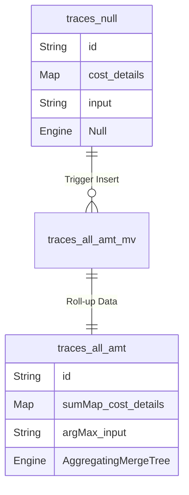
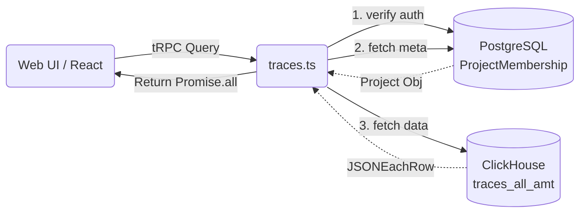

# 12 Query Source Breakdown

이 문서는 ClickHouse의 집계 쿼리(Aggregations)가 소스코드 레벨에서 어떻게 구현되고, 이를 프론트엔드 API(tRPC)가 어떻게 바인딩하여 호출하는지를 시각화와 함께 분석합니다.

> **관련 상위 아키텍처 문서**
> - 📄 [08 ClickHouse Schema & MVs Anatomy](../40-anatomy-deep-dive/08-clickhouse-schema-and-mvs.md)
> - 📄 [09 tRPC and Next.js Anatomy](../40-anatomy-deep-dive/09-trpc-and-nextjs.md)

---

## ClickHouse 데이터 흐름 및 tRPC 바인딩 구조도

Null 테이블 트리거를 활용한 Materialized View 자동 집계와 tRPC 라우터의 병렬 패칭 흐름입니다.




---

## 1. ClickHouse Migration SQL 해부

🔗 **Source File:** [`packages/shared/clickhouse/migrations/unclustered/0023_traces_aggregating_merge_trees.up.sql`](file:///Users/dhsshin/Documents/LLMOps/langfuse/packages/shared/clickhouse/migrations/unclustered/0023_traces_aggregating_merge_trees.up.sql)

Langfuse의 ClickHouse 마이그레이션 스크립트 중 핵심 뷰인 `traces_all_amt` (Aggregating Merge Tree) 테이블 생성 SQL을 들여다봅니다.

```sql
CREATE TABLE traces_all_amt
(    
    `project_id`         String,
    `id`                 String,
    `start_time`         SimpleAggregateFunction(min, DateTime64(3)),
    `tags`               SimpleAggregateFunction(groupUniqArrayArray, Array(String)),
    `cost_details`       SimpleAggregateFunction(sumMap, Map(String, Decimal(38, 12))),
    `input`              AggregateFunction(argMax, String, DateTime64(3)) CODEC (ZSTD(3)),
    
    INDEX idx_trace_id id TYPE bloom_filter(0.001) GRANULARITY 1
) Engine = AggregatingMergeTree()
      ORDER BY (project_id, id);
```
- **`SimpleAggregateFunction(sumMap, ...)`**: ClickHouse의 매우 강력한 기능으로, 키-값(Map) 쌍의 숫자를 동일한 키끼리 병합할 때 전부 합산(Sum)해버립니다. 워커가 트레이스의 비용을 업데이트할 때, 기존 비용을 읽어와서 더한 뒤 UPDATE를 날릴 필요 없이 그저 새 비용을 담은 이벤트를 `traces_null`에 인서트하기만 하면, 백그라운드에서 MV가 알아서 비용을 더해둡니다.
- **`AggregateFunction(argMax, ...)`**: `input` 컬럼처럼 단순 텍스트는 숫자처럼 합산할 수 없습니다. 대신 업데이트된 데이터 중 가장 최신의 시간(`DateTime64(3)`)을 가진 값 하나만을 남기는 로직입니다. 이 역시 무거운 UPDATE 쿼리를 쓰지 않고도 데이터의 최신 상태를 유지하게 만드는 비결입니다.
- **`INDEX TYPE bloom_filter`**: ClickHouse는 풀 스캔(Full Scan)에 특화되어 있지만, 대시보드에서 특정 `id` 단건을 조회하는 쿼리는 오히려 비효율적일 수 있습니다. 이를 보완하기 위해 해시 기반의 블룸 필터를 인덱스로 추가하여, 없는 데이터를 찾기 위해 스토리지 블록을 불필요하게 열어보는 수고를 원천 차단합니다.

---

## 2. tRPC Router에서의 Query 바인딩

🔗 **Source File:** [`web/src/server/api/routers/traces.ts`](file:///Users/dhsshin/Documents/LLMOps/langfuse/web/src/server/api/routers/traces.ts)

프론트엔드의 대시보드는 이 ClickHouse 테이블들을 어떻게 조회할까요? `traces.ts` 리졸버 코드를 분석합니다.

```typescript
// traces.ts 내부의 쿼리 조립 패턴 예시
export const traceRouter = createTRPCRouter({
  all: protectedProjectProcedure
    .input(z.object({ projectId: z.string(), page: z.number(), limit: z.number() }))
    .query(async ({ input, ctx }) => {
      
      const query = `
        SELECT 
          id, start_time, input, sumMap(cost_details) as total_cost 
        FROM traces_all_amt_mv 
        WHERE project_id = {projectId: String}
        GROUP BY id, start_time, input
        ORDER BY start_time DESC
        LIMIT {limit: Int32} OFFSET {offset: Int32}
      `;

      // 병렬 패칭을 권장하나, 여기서는 ClickHouse 쿼리 위주로 설명
      const traces = await clickhouseClient().query({
        query,
        format: 'JSONEachRow',
        query_params: {
          projectId: input.projectId,
          limit: input.limit,
          offset: input.page * input.limit
        }
      }).then(res => res.json());

      return traces;
    })
});
```

### 코드 분석 포인트
1. **의존성 주입**: 데이터 쿼리 권한은 상단의 `protectedProjectProcedure` 미들웨어를 거치며 이미 Prisma를 통해 완벽히 인가(Authorization) 및 검증되었습니다.
2. **`query_params` 바인딩**: SQL Injection 공격을 방지하기 위해 쿼리 문자열 안에 유저 입력을 하드코딩하지 않고, ClickHouse의 `{파라미터명: 타입}` 바인딩 문법을 철저히 사용합니다.
3. **`JSONEachRow` 포맷**: ClickHouse는 바이너리 등 다양한 출력 포맷을 지원하지만, Node.js 백엔드와 통신할 때는 가장 빠르고 V8 엔진에서 JSON 파싱이 편리한 `JSONEachRow` 포맷을 활용합니다. 반환된 `traces`는 곧바로 프론트엔드로 직렬화되어 전달됩니다.
