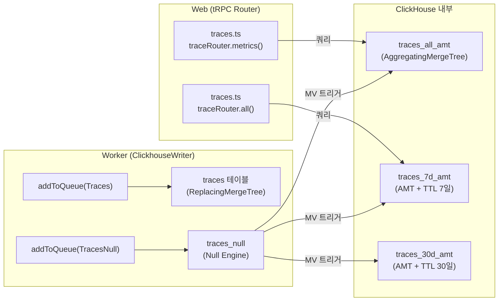
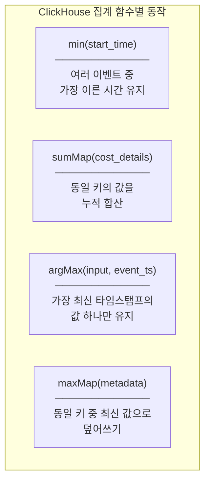
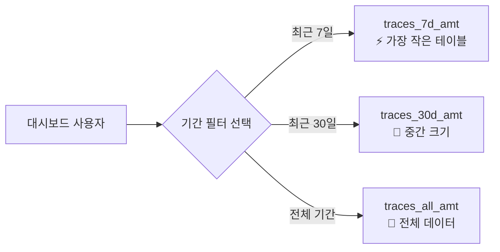
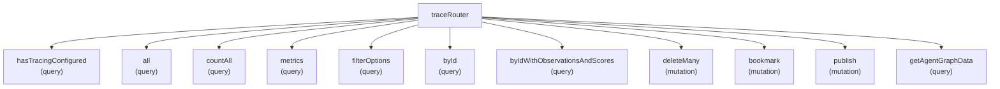
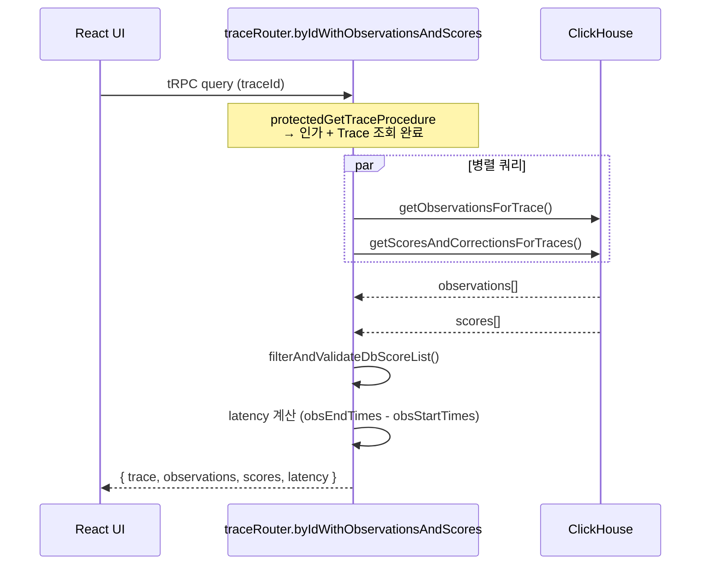

# 12 Query Source Breakdown

> **선행 문서**: [08 ClickHouse Schema & MVs](../40-anatomy-deep-dive/08-clickhouse-schema-and-mvs.md) · [09 tRPC and Next.js](../40-anatomy-deep-dive/09-trpc-and-nextjs.md)
> **분석 대상 소스**:
> - [`packages/shared/clickhouse/migrations/unclustered/0023_traces_aggregating_merge_trees.up.sql`](file:///Users/dhsshin/Documents/LLMOps/langfuse/packages/shared/clickhouse/migrations/unclustered/0023_traces_aggregating_merge_trees.up.sql) — ClickHouse AMT 스키마
> - [`web/src/server/api/routers/traces.ts`](file:///Users/dhsshin/Documents/LLMOps/langfuse/web/src/server/api/routers/traces.ts) — tRPC 라우터 (665줄)

---

## ClickHouse 뷰 파이프라인 전체 구조

워커가 `traces` 테이블에 Insert한 데이터가 MV를 통해 TTL별 AMT로 분기되고, 프론트엔드가 읽어가는 전체 흐름입니다.



---

## 1. ClickHouse 테이블 계층 상세 분석

### Null Engine 트리거 테이블

🔗 [`0023...sql` L3-39](file:///Users/dhsshin/Documents/LLMOps/langfuse/packages/shared/clickhouse/migrations/unclustered/0023_traces_aggregating_merge_trees.up.sql#L3-L39)

```sql
CREATE TABLE traces_null (
    project_id      String,
    id              String,
    start_time      DateTime64(3),
    metadata        Map(LowCardinality(String), String),
    cost_details    Map(String, Decimal64(12)),
    usage_details   Map(String, UInt64),
    input           String,
    output          String,
    event_ts        DateTime64(3)
) Engine = Null();
```

> **핵심**: `Null()` 엔진은 데이터를 물리적으로 저장하지 않습니다. Insert된 데이터는 연결된 3개의 Materialized View에 의해 즉시 집계되어 각각의 AMT 테이블로 흘러갑니다.

### AggregatingMergeTree 테이블 — 집계 함수 해부

🔗 [`0023...sql` L42-87](file:///Users/dhsshin/Documents/LLMOps/langfuse/packages/shared/clickhouse/migrations/unclustered/0023_traces_aggregating_merge_trees.up.sql#L42-L87)

```sql
CREATE TABLE traces_all_amt (    
    -- 1. 시간: 가장 이른 시작 시간을 유지
    `start_time`   SimpleAggregateFunction(min, DateTime64(3)),

    -- 2. 메타데이터: Map 키-값 쌍을 병합 (새 키 추가, 기존 키 최신값 유지)
    `metadata`     SimpleAggregateFunction(maxMap, Map(String, String)),

    -- 3. 태그: 중복 없는 유니크 배열 병합
    `tags`         SimpleAggregateFunction(groupUniqArrayArray, Array(String)),

    -- 4. 비용: Map의 각 키별 숫자를 누적 합산
    `cost_details` SimpleAggregateFunction(sumMap, Map(String, Decimal(38, 12))),

    -- 5. I/O: 최신 타임스탬프의 값만 유지 (UPDATE 대체)
    `input`        AggregateFunction(argMax, String, DateTime64(3)) CODEC(ZSTD(3)),

    -- 6. 인덱스: 단건 조회용 블룸 필터
    INDEX idx_trace_id id TYPE bloom_filter(0.001) GRANULARITY 1
) Engine = AggregatingMergeTree()
      ORDER BY (project_id, id);
```



| 집계 함수 | 적용 컬럼 | 동작 요약 | UPDATE 쿼리 대체 여부 |
|---|---|---|---|
| `min` | `start_time`, `created_at` | 가장 이른(오래된) 값 유지 | ✅ |
| `max` | `end_time`, `updated_at` | 가장 늦은(최신) 값 유지 | ✅ |
| `sumMap` | `cost_details`, `usage_details` | Map 키별 숫자 합산 | ✅ |
| `maxMap` | `metadata` | Map 키별 최신값 유지 | ✅ |
| `groupUniqArrayArray` | `tags`, `observation_ids`, `score_ids` | 중복 없는 유니크 배열 병합 | ✅ |
| `argMax(value, timestamp)` | `input`, `output`, `bookmarked`, `public` | 최신 타임스탬프의 값만 보존 | ✅ |

> **설계 원칙**: ClickHouse는 `UPDATE`/`DELETE`가 매우 비싼 작업입니다. Langfuse는 이를 완전히 회피하고, 대신 **새 이벤트를 Insert만 하면 MV가 백그라운드에서 상태를 자동으로 병합**하는 패턴을 사용합니다.

### TTL 기반 파티셔닝 전략

🔗 [`0023...sql` L129-174](file:///Users/dhsshin/Documents/LLMOps/langfuse/packages/shared/clickhouse/migrations/unclustered/0023_traces_aggregating_merge_trees.up.sql#L129-L174)

| 테이블 | TTL | 용도 |
|---|---|---|
| `traces_all_amt` | 없음 (영구 보존) | 전체 기간 대시보드 조회 |
| `traces_7d_amt` | `toDate(start_time) + INTERVAL 7 DAY` | "최근 7일" 필터 시 초고속 응답 |
| `traces_30d_amt` | `toDate(start_time) + INTERVAL 30 DAY` | "최근 30일" 필터 시 고속 응답 |



---

## 2. tRPC 라우터 분석 — `traces.ts` (665줄)

### 라우터 프로시저 전체 목록

🔗 [`traces.ts` L97](file:///Users/dhsshin/Documents/LLMOps/langfuse/web/src/server/api/routers/traces.ts#L97)



### `traceRouter.all` — 메인 대시보드 쿼리

🔗 [`traces.ts` L125-152](file:///Users/dhsshin/Documents/LLMOps/langfuse/web/src/server/api/routers/traces.ts#L125-L152)

```typescript
all: protectedProjectProcedure
  .input(TraceFilterOptions)
  .query(async ({ input, ctx }) => {
    // 1. 댓글 필터 적용 (Prisma → PostgreSQL)
    const { filterState, hasNoMatches } = await applyCommentFilters({ ... });

    // 2. ClickHouse AMT 테이블 쿼리
    const traces = await getTracesTable({
      projectId: ctx.session.projectId,
      filter: filterState,
      searchQuery: input.searchQuery ?? undefined,
      orderBy: normalizeOrderByForTable({ orderBy: input.orderBy, ... }),
      limit: input.limit,
      page: input.page,
    });

    return { traces };
  }),
```

### `traceRouter.filterOptions` — 병렬 쿼리 패턴 실례

🔗 [`traces.ts` L262-331](file:///Users/dhsshin/Documents/LLMOps/langfuse/web/src/server/api/routers/traces.ts#L262-L331)

```typescript
// 6개의 ClickHouse 쿼리를 Promise.all로 동시 실행
const [numericScoreNames, categoricalScoreNames, traceNames, tags, userIds, sessionIds] =
  await Promise.all([
    getNumericScoresGroupedByName(projectId, filters),
    getCategoricalScoresGroupedByName(projectId, filters),
    getTracesGroupedByName(projectId, ...),
    getTracesGroupedByTags({ projectId, filter }),
    getTracesGroupedByUsers(projectId, ...),
    getTracesGroupedBySessionId(projectId, ...),
  ]);
```

> **성능 최적화**: 필터 드롭다운의 옵션 목록을 채우기 위해 6개의 독립적인 ClickHouse 쿼리를 동시에 날리고, 가장 느린 쿼리가 완료되면 한 번에 응답합니다.

### `traceRouter.byIdWithObservationsAndScores` — 상세 페이지의 병렬 데이터 패칭

🔗 [`traces.ts` L352-428](file:///Users/dhsshin/Documents/LLMOps/langfuse/web/src/server/api/routers/traces.ts#L352-L428)

```typescript
const [observations, traceScores] = await Promise.all([
  getObservationsForTrace({           // ClickHouse
    traceId, projectId,
    timestamp, includeIO: false,
  }),
  getScoresAndCorrectionsForTraces({  // ClickHouse
    projectId,
    traceIds: [input.traceId],
    timestamp,
  }),
]);
```



---

## 다음 문서

사내 모델 가격 추가, SSO 연동 등 커스터마이징이 필요한 소스코드 진입점은 👉 [13 Customization Source Breakdown](./13-customization-source-breakdown.md)에서 다룹니다.
