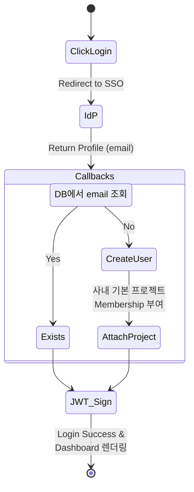

# 13 Customization Source Breakdown

이 문서는 Langfuse를 사내 환경에 맞게 커스터마이징(사내 전용 LLM 추가 및 가격 책정, SSO 연동)하기 위해 직접 소스코드를 수정해야 하는 지점을 시각적 흐름과 함께 안내합니다.

> **관련 상위 설계 문서**
> - 📄 [05 Internal Observability Customization](../30-customization/05-internal-observability.md)

---

## 1. 사내 모델 및 토큰 가격 주입하기 (Pricing Models)

사내에서 Llama 3이나 커스텀 파인튜닝된 모델을 서빙하고 있다면, 해당 모델에 대한 토큰 비용을 Langfuse가 정확히 산정할 수 있도록 아래 두 곳의 코드를 추가해야 합니다.

### A. 가격 정의 파일 수정
🔗 **Source File:** [`worker/src/constants/default-model-prices.json`](file:///Users/dhsshin/Documents/LLMOps/langfuse/worker/src/constants/default-model-prices.json)

Langfuse는 `IngestionService`가 ClickHouse에 데이터를 쓸 때, 이 JSON 파일을 메모리에 올려두고 `matchPattern`에 일치하는 모델을 찾아내어 `input_cost`, `output_cost`를 자동 계산합니다.

```json
{
  "modelName": "custom-sLLM-v1",
  "matchPattern": "^(?i)(custom-sLLM-v1)(.*)$",
  "inputPrice": 0.0001,
  "outputPrice": 0.0002,
  "totalPrice": null,
  "unit": "TOKENS",
  "tokenizerId": "cl100k_base"
}
```
- **`matchPattern`**: SDK에서 올라오는 `model` 필드가 이 정규식에 매치되면 비용이 계산됩니다. 대소문자를 무시하거나 Prefix만 일치해도 잡히도록 `^(?i)` 문법을 주로 사용합니다.
- **`unit` & `tokenizerId`**: 요금의 기준이 무엇인지 정의합니다. "TOKENS"로 설정하면 지정된 토크나이저를 구동하여 바이트 길이를 토큰 수로 환산한 뒤 가격을 곱합니다.

### B. 타입스크립트 계약 추가
🔗 **Source File:** [`packages/shared/src/server/llm/types.ts`](file:///Users/dhsshin/Documents/LLMOps/langfuse/packages/shared/src/server/llm/types.ts)

정적 타입 체킹을 통과하기 위해, 새로운 `tokenizerId`나 모델 공급자(Provider)를 추가했다면 해당 타입스크립트 유니온(Union) 타입에 문자열을 수동으로 추가해주어야 컴파일 타임 에러가 발생하지 않습니다.

```typescript
// types.ts 내부 수정 포인트
export const TokenizerModels = z.enum([
  "cl100k_base",
  "p50k_base",
  "r50k_base",
  "claude",
  "custom_company_tokenizer" // <- 사내 전용 토크나이저를 쓰려면 새로 추가
]);
```

---

## 2. 사내 SSO (SAML/OIDC) 연동 커스터마이징

사내 임직원들이 Langfuse 계정을 별도로 회원가입하지 않고, 사내 포털 계정(IdP)으로 자동 로그인(Auto-provisioning)되도록 하려면 NextAuth 모듈을 덮어써야 합니다.

### 인증 및 자동 프로비저닝 상태 흐름 (State Diagram)



### NextAuth `authOptions.ts` 수정
🔗 **Source File:** [`web/src/features/auth/lib/authOptions.ts`](file:///Users/dhsshin/Documents/LLMOps/langfuse/web/src/features/auth/lib/authOptions.ts)

이 파일은 Next.js의 표준 인증 라이브러리인 NextAuth.js 설정을 담고 있습니다.

```typescript
import CustomCompanyOIDCProvider from "next-auth/providers/company-oidc";

export const authOptions: NextAuthOptions = {
  providers: [
    // 기존의 Google, Github 등을 제거하거나 둔 상태로 사내 Provider 추가
    CustomCompanyOIDCProvider({
      clientId: env.COMPANY_OIDC_CLIENT_ID,
      clientSecret: env.COMPANY_OIDC_CLIENT_SECRET,
      issuer: "https://sso.company.internal"
    })
  ],
  callbacks: {
    async signIn({ user, account, profile }) {
      // [커스텀 로직 추가 구간]
      // 여기서 사내 사용자 정보(user.email 등)를 읽어와서
      // Prisma를 통해 langfuse DB의 ProjectMembership 레코드를 자동 생성(Upsert)해주면,
      // 가입 승인(Admin Approval) 절차 없이 즉시 대시보드 사용이 가능합니다.
      return true;
    }
  }
};
```
- **인프라 주의점**: 폐쇄망/사내망 연동 시, Next.js 컨테이너가 `sso.company.internal` 도메인의 자체 서명 인증서(Self-Signed Certificate) 검증을 통과할 수 있도록 Node.js 런타임에 사내 루트 인증서(Root CA)를 환경변수로 주입(`NODE_EXTRA_CA_CERTS=/certs/root-ca.crt`)해주어야 합니다.
