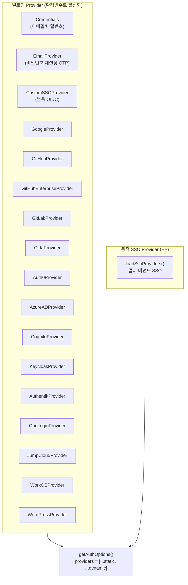
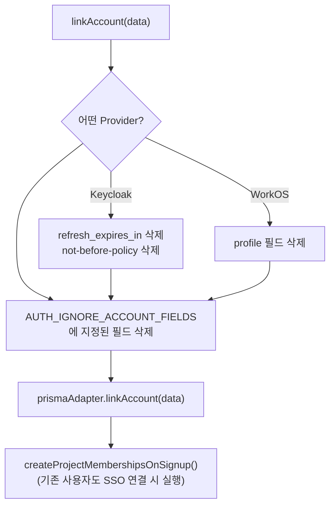
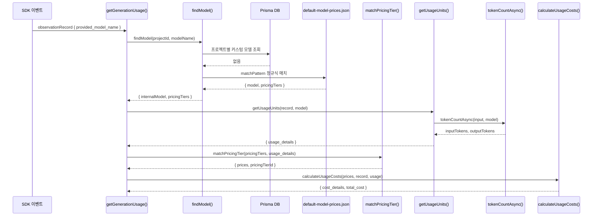
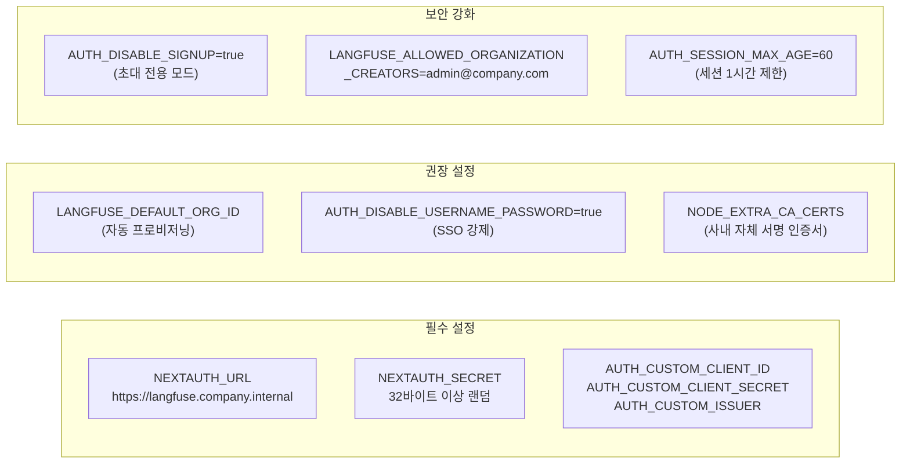

# 13 Customization Source Breakdown

> **선행 문서**: [05 Internal Observability Customization](../30-customization/05-internal-observability.md)
>
> **분석 대상 소스**:
> | 파일 | 줄 수 | 역할 |
> |---|---|---|
> | [`web/src/server/auth.ts`](file:///Users/dhsshin/Documents/LLMOps/langfuse/web/src/server/auth.ts) | ~1162 | NextAuth 설정, SSO Provider 17개, RBAC |
> | [`web/src/features/auth/lib/createProjectMembershipsOnSignup.ts`](file:///Users/dhsshin/Documents/LLMOps/langfuse/web/src/features/auth/lib/createProjectMembershipsOnSignup.ts) | ~376 | 회원가입 시 자동 프로젝트 멤버십 생성 |
> | [`worker/src/services/IngestionService/index.ts`](file:///Users/dhsshin/Documents/LLMOps/langfuse/worker/src/services/IngestionService/index.ts) | ~1935 | 모델/토큰 비용 연산 |
> | [`worker/src/constants/default-model-prices.json`](file:///Users/dhsshin/Documents/LLMOps/langfuse/worker/src/constants/default-model-prices.json) | — | 전체 모델 가격 정의 |
> | [`packages/shared/src/server/llm/types.ts`](file:///Users/dhsshin/Documents/LLMOps/langfuse/packages/shared/src/server/llm/types.ts) | — | 토크나이저 타입 정의 |

---

## 1. 사내 SSO 연동 (OIDC/SAML)

### 1.1 NextAuth SSO Provider 구조 (17개)

🔗 [`auth.ts` — SSO Provider 정의](file:///Users/dhsshin/Documents/LLMOps/langfuse/web/src/server/auth.ts#L130-L590)

`auth.ts`는 ~1162줄의 파일로, 그 중 **SSO Provider 설정**이 전체의 약 40%를 차지합니다. 모두 환경변수만으로 활성화됩니다.



### 1.2 Custom SSO 예시 — `CustomSSOProvider()`

🔗 [`auth.ts` — Custom SSO Provider](file:///Users/dhsshin/Documents/LLMOps/langfuse/web/src/server/auth.ts#L159-L188)

```typescript
if (
  env.AUTH_CUSTOM_CLIENT_ID &&
  env.AUTH_CUSTOM_CLIENT_SECRET &&
  env.AUTH_CUSTOM_ISSUER &&
  env.AUTH_CUSTOM_NAME
)
  // 🔑 패턴: 모든 Provider는 staticProviders.push() 호출로 등록되며, 환경변수가 설정되지 않으면 자동으로 Skip됩니다.
  staticProviders.push(
    CustomSSOProvider({
      clientId: env.AUTH_CUSTOM_CLIENT_ID,
      clientSecret: env.AUTH_CUSTOM_CLIENT_SECRET,
      issuer: env.AUTH_CUSTOM_ISSUER,
      idToken: env.AUTH_CUSTOM_ID_TOKEN === "true",
      allowDangerousEmailAccountLinking:
        env.AUTH_CUSTOM_ALLOW_ACCOUNT_LINKING === "true",
      authorization: {
        params: { scope: env.AUTH_CUSTOM_SCOPE ?? "openid email profile" },
      },
    })
  );
```

| # | Provider | 환경변수 Prefix | 위치 |
|---|---|---|---|
| 1 | Credentials (email/password) | `SALT` | L130-140 |
| 2 | Email (password reset) | `SMTP_CONNECTION_URL`, `EMAIL_FROM_ADDRESS` | L143-156 |
| 3 | Custom SSO (OIDC) | `AUTH_CUSTOM_*` | L159-188 |
| 4 | Google | `AUTH_GOOGLE_*` | L190-212 |
| 5 | Okta | `AUTH_OKTA_*` | L214-238 |
| 6 | Authentik | `AUTH_AUTHENTIK_*` | L239-283 |
| 7 | OneLogin | `AUTH_ONELOGIN_*` | L291-314 |
| 8 | Auth0 | `AUTH_AUTH0_*` | L316-335 |
| 9 | Auth0 (Custom ID) | `AUTH_AUTH0_LEGACY_*` | L337-372 |
| 10 | GitHub | `AUTH_GITHUB_*` | L377-396 |
| 11 | GitHub Enterprise | `AUTH_GITHUB_ENTERPRISE_*` | L399-416 |
| 12 | GitLab | `AUTH_GITLAB_*` | L419-443 |
| 13 | Azure AD | `AUTH_AZURE_AD_*` | L450-468 |
| 14 | Cognito | `AUTH_COGNITO_*` | L475-495 |
| 15 | Keycloak | `AUTH_KEYCLOAK_*` | L502-524 |
| 16 | JumpCloud | `AUTH_JUMPCLOUD_*` | L531-554 |
| 17 | WorkOS | `AUTH_WORKOS_*` | L557-567 |
| — | WordPress | `AUTH_WORDPRESS_*` | L569-590 |

### 1.3 자동 프로젝트 멤버십

🔗 [`createProjectMembershipsOnSignup.ts`](file:///Users/dhsshin/Documents/LLMOps/langfuse/web/src/features/auth/lib/createProjectMembershipsOnSignup.ts)

~376줄 파일. 환경변수 또는 DB 설정을 기반으로 새 사용자가 가입할 때 자동으로 프로젝트에 배정합니다.

```mermaid
stateDiagram-v2
    [*] --> SSO_Login : 사내 직원 첫 로그인

    state SSO_Login {
        [*] --> ProfileFetch : OIDC → email, name, groups 수신
        ProfileFetch --> AdapterCreateUser : PrismaAdapter.createUser()
    }

    state AdapterCreateUser {
        [*] --> SignUpCheck : NEXT_PUBLIC_SIGN_UP_DISABLED?
        SignUpCheck --> Blocked : "true" → Error("Sign up is disabled")
        SignUpCheck --> CreateUser : "false" → prisma.user.create()
        CreateUser --> AssignMembership : createProjectMembershipsOnSignup()
    }

    state AssignMembership {
        [*] --> DefaultOrg : LANGFUSE_DEFAULT_ORG_ID<br/>(쉼표 구분 지원)
        DefaultOrg --> OrgUpsert : organizationMembership.upsert<br/>(role: LANGFUSE_DEFAULT_ORG_ROLE)
        OrgUpsert --> DefaultProject : LANGFUSE_DEFAULT_PROJECT_ID<br/>(쉼표 구분 지원)
        DefaultProject --> ProjUpsert : projectMembership.upsert<br/>(role: LANGFUSE_DEFAULT_PROJECT_ROLE)
        ProjUpsert --> InviteCheck : processMembershipInvitations()
    }

    state InviteCheck {
        [*] --> FindInvites : membershipInvitation.findMany<br/>(where: email)
        FindInvites --> HasInvites{초대장 있음?}
        HasInvites -- Yes --> AcceptAll : $transaction: create membership<br/>+ delete invitations
        HasInvites -- No --> Done
        AcceptAll --> Done
    }

    AssignMembership --> Dashboard : 대시보드 렌더링
    Dashboard --> [*]
```

**자동 프로비저닝 환경변수**:

| 환경변수 | 타입 | 기본값 | 설명 |
|---|---|---|---|
| `LANGFUSE_DEFAULT_ORG_ID` | `string[]` | — | 신규 사용자가 자동 참여할 조직 ID 목록 |
| `LANGFUSE_DEFAULT_ORG_ROLE` | `string` | `"VIEWER"` | 자동 부여 조직 역할 |
| `LANGFUSE_DEFAULT_PROJECT_ID` | `string[]` | — | 신규 사용자가 자동 참여할 프로젝트 ID 목록 |
| `LANGFUSE_DEFAULT_PROJECT_ROLE` | `string` | `"VIEWER"` | 자동 부여 프로젝트 역할 |
| `AUTH_DISABLE_USERNAME_PASSWORD` | `string` | — | `"true"` 설정 시 이메일/비밀번호 로그인 차단 |
| `AUTH_DISABLE_SIGNUP` | `string` | — | `"true"` 설정 시 신규 가입 차단 |

### 1.4 Keycloak 호환성 패치 — `idToken` 옵션

🔗 [`auth.ts` — Keycloak Provider](file:///Users/dhsshin/Documents/LLMOps/langfuse/web/src/server/auth.ts#L502-L524)



---

## 2. 사내 LLM 모델 가격 주입

### 2.1 모델/토큰 비용 연산

🔗 [`IngestionService/index.ts` — `getGenerationUsage()`](file:///Users/dhsshin/Documents/LLMOps/langfuse/worker/src/services/IngestionService/index.ts#L1187)

~1935줄의 IngestionService에서 주요 비용 연산 함수들:



| 함수 | 위치 | 역할 |
|---|---|---|
| `getGenerationUsage()` | L1187 | 주 오케스트레이터: 모델 매칭 → 토큰 카운팅 → 비용 계산 |
| `getUsageUnits()` | L1275 | 토큰 수 결정 (SDK 제공 / 토크나이저 카운팅) |
| `calculateUsageCosts()` | L1480 | 단가 × 수량 비용 연산 (static method) |

### 2.2 `default-model-prices.json` 항목 정의

```json
{
  "modelName": "sllm-internal-v2",
  "matchPattern": "^(?i)(sllm-internal-v2)(.*)$",
  "inputPrice": 0.00015,
  "outputPrice": 0.0006,
  "totalPrice": null,
  "unit": "TOKENS",
  "tokenizerId": "cl100k_base"
}
```

| 필드 | 타입 | 설명 |
|---|---|---|
| `inputPrice` | `number` | 토큰 1개당 입력 비용 (USD) |
| `outputPrice` | `number` | 토큰 1개당 출력 비용 (USD) |
| `totalPrice` | `number?` | 총 비용 (input/output 대신 사용) |
| `unit` | `enum` | `"TOKENS"`, `"CHARACTERS"`, etc |
| `tokenizerId` | `string?` | 토크나이저 식별자 |
| `startDate` | `ISO8601?` | 가격 적용 시작일 |

---

## 3. 인프라 주의사항 종합



---

## 관련 문서 네비게이션

| | |
|---|---|
| ⬆️ 상위 설계 | [05 Internal Observability Customization](../30-customization/05-internal-observability.md) |
| ⬅️ 이전 | [12 Query Source Breakdown](./12-query-source-breakdown.md) |
| ➡️ 오픈 결정 | [11 Open Decisions](../90-decisions/11-open-decisions.md) |
| 🏠 색인 | [README](../README.md) |
