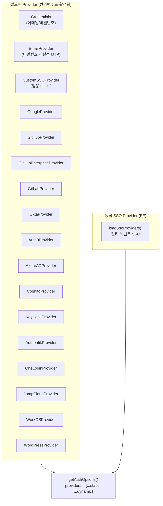
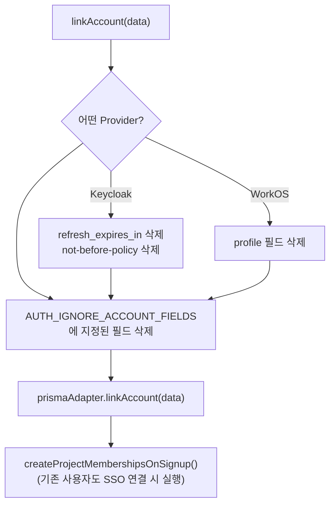
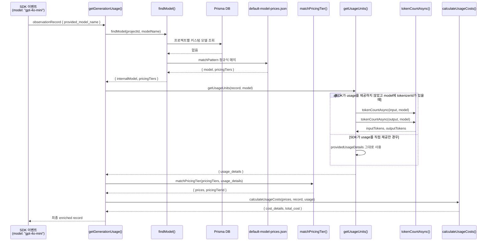
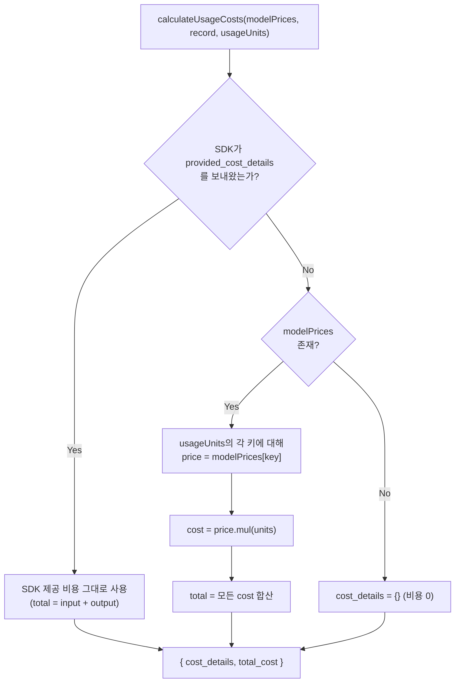
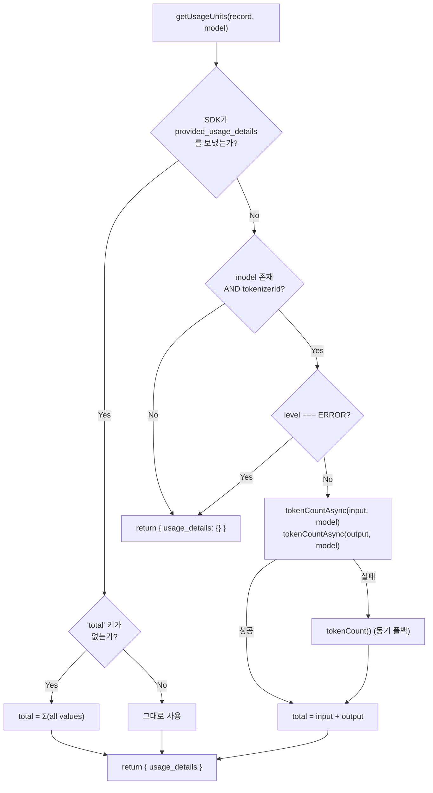
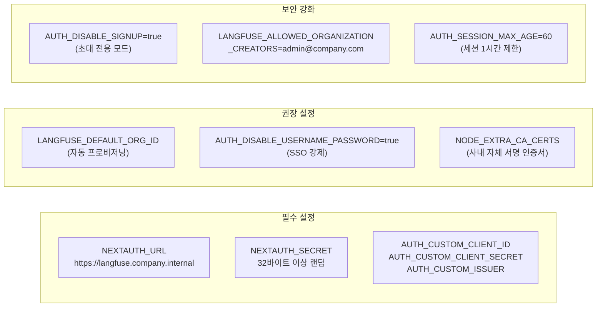

# 13 Customization Source Breakdown

> **선행 문서**: [05 Internal Observability Customization](../30-customization/05-internal-observability.md)
>
> **분석 대상 소스**:
> | 파일 | 줄 수 | 역할 |
> |---|---|---|
> | [`web/src/server/auth.ts`](file:///Users/dhsshin/Documents/LLMOps/langfuse/web/src/server/auth.ts) | 1115 | NextAuth 전체 설정 (Provider + Callback + Adapter) |
> | [`web/src/features/auth/lib/createProjectMembershipsOnSignup.ts`](file:///Users/dhsshin/Documents/LLMOps/langfuse/web/src/features/auth/lib/createProjectMembershipsOnSignup.ts) | 283 | 첫 로그인 시 자동 프로젝트/조직 멤버십 부여 |
> | [`worker/src/services/IngestionService/index.ts`](file:///Users/dhsshin/Documents/LLMOps/langfuse/worker/src/services/IngestionService/index.ts) | 1736 | 모델 매칭 + 토큰 카운팅 + 비용 산정 |
> | [`worker/src/constants/default-model-prices.json`](file:///Users/dhsshin/Documents/LLMOps/langfuse/worker/src/constants/default-model-prices.json) | — | 전체 모델 가격 정의 |
> | [`packages/shared/src/server/llm/types.ts`](file:///Users/dhsshin/Documents/LLMOps/langfuse/packages/shared/src/server/llm/types.ts) | — | 토크나이저 타입 정의 |

---

## 1. 사내 SSO 연동 (OIDC/SAML)

### 1.1 Langfuse의 인증 Provider 전체 구조

🔗 [`auth.ts` L89-607](file:///Users/dhsshin/Documents/LLMOps/langfuse/web/src/server/auth.ts#L89-L607)

Langfuse는 **16개의 SSO Provider**를 빌트인으로 지원합니다. 모두 환경변수만으로 활성화됩니다.



### 1.2 사내 연동 — CustomSSOProvider (가장 범용적)

🔗 [`auth.ts` L177-205](file:///Users/dhsshin/Documents/LLMOps/langfuse/web/src/server/auth.ts#L177-L205)

```typescript
if (
  env.AUTH_CUSTOM_CLIENT_ID &&
  env.AUTH_CUSTOM_CLIENT_SECRET &&
  env.AUTH_CUSTOM_ISSUER &&
  env.AUTH_CUSTOM_NAME
)
  staticProviders.push(
    CustomSSOProvider({
      clientId: env.AUTH_CUSTOM_CLIENT_ID,
      clientSecret: env.AUTH_CUSTOM_CLIENT_SECRET,
      issuer: env.AUTH_CUSTOM_ISSUER,
      idToken: env.AUTH_CUSTOM_ID_TOKEN === "true",
      allowDangerousEmailAccountLinking:
        env.AUTH_CUSTOM_ALLOW_ACCOUNT_LINKING === "true",
      authorization: {
        params: { scope: env.AUTH_CUSTOM_SCOPE ?? "openid email profile" },
      },
    })
  );
```

| 환경변수 | 필수 | 설명 | 예시 |
|---|---|---|---|
| `AUTH_CUSTOM_CLIENT_ID` | ✅ | OIDC Client ID | `langfuse-internal` |
| `AUTH_CUSTOM_CLIENT_SECRET` | ✅ | OIDC Client Secret | `$(vault kv get ...)` |
| `AUTH_CUSTOM_ISSUER` | ✅ | IdP의 Issuer URL | `https://sso.company.internal/realms/main` |
| `AUTH_CUSTOM_NAME` | ✅ | 로그인 버튼에 표시될 이름 | `사내 SSO` |
| `AUTH_CUSTOM_SCOPE` | — | 요청 스코프 | `openid email profile groups` |
| `AUTH_CUSTOM_ID_TOKEN` | — | ID Token 사용 여부 | `"true"` |
| `AUTH_CUSTOM_ALLOW_ACCOUNT_LINKING` | — | 기존 계정 자동 연결 | `"true"` |
| `AUTH_CUSTOM_CLIENT_AUTH_METHOD` | — | Token Endpoint 인증 방식 | `client_secret_post` |
| `AUTH_CUSTOM_ID_TOKEN_SIGNED_RESPONSE_ALG` | — | JWT 서명 알고리즘 | `RS256` |
| `AUTH_CUSTOM_CHECKS` | — | OIDC 검증 체크 | `nonce` |

> **사내 Keycloak 사용 시**: `AUTH_KEYCLOAK_*` 전용 환경변수 세트가 별도로 존재하므로 `CustomSSO` 대신 이를 사용하세요 (L515-542).

### 1.3 첫 로그인 시 자동 프로비저닝 — `createProjectMembershipsOnSignup()`

🔗 [`createProjectMembershipsOnSignup.ts` L9](file:///Users/dhsshin/Documents/LLMOps/langfuse/web/src/features/auth/lib/createProjectMembershipsOnSignup.ts#L9-L239)

```mermaid
stateDiagram-v2
    [*] --> SSO_Login : 사내 직원 첫 로그인

    state SSO_Login {
        [*] --> ProfileFetch : OIDC → email, name, groups 수신
        ProfileFetch --> AdapterCreateUser : PrismaAdapter.createUser()
    }

    state AdapterCreateUser {
        [*] --> SignUpCheck : NEXT_PUBLIC_SIGN_UP_DISABLED?
        SignUpCheck --> Blocked : "true" → Error("Sign up is disabled")
        SignUpCheck --> CreateUser : "false" → prisma.user.create()
        CreateUser --> AssignMembership : createProjectMembershipsOnSignup()
    }

    state AssignMembership {
        [*] --> DefaultOrg : LANGFUSE_DEFAULT_ORG_ID<br/>(쉼표 구분 지원)
        DefaultOrg --> OrgUpsert : organizationMembership.upsert<br/>(role: LANGFUSE_DEFAULT_ORG_ROLE)
        OrgUpsert --> DefaultProject : LANGFUSE_DEFAULT_PROJECT_ID<br/>(쉼표 구분 지원)
        DefaultProject --> ProjUpsert : projectMembership.upsert<br/>(role: LANGFUSE_DEFAULT_PROJECT_ROLE)
        ProjUpsert --> InviteCheck : processMembershipInvitations()
    }

    state InviteCheck {
        [*] --> FindInvites : membershipInvitation.findMany<br/>(where: email)
        FindInvites --> HasInvites{초대장 있음?}
        HasInvites -- Yes --> AcceptAll : $transaction: create membership<br/>+ delete invitations
        HasInvites -- No --> Done
        AcceptAll --> Done
    }

    AssignMembership --> Dashboard : 대시보드 렌더링
    Dashboard --> [*]
```

**자동 프로비저닝 환경변수**:

| 환경변수 | 타입 | 기본값 | 설명 |
|---|---|---|---|
| `LANGFUSE_DEFAULT_ORG_ID` | `string[]` (쉼표 구분) | — | 신규 사용자가 자동 참여할 조직 ID 목록 |
| `LANGFUSE_DEFAULT_ORG_ROLE` | `string` | `"VIEWER"` | 자동 부여 조직 역할 |
| `LANGFUSE_DEFAULT_PROJECT_ID` | `string[]` (쉼표 구분) | — | 신규 사용자가 자동 참여할 프로젝트 ID 목록 |
| `LANGFUSE_DEFAULT_PROJECT_ROLE` | `string` | `"VIEWER"` | 자동 부여 프로젝트 역할 |
| `AUTH_DISABLE_USERNAME_PASSWORD` | `string` | — | `"true"` 설정 시 이메일/비밀번호 로그인 완전 차단 |
| `AUTH_DISABLE_SIGNUP` | `string` | — | `"true"` 설정 시 신규 가입 차단 (초대 전용 모드) |

### 1.4 PrismaAdapter 확장 — 계정 링크 시 보안 방어

🔗 [`auth.ts` L609-742](file:///Users/dhsshin/Documents/LLMOps/langfuse/web/src/server/auth.ts#L609-L742)



> **Keycloak 호환성**: Keycloak이 반환하는 `refresh_expires_in`, `not-before-policy` 필드가 NextAuth 스키마와 충돌하므로 자동 제거합니다 (L645-649).

---

## 2. 사내 LLM 모델 가격 주입

### 2.1 가격 매칭 및 비용 계산 전체 흐름

🔗 [`IngestionService/index.ts` L1054](file:///Users/dhsshin/Documents/LLMOps/langfuse/worker/src/services/IngestionService/index.ts#L1054-L1140)



### 2.2 비용 계산 분기 로직 — `calculateUsageCosts()` (L1280-1351)

🔗 [`IngestionService/index.ts` L1280](file:///Users/dhsshin/Documents/LLMOps/langfuse/worker/src/services/IngestionService/index.ts#L1280-L1351)



> **우선순위**: SDK가 `provided_cost_details`를 보내면 서버의 가격 계산을 **완전히 건너뜁니다**. 사내에서 자체 과금 로직이 있으면 SDK에서 비용을 직접 넣는 것도 가능합니다.

### 2.3 토큰 카운팅 — `getUsageUnits()` (L1142-1278)

🔗 [`IngestionService/index.ts` L1142](file:///Users/dhsshin/Documents/LLMOps/langfuse/worker/src/services/IngestionService/index.ts#L1142-L1278)



> **에러 레벨 관찰(Observation)**: `level === "ERROR"`인 관찰은 토큰 카운팅을 **건너뜁니다**. 에러 응답에는 의미 있는 토큰 수가 없기 때문입니다.

### 2.4 `default-model-prices.json` 항목 추가 가이드

🔗 [`worker/src/constants/default-model-prices.json`](file:///Users/dhsshin/Documents/LLMOps/langfuse/worker/src/constants/default-model-prices.json)

```json
{
  "modelName": "sllm-internal-v2",
  "matchPattern": "^(?i)(sllm-internal-v2)(.*)$",
  "inputPrice": 0.00015,
  "outputPrice": 0.0006,
  "totalPrice": null,
  "unit": "TOKENS",
  "tokenizerId": "cl100k_base"
}
```

| 필드 | 타입 | 설명 | 주의사항 |
|---|---|---|---|
| `modelName` | `string` | 대시보드에 표시될 모델 이름 | — |
| `matchPattern` | `regex` | SDK의 `model` 필드를 매칭하는 정규식 | `(?i)` = 대소문자 무시 |
| `inputPrice` | `number` | 토큰 1개당 입력 비용 (USD) | `null` 가능 |
| `outputPrice` | `number` | 토큰 1개당 출력 비용 (USD) | `null` 가능 |
| `totalPrice` | `number?` | 총 비용 (input/output 대신 사용) | `null` = input+output 합산 |
| `unit` | `enum` | `"TOKENS"`, `"CHARACTERS"`, `"IMAGES"`, `"SECONDS"`, `"MILLISECONDS"`, `"REQUESTS"` | 토크나이저 필요 여부 결정 |
| `tokenizerId` | `string?` | 토크나이저 식별자 | `unit=TOKENS`일 때 필수 |
| `startDate` | `ISO8601?` | 가격 적용 시작일 | 기간별 가격 변동 관리 |

---

## 3. 인프라 주의사항 종합



---

## 관련 문서 네비게이션

| 방향 | 문서 |
|---|---|
| ⬆️ 상위 설계 | [05 Internal Observability Customization](../30-customization/05-internal-observability.md) |
| ⬅️ 이전 | [12 Query Source Breakdown](./12-query-source-breakdown.md) |
| ➡️ 오픈 결정 | [11 Open Decisions](../90-decisions/11-open-decisions.md) |
| 🏠 색인 | [README](../README.md) |
