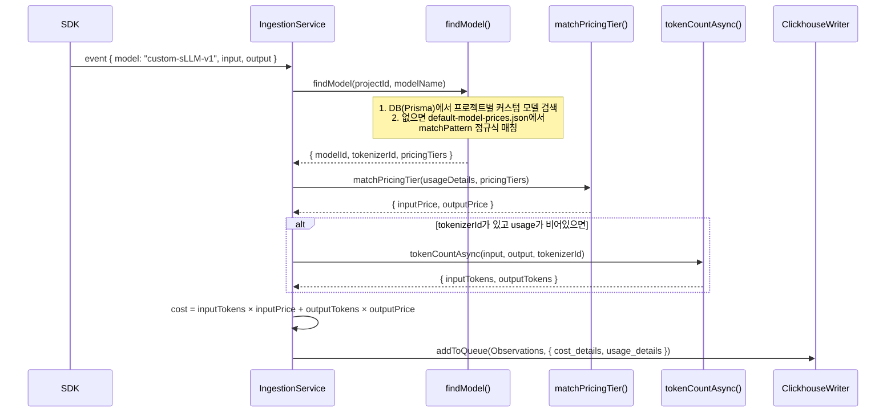
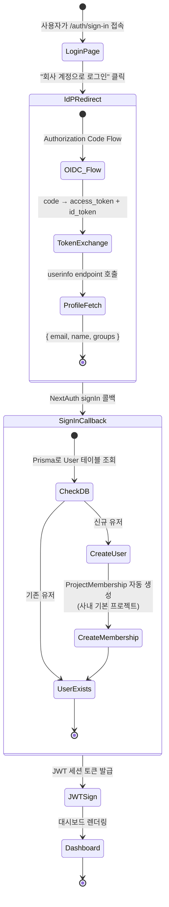

# 13 Customization Source Breakdown

> **선행 문서**: [05 Internal Observability Customization](../30-customization/05-internal-observability.md)
> **분석 대상 소스**:
> - [`worker/src/constants/default-model-prices.json`](file:///Users/dhsshin/Documents/LLMOps/langfuse/worker/src/constants/default-model-prices.json) — 모델 가격 정의
> - [`packages/shared/src/server/llm/types.ts`](file:///Users/dhsshin/Documents/LLMOps/langfuse/packages/shared/src/server/llm/types.ts) — 토크나이저 및 모델 타입 정의
> - [`worker/src/services/IngestionService/index.ts`](file:///Users/dhsshin/Documents/LLMOps/langfuse/worker/src/services/IngestionService/index.ts) — 가격 계산이 실행되는 워커 로직
> - [`web/src/features/auth`](file:///Users/dhsshin/Documents/LLMOps/langfuse/web/src/features/auth) — NextAuth.js 인증 모듈

---

## 1. 사내 LLM 모델 가격 주입

### 가격 매칭 흐름

SDK가 보낸 이벤트에 `model: "custom-sLLM-v1"`이 포함되어 있을 때, Langfuse가 비용을 계산하는 전체 경로입니다.



### 수정 포인트 A: `default-model-prices.json`

🔗 [`worker/src/constants/default-model-prices.json`](file:///Users/dhsshin/Documents/LLMOps/langfuse/worker/src/constants/default-model-prices.json)

사내 전용 모델을 등록하려면 이 JSON 배열에 항목을 추가합니다:

```json
{
  "modelName": "custom-sLLM-v1",
  "matchPattern": "^(?i)(custom-sLLM-v1)(.*)$",
  "inputPrice": 0.0001,
  "outputPrice": 0.0002,
  "totalPrice": null,
  "unit": "TOKENS",
  "tokenizerId": "cl100k_base"
}
```

| 필드 | 설명 | 주의사항 |
|---|---|---|
| `matchPattern` | SDK에서 올라오는 `model` 필드를 매치하는 정규식 | `(?i)`로 대소문자 무시. Prefix만 일치해도 잡히도록 `(.*)$` 권장 |
| `unit` | `"TOKENS"`, `"CHARACTERS"`, `"IMAGES"` 등 | `TOKENS` 선택 시 `tokenizerId`가 반드시 필요 |
| `tokenizerId` | 토크나이저 식별자 | 사내 커스텀 토크나이저를 쓰려면 `types.ts`에도 등록 필요 |
| `inputPrice` / `outputPrice` | 토큰 1개당 USD 가격 | Decimal64(12) 범위 내 (< 10^6) |

### 수정 포인트 B: `types.ts`

🔗 [`packages/shared/src/server/llm/types.ts`](file:///Users/dhsshin/Documents/LLMOps/langfuse/packages/shared/src/server/llm/types.ts)

새로운 `tokenizerId`를 추가했다면 Zod enum에도 등록해야 TypeScript 컴파일 에러가 발생하지 않습니다:

```typescript
export const TokenizerModels = z.enum([
  "cl100k_base",
  "p50k_base",
  "r50k_base",
  "claude",
  "custom_company_tokenizer"  // ← 새로 추가
]);
```

### 가격 계산이 실행되는 코드 경로

🔗 [`IngestionService/index.ts` L220-250](file:///Users/dhsshin/Documents/LLMOps/langfuse/worker/src/services/IngestionService/index.ts#L220-L250)

```typescript
// createEventRecord 또는 processObservationEventList 내부
const [prompt, generationUsage] = await Promise.all([
  // 프롬프트 매칭 (이름 + 버전)
  eventData.promptName && eventData.promptVersion
    ? this.promptService.getPrompt({ ... })
    : null,
  // 모델 매칭 + 토큰 수 계산 + 비용 산정
  eventData.modelName
    ? this.getGenerationUsage({
        projectId: eventData.projectId,
        observationRecord: {
          provided_model_name: eventData.modelName,
          provided_usage_details: eventData.providedUsageDetails ?? {},
          provided_cost_details: eventData.providedCostDetails ?? {},
          input: eventData.input,
          output: eventData.output,
        },
      })
    : null,
]);
```

> `getGenerationUsage` 내부에서 `findModel()` → `matchPricingTier()` → `tokenCountAsync()` 순서로 호출됩니다. 모델을 찾지 못하면 비용은 0으로 기록됩니다.

---

## 2. 사내 SSO (SAML/OIDC) 연동

### NextAuth 인증 흐름



### 수정 대상 파일

🔗 [`web/src/features/auth`](file:///Users/dhsshin/Documents/LLMOps/langfuse/web/src/features/auth) 디렉토리

| 파일 | 역할 | 수정 범위 |
|---|---|---|
| `lib/authOptions.ts` | NextAuth.js Provider 및 Callback 설정 | 사내 OIDC Provider 추가 |
| `lib/createProjectMembershipsOnSignup.ts` | 첫 로그인 시 프로젝트 멤버십 자동 부여 | 사내 기본 프로젝트 ID 설정 |

### `authOptions.ts` 수정 예시

```typescript
import CompanyOIDCProvider from "next-auth/providers/oidc";  // 또는 커스텀 Provider

export const authOptions: NextAuthOptions = {
  providers: [
    CompanyOIDCProvider({
      clientId: env.COMPANY_OIDC_CLIENT_ID,
      clientSecret: env.COMPANY_OIDC_CLIENT_SECRET,
      issuer: "https://sso.company.internal",
      // 사내 CA 인증서가 필요한 경우:
      // httpOptions: { agent: new https.Agent({ ca: readFileSync('/certs/root-ca.crt') }) }
    }),
  ],
  callbacks: {
    async signIn({ user, account, profile }) {
      // ★ 커스텀 로직 추가 구간
      // 1. 사내 그룹(profile.groups)에 따라 Role(Admin/Viewer) 결정
      // 2. Prisma를 통해 User + OrgMembership + ProjectMembership Upsert
      // 3. 사내 AD 그룹 → Langfuse 프로젝트 매핑
      return true;
    },
    async jwt({ token, account, profile }) {
      // JWT에 사내 사용자 속성(부서, 직급 등) 추가 가능
      if (profile) {
        token.department = (profile as any).department;
      }
      return token;
    },
  },
};
```

### 인프라 주의사항

| 항목 | 설명 |
|---|---|
| `NODE_EXTRA_CA_CERTS` | 사내 자체 서명 인증서 사용 시, 컨테이너에 루트 CA 인증서 경로 지정 필요 |
| `NEXTAUTH_URL` | 사내 도메인으로 정확히 설정 (`https://langfuse.company.internal`) |
| `NEXTAUTH_SECRET` | JWT 서명 시크릿. 반드시 안전한 난수로 생성하여 Vault에 저장 |

---

## 관련 문서 네비게이션

| 방향 | 문서 |
|---|---|
| ⬆️ 상위 설계 | [05 Internal Observability Customization](../30-customization/05-internal-observability.md) |
| ⬅️ 이전 | [12 Query Source Breakdown](./12-query-source-breakdown.md) |
| ➡️ 오픈 결정 | [11 Open Decisions](../90-decisions/11-open-decisions.md) |
| 🏠 색인 | [README](../README.md) |
