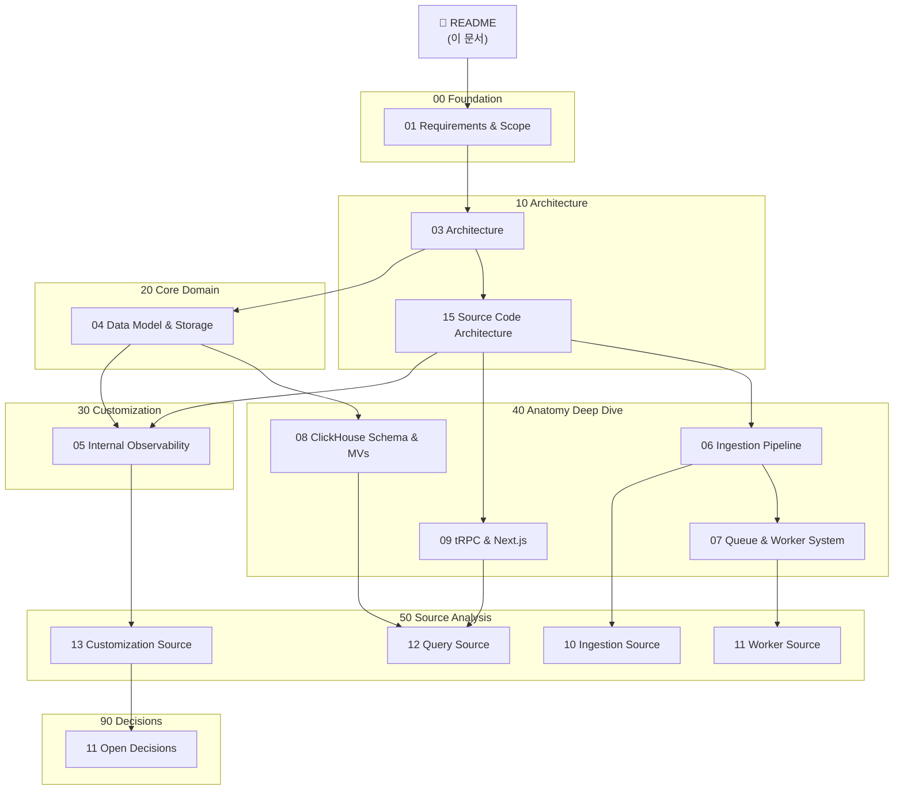

# Langfuse 사내 도입 문서 색인

작성일: 2026-05-16

> **📕 [Langfuse 시스템 백서](./WHITEPAPER.md)** — "왜 이렇게 설계되었는가"에 초점을 맞춘 9개 챕터의 기술 백서입니다. 설계 철학, 트레이드오프 분석, 대안 비교를 포함합니다. 처음 읽는 분은 백서부터 시작하세요.

## 목적

이 문서 세트는 오픈소스 Langfuse를 사내 observability 플랫폼으로 도입 및 커스터마이징하기 위한 **포괄적 소스코드 해부학(Anatomy)** 문서입니다.

SDK의 로그 한 줄이 대시보드에 표시되기까지 — API 인증, S3 캐싱, BullMQ 큐잉, 워커 병합, ClickHouse Batch Insert, tRPC 쿼리, React 렌더링 — 그 모든 경로를 소스코드 라인 레벨까지 추적하고 시각화합니다.

## 전체 문서 구조

## 빠른 읽기 경로

| 독자 | 읽는 순서 | 목적 |
| --- | --- | --- |
| 시스템 아키텍트 | 01 → 03 → 15 → 04 → 06 → 07 | 요구사항, 전체 아키텍처, 소스 구조, 데이터 모델, 수집/처리 파이프라인 전체 파악 |
| 백엔드 엔지니어 | 03 → 15 → 06 → 07 → 10 → 11 → 12 | 모노레포 구조, Ingestion/Worker 소스코드 구현체 라인 바이 라인 딥다이브 |
| 프론트엔드/커스텀 | 05 → 09 → 13 | 커스텀 인증(SSO) 연동, tRPC 라우팅 구조, 모델 가격 정책 수정 위치 파악 |
| 데이터 엔지니어 | 04 → 08 → 12 | 와이드 이벤트 모델, ClickHouse AMT/MV 롤업 최적화, SQL 바인딩 분석 |
| 인프라/보안 담당자 | 03 → 05 → 11 → 13 | 인프라 토폴로지, SSO 연동 주의사항, 오픈 결정 사항 점검 |

## 전체 문서 목록

### 00 Foundation

| 문서 | 핵심 내용 |
| --- | --- |
| [01 Requirements and Scope](00-foundation/01-requirements-and-scope.md) | 도입 목적, 커스터마이징 핵심 요구사항(인증, 모델 추가), non-goals 정리 |

### 10 Architecture

| 문서 | 핵심 내용 |
| --- | --- |
| [03 Architecture](10-architecture/03-architecture.md) | 전체 시스템 컴포넌트(Web, Worker, Shared) 및 트래픽/데이터 플로우 시퀀스 |
| [15 Source Code Architecture](10-architecture/15-source-code-architecture.md) | 모노레포 디렉토리 레이아웃, 패키지 의존성 규칙, 빌드/검증 스크립트 |

### 20 Core Domain

| 문서 | 핵심 내용 |
| --- | --- |
| [04 Data Model and Storage](20-core-domain/04-data-model-and-storage.md) | PostgreSQL(릴레이셔널) + ClickHouse(분석) 이중 저장소 역할 분담 |

### 30 Customization

| 문서 | 핵심 내용 |
| --- | --- |
| [05 Internal Observability Customization](30-customization/05-internal-observability.md) | 사내 SSO 통합 설계, 커스텀 LLM 가격 산정 전략 |

### 40 Anatomy Deep Dive — 소스 아키텍처 심층 해부

| 문서 | 핵심 내용 | 주요 다이어그램 |
| --- | --- | --- |
| [06 Ingestion Pipeline](40-anatomy-deep-dive/06-ingestion-pipeline.md) | API → S3 → BullMQ → Worker → ClickHouse 3단계 비동기 파이프라인 | 시퀀스 다이어그램 |
| [07 Queue and Worker System](40-anatomy-deep-dive/07-queue-and-worker-system.md) | BullMQ 큐 토폴로지, WorkerManager, Retry Baggage, DLQ | 토폴로지 차트 + 클래스 다이어그램 |
| [08 ClickHouse Schema & MVs](40-anatomy-deep-dive/08-clickhouse-schema-and-mvs.md) | Null → MV → AMT 트리거 패턴, sumMap/argMax 집계 | 테이블 계층 플로우차트 |
| [09 tRPC and Next.js](40-anatomy-deep-dive/09-trpc-and-nextjs.md) | 미들웨어 체인, 병렬 쿼리 패턴, Parameter Binding 보안 | 미들웨어 체인 + 시퀀스 다이어그램 |

### 50 Source Analysis — 소스코드 라인 바이 라인 분석

| 문서 | 핵심 내용 | 분석 대상 파일 |
| --- | --- | --- |
| [10 Ingestion Source](50-source-analysis/10-ingestion-source-breakdown.md) | Zod 검증, S3 SlowDown 에러 폴백, Sampling, Delay 전략 | `ingestion.ts`, `processEventBatch.ts` |
| [11 Worker Source](50-source-analysis/11-worker-source-breakdown.md) | Redis 중복 캐싱, Secondary Queue, ClickhouseWriter flush | `ingestionQueue.ts`, `ClickhouseWriter/index.ts`, `IngestionService/index.ts` |
| [12 Query Source](50-source-analysis/12-query-source-breakdown.md) | AMT SQL 함수 해부, tRPC Router 전체 프로시저 맵 | `0023...sql`, `traces.ts` |
| [13 Customization Source](50-source-analysis/13-customization-source-breakdown.md) | 가격 매칭 흐름, SSO 자동 프로비저닝 State Diagram | `default-model-prices.json`, `authOptions.ts` |

### 90 Decisions

| 문서 | 핵심 내용 |
| --- | --- |
| [11 Open Decisions](90-decisions/11-open-decisions.md) | 배포 아키텍처, 데이터 보존(Retention), 비용 정밀도 미결정 사항 |

## 문서 작성 규칙

| 규칙 | 설명 |
| --- | --- |
| 한국어 우선 | 설명 문장은 한국어를 기본으로 한다. |
| 기술 식별자 유지 | API path, header, field, file path, 패키지 이름, 주요 도메인 객체 이름(Trace, Observation 등)은 원문을 유지한다. |
| Mermaid 사용 | 구조도, flowchart, sequence는 모두 Mermaid로 작성한다. ASCII art chart는 사용하지 않는다. |
| 소스코드 링크 | 분석 대상 소스 파일은 `file:///` 절대 경로 링크로 연결하여 IDE에서 바로 열 수 있게 한다. |
| 다이어그램 특수문자 | Mermaid 노드 이름에 `@`, `/` 등 특수문자가 있으면 반드시 따옴표(`""`)로 감싼다. |
| 원본 존중 | Langfuse의 기본 아키텍처 사상(Wide Event 등)을 그대로 반영하며, 커스텀 영역을 명확히 분리하여 기재한다. |
