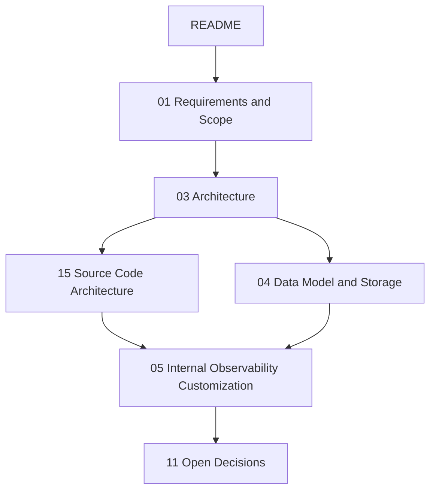

# Langfuse 사내 도입 문서 색인

작성일: 2026-05-16

## 목적

이 문서 세트는 오픈소스 Langfuse를 사내 observability 플랫폼으로 도입 및 커스터마이징하기 위한 아키텍처 분석 및 설계 기준입니다.

주요 분석 및 커스터마이징 포인트는 다음과 같습니다.
- 오픈소스 Langfuse의 데이터 모델 및 아키텍처 상세 분석 (PostgreSQL, ClickHouse 역할 분담).
- 사내 보안 요구사항에 맞춘 인증/인가 시스템 연동 (Custom Auth/SSO).
- 내부 트래픽 비용 계산 및 사내 인프라(Redis, BullMQ)와의 안정적인 통합.

## 핵심 결론

| 주제 | 결론 |
| --- | --- |
| 아키텍처 | Next.js 웹 셸, tRPC 백엔드, BullMQ Worker로 구성된 모노레포 구조를 유지한다. |
| 데이터 저장소 | 트랜잭션 데이터(User, Project, API Key)는 PostgreSQL, 분석형 와이드 이벤트 데이터(Traces, Observations, Scores)는 ClickHouse에 분리 저장한다. |
| 와이드 이벤트 모델 | Observation을 분석의 기본 단위로 취급하며, Trace는 관련 Observation들을 묶는 상관관계 핸들(Correlation Handle)로 사용한다. |
| 백그라운드 처리 | 외부 API 연동(예: 비용 청구, 배치 내보내기)과 대량 데이터 처리는 Worker(BullMQ)에서 비동기 처리하여 웹 API 레이턴시를 최소화한다. |
| 인증 연동 | 기본 제공되는 NextAuth 기반 인증을 사내 SSO(OIDC/SAML)로 교체 및 연동해야 한다. |
| 비용 청구 | 내부 모델의 고유 토큰 비용 계산 로직을 `worker/src/constants` 및 `packages/shared` 모델 가격 테이블에 확장 반영해야 한다. |

## 구현 상태

2026-05-16 기준, 초기 아키텍처 문서화 작업이 진행 중입니다.

| 영역 | 상태 |
| --- | --- |
| 아키텍처 문서화 | 진행 중. 시스템 경계, 소스코드 아키텍처 분석 문서 작성 중 |
| 도메인 모델 분석 | 대기 중. Prisma 및 ClickHouse 스키마 기반 데이터 모델 문서 작성 예정 |
| 커스텀 연동 분석 | 대기 중. 사내 인증 및 비용 로직 연동 포인트 문서화 예정 |

## 디렉토리 구조

루트 `docs`에는 색인만 두고, 실제 문서는 책임 영역별 하위 디렉토리에 둡니다. 번호 prefix는 전체 읽기 순서를 유지하기 위한 것이며, 디렉토리명은 탐색 기준입니다.

| 디렉토리 | 책임 |
| --- | --- |
| `00-foundation` | 시스템 커스터마이징 요구사항, 범위 정리 |
| `10-architecture` | Langfuse 전체 시스템 경계, 모노레포 아키텍처, 패키지 간 의존성 |
| `20-core-domain` | PostgreSQL, ClickHouse 스키마 및 와이드 이벤트 데이터 모델 분석 |
| `30-customization` | 사내 플랫폼 통합을 위한 커스텀 인증, 비용 계산, 알림 등 연동 설계 |
| `90-decisions` | 진행 중 아직 확정되지 않은 오픈된 정책 및 기술 결정 사항 추적 |

## 빠른 읽기 경로

| 독자 | 읽는 순서 | 목적 |
| --- | --- | --- |
| 시스템 아키텍트 | 01 -> 03 -> 15 -> 04 | 도입 요구사항, 전체 아키텍처, 소스 구조, 데이터 모델 파악 |
| 백엔드 엔지니어 | 03 -> 15 -> 04 -> 05 | 모노레포 빌드 시스템 파악, 데이터 파이프라인 분석 및 커스텀 구현 포인트 확인 |
| 인프라/보안 담당자 | 03 -> 05 -> 11 | DB/캐시 인프라 구조 확인, 사내 SSO 연동 및 보안 미결정 사항 점검 |

## 전체 문서 흐름

## 문서별 책임

| 문서 | 책임 |
| --- | --- |
| [01 Requirements and Scope](00-foundation/01-requirements-and-scope.md) | 도입 목적, 커스터마이징 핵심 요구사항(인증, 모델 추가), non-goals 정리 |
| [03 Architecture](10-architecture/03-architecture.md) | Langfuse 전체 시스템 컴포넌트(Web, Worker, Shared) 및 트래픽/데이터 플로우 시퀀스 |
| [15 Source Code Architecture](10-architecture/15-source-code-architecture.md) | Turborepo, Next.js, tRPC, BullMQ 기반 소스코드 디렉토리 레이아웃 및 의존성 규칙 정의 |
| [04 Data Model and Storage](20-core-domain/04-data-model-and-storage.md) | Prisma(PostgreSQL) 릴레이셔널 모델과 ClickHouse 분석 이벤트 모델의 분담 |
| [05 Internal Observability Customization](30-customization/05-internal-observability.md) | 사내 SSO 통합, 커스텀 LLM 가격 산정 방식 추가 등 사내 전용 연동 전략 |
| [11 Open Decisions](90-decisions/11-open-decisions.md) | 인프라 배포 옵션, 데이터 보존 기간(Retention) 등 오픈 결정을 추적 |

## 문서 작성 규칙

| 규칙 | 설명 |
| --- | --- |
| 한국어 우선 | 설명 문장은 한국어를 기본으로 한다. |
| 기술 식별자 유지 | API path, header, field, file path, 패키지 이름, 주요 도메인 객체 이름(Trace, Observation 등)은 원문을 유지한다. |
| Mermaid 사용 | 구조도, flowchart, sequence는 모두 Mermaid로 작성한다. ASCII art chart는 사용하지 않는다. |
| 원본 존중 | Langfuse의 기본 아키텍처 사상(Wide Event 등)을 그대로 반영하며, 커스텀 영역을 명확히 분리하여 기재한다. |
