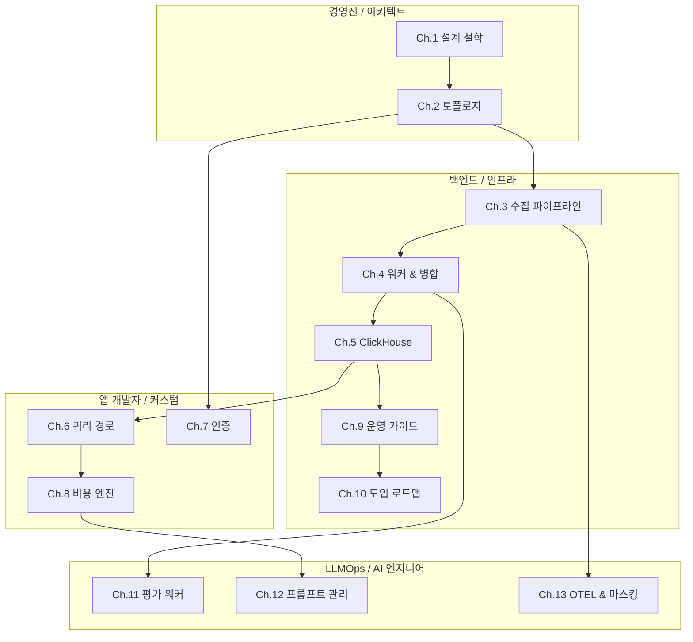

# Langfuse 시스템 백서

**LLM Observability 플랫폼의 설계 철학, 아키텍처 결정, 그리고 소스코드 해부**

> 버전: 1.0 · 2026-05-16 · 사내 On-Premise 도입을 위한 기술 백서

---

## Abstract

Langfuse는 LLM 애플리케이션의 개발·모니터링·평가·디버깅을 위한 오픈소스 Observability 플랫폼이다. 본 백서는 Langfuse를 사내 인프라에 도입하려는 엔지니어링 조직을 위해, 단순한 기능 나열이 아닌 **"왜 이렇게 설계되었는가"**에 초점을 맞추어 시스템의 핵심 설계 결정과 트레이드오프를 분석한다.

SDK의 `langfuse.trace()` 한 줄이 대시보드의 차트로 렌더링되기까지 — API 인증, S3 캐싱, BullMQ 큐잉, 이벤트 병합, ClickHouse Batch Insert, Materialized View 집계, tRPC 쿼리, React 렌더링 — 그 전체 여정을 소스코드 라인 수준까지 추적하고, 각 지점에서 Langfuse 팀이 내린 아키텍처 결정의 근거를 해부한다.

---

## 목차

### Volume 1: Core Infrastructure (핵심 인프라)
| Ch. | 제목 | 핵심 질문 |
|---|---|---|
| **1** | [설계 철학과 첫 번째 원칙](./whitepaper/ch01-design-philosophy.md) | 왜 Wide Event인가? 왜 ClickHouse인가? |
| **2** | [시스템 토폴로지와 의존성 경계](./whitepaper/ch02-system-topology.md) | 모노레포의 4개 패키지는 어떤 계약으로 연결되는가? |
| **3** | [수집 파이프라인: 가용성을 위한 설계](./whitepaper/ch03-ingestion-pipeline.md) | 데이터 유실과 가용성 사이의 트레이드오프 |
| **4** | [워커와 이벤트 병합: 최종 일관성의 구현](./whitepaper/ch04-worker-and-merge.md) | Create/Update 순서 보장, Immutable Key |
| **5** | [ClickHouse 데이터 엔지니어링](./whitepaper/ch05-clickhouse-engineering.md) | AMT 집계함수, TTL 기반 쿼리 라우팅 |
| **6** | [쿼리 경로와 타입 안전성](./whitepaper/ch06-query-path.md) | tRPC 미들웨어 체인, Parameter Binding 보안 |
| **7** | [인증 아키텍처와 사내 SSO 연동](./whitepaper/ch07-authentication.md) | 16개 Provider, 자동 프로비저닝 |
| **8** | [비용 산정 엔진](./whitepaper/ch08-cost-engine.md) | 모델 매칭, 토크나이저 폴백 전략 |
| **9** | [운영 가이드와 튜닝](./whitepaper/ch09-operations.md) | 환경변수 전체 맵, 수평 확장 전략 |
| **10** | [사내 도입 미결 결정 및 로드맵](./whitepaper/ch10-open-decisions-and-roadmap.md) | 클러스터링, Chargeback, Retention |

### Volume 2: Advanced LLMOps Architecture (심화 아키텍처)
| Ch. | 제목 | 핵심 질문 |
|---|---|---|
| **11** | [LLM-as-a-Judge와 비동기 평가 워커](./whitepaper/ch11-evaluations.md) | Rate Limit 에러 복구와 무한 루프 방지 로직 |
| **12** | [프롬프트 레지스트리와 이벤트 소싱](./whitepaper/ch12-prompt-management.md) | 레이블 기반 런타임 스위칭과 감사 로그 |
| **13** | [OTEL 연동과 데이터 마스킹 (EE)](./whitepaper/ch13-otel-and-masking.md) | OTLP 매핑 원리와 Fail-closed 보안 파이프라인 |

---

## 이 백서의 읽는 법

**모든 챕터는 동일한 구조를 따른다:**
1. **설계 질문** — 이 컴포넌트가 해결해야 하는 핵심 문제
2. **Langfuse의 답** — 실제 구현된 아키텍처 결정
3. **왜 이 방식인가** — 대안 분석과 트레이드오프
4. **소스코드 증거** — 실제 코드 링크와 라인 수준 분석
5. **사내 커스터마이징 포인트** — On-Premise 도입 시 수정이 필요한 지점

---

## 기존 문서와의 관계

본 백서는 기존 `docs/` 하위 문서들의 **상위 서사(Narrative)**를 제공합니다. 기존 문서는 참조용으로 유지됩니다.

| 백서 챕터 | 기존 참조 문서 |
|---|---|
| Ch.1 | [01 Requirements](00-foundation/01-requirements-and-scope.md), [03 Architecture](10-architecture/03-architecture.md) |
| Ch.2 | [15 Source Code Architecture](10-architecture/15-source-code-architecture.md) |
| Ch.3 | [06 Ingestion Pipeline](40-anatomy-deep-dive/06-ingestion-pipeline.md), [10 Ingestion Source](50-source-analysis/10-ingestion-source-breakdown.md) |
| Ch.4 | [07 Queue & Worker](40-anatomy-deep-dive/07-queue-and-worker-system.md), [11 Worker Source](50-source-analysis/11-worker-source-breakdown.md) |
| Ch.5 | [08 ClickHouse Schema](40-anatomy-deep-dive/08-clickhouse-schema-and-mvs.md), [12 Query Source](50-source-analysis/12-query-source-breakdown.md) |
| Ch.6 | [09 tRPC & Next.js](40-anatomy-deep-dive/09-trpc-and-nextjs.md) |
| Ch.7-8 | [05 Customization](30-customization/05-internal-observability.md), [13 Customization Source](50-source-analysis/13-customization-source-breakdown.md) |
| Ch.10 | [11 Open Decisions](90-decisions/11-open-decisions.md) |
| Ch.11-13 | [13 Customization Source](50-source-analysis/13-customization-source-breakdown.md) |
