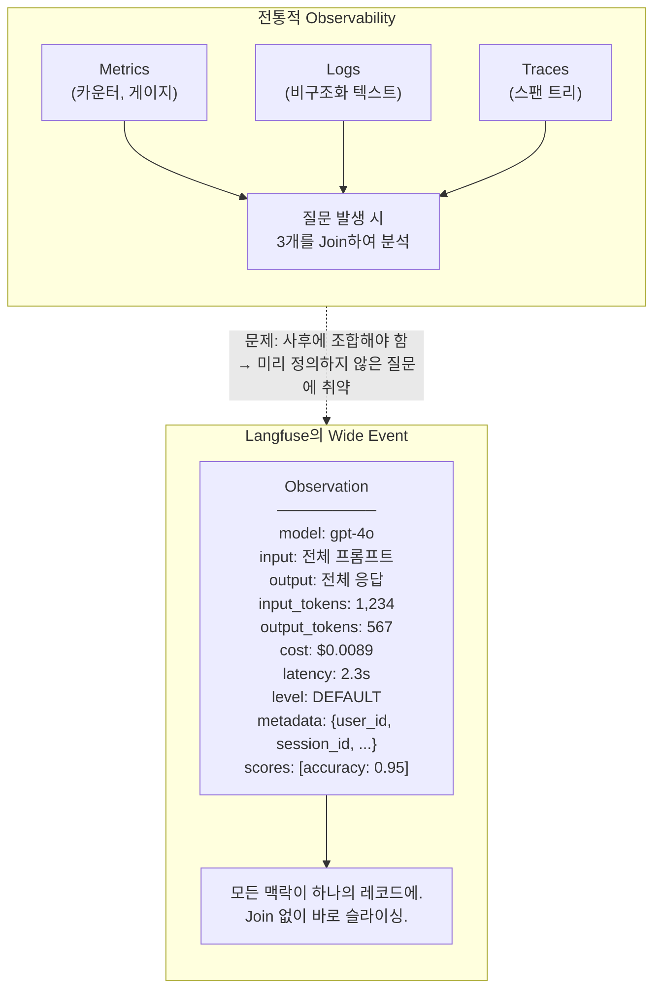
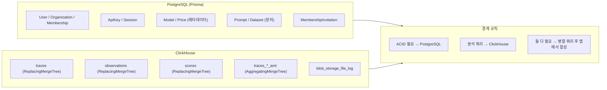
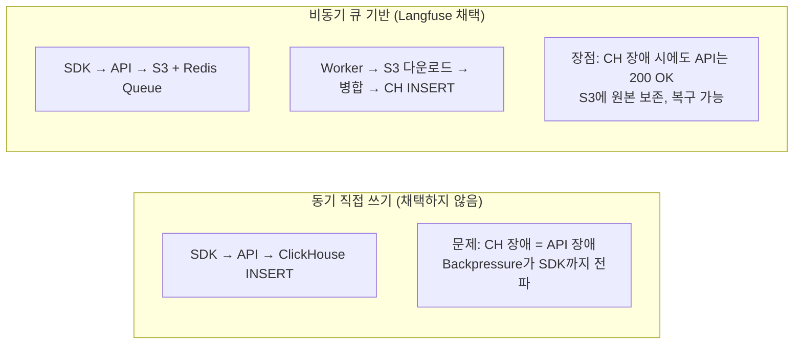

# Chapter 1. 설계 철학과 첫 번째 원칙

> *"All you need is Wide Events, not Metrics, Logs and Traces"*
> — Ivan Burmistrov

---

## 1.1 Langfuse가 해결하는 문제

LLM 애플리케이션은 전통적인 소프트웨어와 근본적으로 다른 관측 가능성(Observability) 요구사항을 가진다.

| 전통적 백엔드 | LLM 애플리케이션 |
|---|---|
| 응답이 결정론적 | 동일 입력에 다른 출력 |
| 레이턴시 ≈ ms | 레이턴시 ≈ 초~분 |
| 비용이 인프라에 비례 | 비용이 **토큰 수**에 비례 |
| 디버깅 = 스택 트레이스 | 디버깅 = **프롬프트 + 응답 전문** 비교 |
| 품질 = 단위 테스트 | 품질 = **사람/LLM 평가 점수** |

이 차이는 기존 APM(Datadog, New Relic)이나 로그 수집기(ELK)로는 해결할 수 없는 영역을 만든다. Langfuse는 이 간극을 메우기 위해 설계되었다.

## 1.2 첫 번째 원칙: Wide Event

Langfuse 아키텍처의 **모든 결정**은 하나의 원칙에서 출발한다:

> **Observation(와이드 이벤트)을 분석의 기본 단위로 삼는다. Trace는 관련 Observation들을 묶는 상관관계 핸들(Correlation Handle)일 뿐이다.**

🔗 [`.agents/ARCHITECTURE_PRINCIPLES.md`](file:///Users/dhsshin/Documents/LLMOps/langfuse/.agents/ARCHITECTURE_PRINCIPLES.md#L15-L16)

### 이 원칙이 아키텍처에 미치는 영향

| 영역 | 결과 |
|---|---|
| **스토리지 선택** | Wide Event는 수백 개 컬럼을 가질 수 있으므로, 행 기반(PostgreSQL)이 아닌 **컬럼형 DB(ClickHouse)**가 필수 |
| **비정규화** | `user_id`, `session_id`, `environment` 등을 Observation에 중복 저장하여 Join을 제거 |
| **불변성** | Append-only Insert를 기본으로 하고, UPDATE는 `ReplacingMergeTree`의 백그라운드 머지에 위임 |
| **API 설계** | Time Window 필수, 페이지네이션 필수 — 와이드 이벤트의 무한 스캔을 원천 방지 |

## 1.3 왜 ClickHouse인가 — 대안 분석

Langfuse 팀이 ClickHouse를 선택한 이유를 대안과 비교하여 분석한다.

| 기준 | PostgreSQL | Elasticsearch | ClickHouse | **Langfuse 판단** |
|---|---|---|---|---|
| 컬럼 수 확장 | 테이블당 ~1,600개 제한 | 매핑 폭발(mapping explosion) | **무제한** | ✅ Wide Event에 적합 |
| 압축률 | 1x (행 기반) | 2-5x | **10-20x** (LZ4 컬럼 압축) | ✅ 스토리지 비용 절감 |
| 집계 쿼리 속도 | 인덱스 의존 | 역인덱스 한정 | **벡터화 실행** | ✅ 대시보드 실시간 집계 |
| 트랜잭션 | ACID ✅ | Eventual | **No ACID** | ⚠️ 메타데이터는 PostgreSQL에 분리 |
| UPDATE 비용 | O(1) in-place | 재인덱싱 | **비쌈** (ReplacingMerge) | ⚠️ Append-only 설계로 우회 |
| 운영 복잡도 | 낮음 | 높음 (JVM, 샤딩) | 중간 | — |

> **핵심 트레이드오프**: ClickHouse는 UPDATE가 비싸다. Langfuse는 이를 **"워커에서 미리 병합한 뒤 최종 상태만 INSERT"**하는 방식으로 우회한다. 이 결정이 Chapter 4의 이벤트 병합 로직 전체를 결정짓는다.

## 1.4 Dual Storage — 각 DB의 책임 경계

| 데이터 | 저장소 | 이유 |
|---|---|---|
| 사용자 인증 | PostgreSQL | 로그인 시 `SELECT ... FOR UPDATE` 등 트랜잭션 필요 |
| API Key | PostgreSQL | `UNIQUE` 제약, 해시 비교 |
| 모델 가격 정의 | PostgreSQL | 프로젝트별 커스텀 모델 → 관리 UI에서 CRUD |
| Trace/Observation 이벤트 | ClickHouse | 초당 수만 건 Insert, 컬럼형 집계 쿼리 |
| Score | ClickHouse | 대량 평가 결과, 집계 분석 |
| 댓글 (Comment) | PostgreSQL | 소량, 관계형 (user → comment → trace) |

> **경계선의 예외**: `traceRouter.all`은 댓글 필터가 있으면 먼저 PostgreSQL에서 매칭 ID를 조회하고, 그 ID 목록으로 ClickHouse를 필터링한다. 이것이 "병렬 쿼리 후 앱에서 합성" 패턴의 실제 구현이다 (Chapter 6에서 상세 분석).

## 1.5 비동기 수집 — 왜 API에서 직접 DB에 쓰지 않는가

| 설계 결정 | 직접 쓰기 | Langfuse (비동기) |
|---|---|---|
| API 응답 시간 | ClickHouse Insert 시간에 의존 | S3 Upload + Redis Enqueue (~50ms) |
| ClickHouse 장애 내성 | ❌ API가 함께 다운 | ✅ 큐에 쌓이고, 복구 후 재처리 |
| 이벤트 병합 | 불가 (개별 Insert) | ✅ 동일 entityId의 Create/Update를 하나로 병합 |
| 복잡도 | 낮음 | 높음 (S3 + Redis + Worker 운영 필요) |

> **이 결정의 대가**: 시스템 복잡도가 크게 증가한다. S3, Redis, Worker라는 세 개의 추가 인프라 컴포넌트가 필요하며, 이벤트 순서 보장을 위한 Delay 전략(Chapter 3)과 중복 방지 캐시(Chapter 4)가 필수적으로 따라온다. Langfuse 팀은 이 복잡도를 **"가용성과 데이터 무결성을 위한 필수 투자"**로 판단했다.

---

## 이 챕터의 핵심 인사이트

1. **Wide Event가 아키텍처를 결정한다** — 스토리지, 비정규화, API 설계가 모두 이 원칙에서 파생
2. **ClickHouse의 UPDATE 비용이 전체 파이프라인을 형성한다** — 워커의 이벤트 병합 로직이 존재하는 이유
3. **비동기 수집의 대가는 복잡도** — 하지만 가용성과 데이터 보존을 위해 감수

---

| 방향 | 문서 |
|---|---|
| ➡️ 다음 | [Ch.2 시스템 토폴로지와 의존성 경계](./ch02-system-topology.md) |
| 🏠 백서 색인 | [WHITEPAPER.md](../WHITEPAPER.md) |
