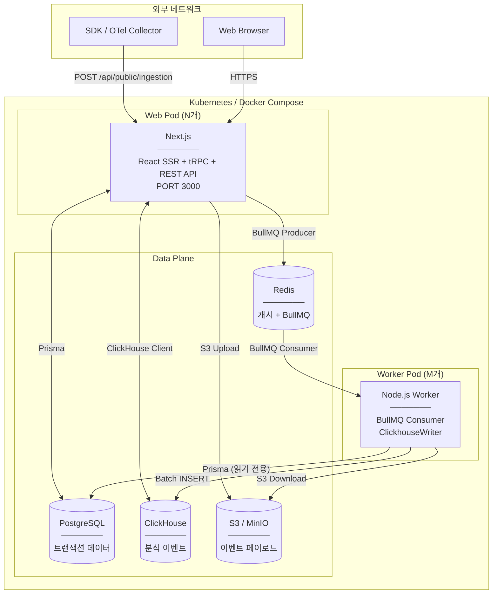
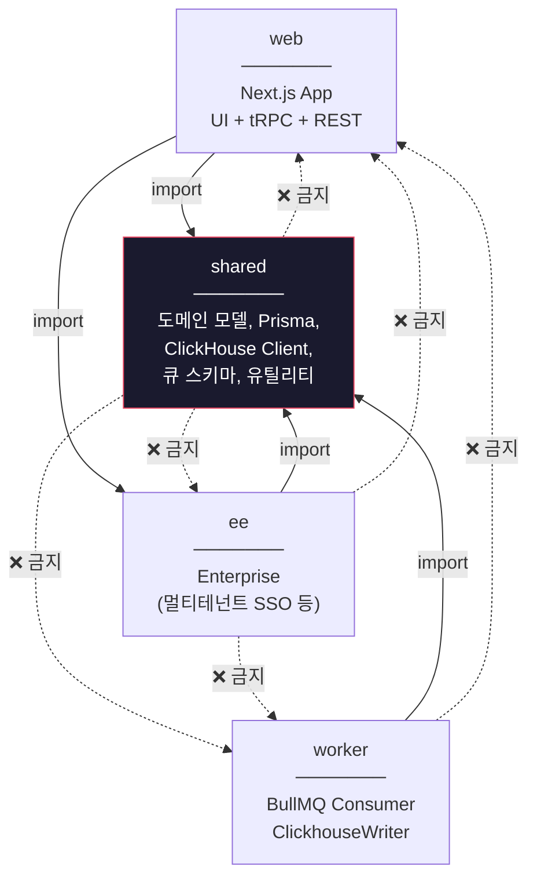
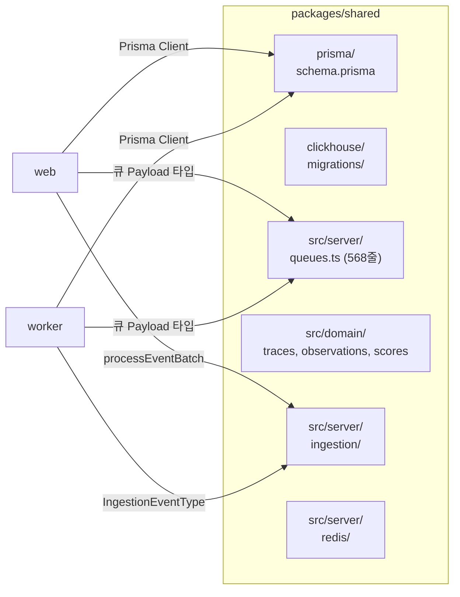
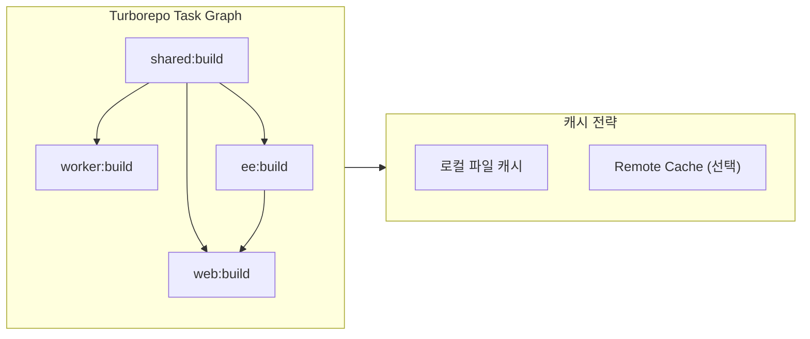

# Chapter 2. 시스템 토폴로지와 의존성 경계

> *"Dependency direction must be strictly unidirectional."*

---

## 2.1 설계 질문

모노레포 내 4개 패키지(web, worker, ee, shared)를 어떻게 조합해야 **빌드 시간은 최소화**하면서 **런타임 안전성은 극대화**할 수 있는가?

## 2.2 물리적 토폴로지

### 스케일링 특성

| 컴포넌트 | 상태 | 스케일링 방식 | 병목 지점 |
|---|---|---|---|
| Web Pod | Stateless | 수평 확장 (HPA) | tRPC 쿼리 시 ClickHouse 커넥션 |
| Worker Pod | Stateless (메모리 버퍼 제외) | 수평 확장 | S3 다운로드 대역폭, CH Insert 처리량 |
| PostgreSQL | Stateful | 수직 확장 (Read Replica 가능) | 인증 캐시 미스 시 |
| ClickHouse | Stateful | 수직 확장 / 클러스터 샤딩 | 대시보드 집계 쿼리 |
| Redis | Stateful | Sentinel / Cluster | BullMQ Job 큐 깊이 |

> **주의**: Worker의 `ClickhouseWriter`는 메모리 내 버퍼를 유지한다. Worker가 갑자기 종료되면 아직 flush되지 않은 레코드가 유실될 수 있다. 이를 방지하기 위해 `shutdown()` 메서드가 `flushAll(true)`를 호출하며, Kubernetes에서는 `terminationGracePeriodSeconds`를 충분히 설정해야 한다.

## 2.3 논리적 의존성 규칙

🔗 [`10-architecture/15-source-code-architecture.md`](file:///Users/dhsshin/Documents/LLMOps/langfuse/docs/10-architecture/15-source-code-architecture.md)

**왜 단방향인가?**

| 규칙 위반 시나리오 | 결과 |
|---|---|
| `shared`가 `web`을 import | Worker 빌드에 Next.js 전체가 포함됨 → 빌드 시간 10배 증가 |
| `worker`가 `web`을 import | Worker 컨테이너에 React/SSR 코드가 포함됨 → 이미지 크기 3배 |
| `ee`가 `worker`를 import | Enterprise 기능이 Worker 릴리스에 의존하게 됨 → 배포 결합 |

## 2.4 패키지별 책임과 주요 진입점

### `packages/shared` — 공통 계약의 단일 진실 공급원

> **핵심**: `queues.ts`의 568줄이 Web(프로듀서)과 Worker(컨슈머) 사이의 **유일한 계약**이다. 이 파일의 Zod 스키마를 수정하면 양쪽이 동시에 타입 체크된다.

### `web` — Next.js 풀스택 앱

| 디렉토리 | 역할 |
|---|---|
| `src/pages/api/public/` | SDK용 Public REST API (ingestion, traces, scores 등) |
| `src/server/api/routers/` | tRPC 라우터 (대시보드 백엔드) |
| `src/server/auth.ts` | NextAuth 설정 (1,115줄 — Ch.7에서 분석) |
| `src/components/` | React UI 컴포넌트 |

### `worker` — 백그라운드 프로세서

| 디렉토리 | 역할 |
|---|---|
| `src/queues/` | BullMQ Processor 정의 (ingestionQueue, evalQueue 등) |
| `src/services/IngestionService/` | 이벤트 병합 + 모델 매칭 + 비용 계산 (1,736줄 — Ch.4, 8에서 분석) |
| `src/services/ClickhouseWriter/` | 메모리 버퍼 + Batch Insert (643줄 — Ch.4에서 분석) |
| `src/constants/` | `default-model-prices.json` (Ch.8에서 분석) |

## 2.5 빌드 시스템 — Turborepo

| 변경 범위 | 영향받는 빌드 | 최소 검증 명령 |
|---|---|---|
| `shared` 코드 변경 | web + worker + ee 전체 | `pnpm run lint && pnpm run typecheck` |
| `web` 코드 변경 | web만 | `pnpm --filter web run lint` |
| `worker` 코드 변경 | worker만 | `pnpm --filter worker run lint` |
| `shared/prisma` 스키마 변경 | 전체 + DB 마이그레이션 | `pnpm run db:generate` + 통합 테스트 |

---

## 이 챕터의 핵심 인사이트

1. **의존성 단방향 규칙은 빌드 성능과 배포 독립성을 위한 것**이다
2. **`queues.ts`가 Web↔Worker 간의 유일한 계약**이며, Zod로 타입 안전성을 보장
3. **Worker는 "거의" Stateless**지만, ClickhouseWriter의 메모리 버퍼가 유일한 예외

---

| 방향 | 문서 |
|---|---|
| ⬅️ 이전 | [Ch.1 설계 철학](./ch01-design-philosophy.md) |
| ➡️ 다음 | [Ch.3 수집 파이프라인](./ch03-ingestion-pipeline.md) |
| 🏠 백서 색인 | [WHITEPAPER.md](../WHITEPAPER.md) |
