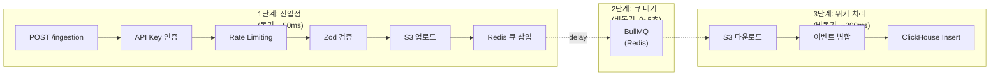
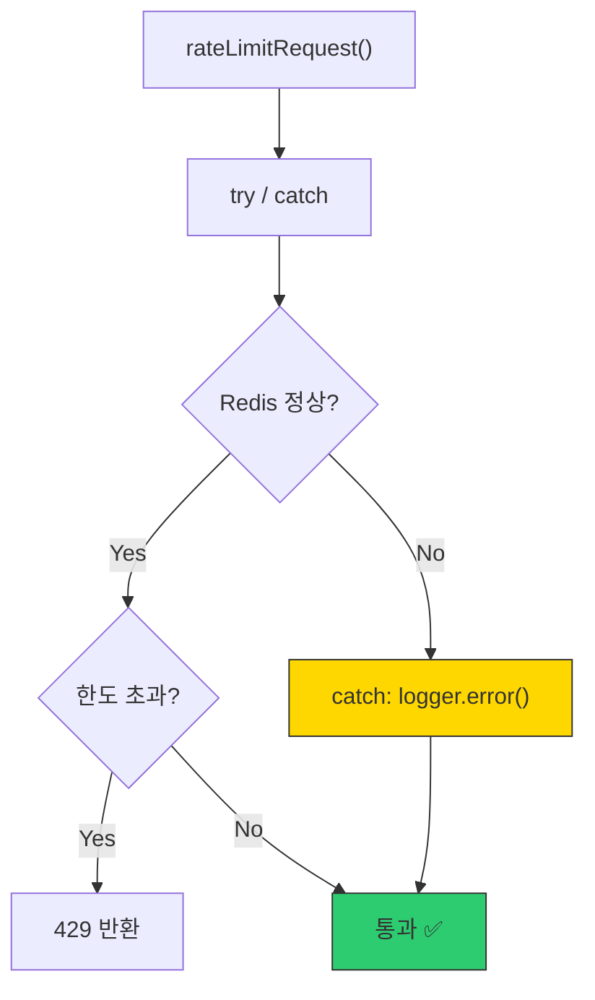
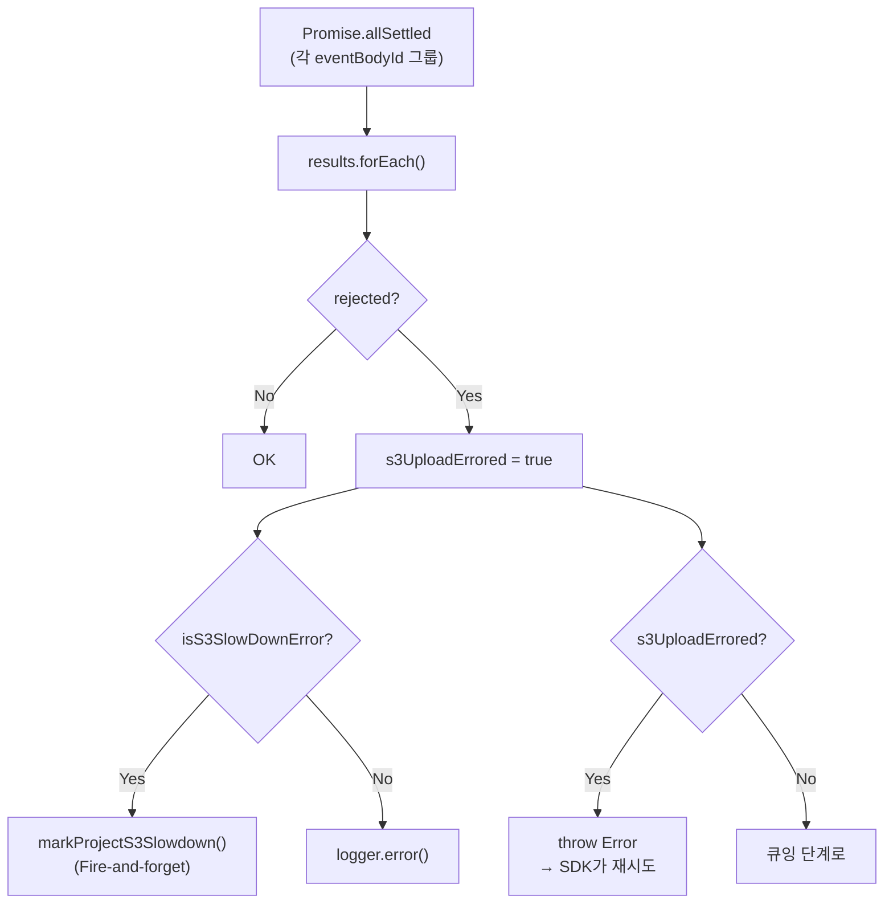
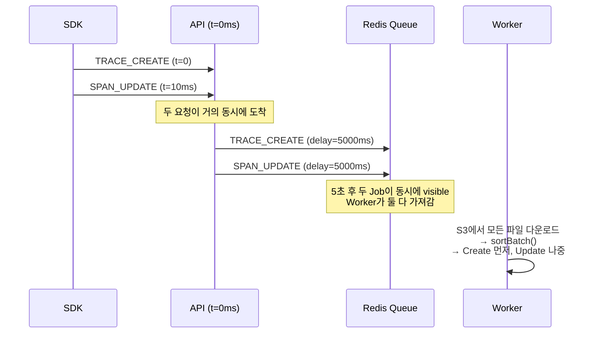
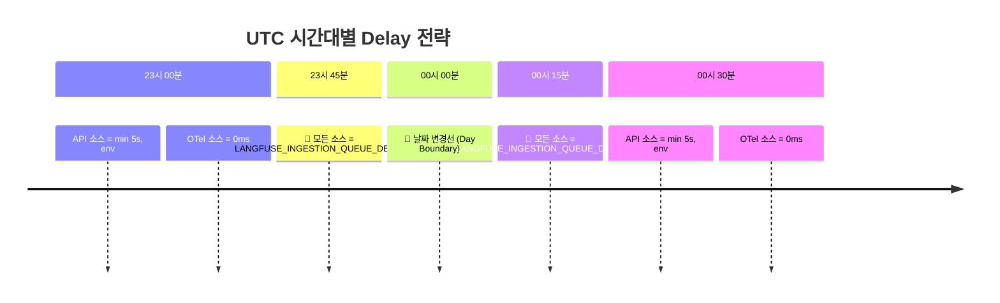
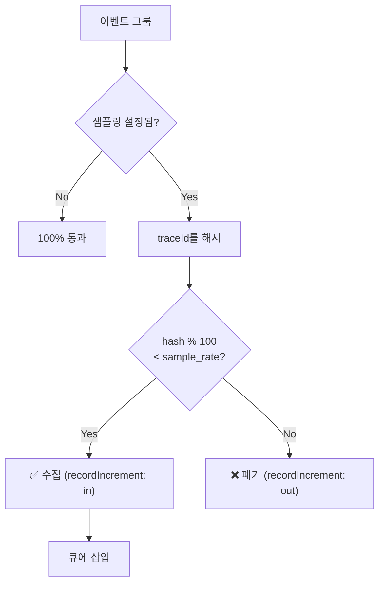

# Chapter 3. 수집 파이프라인: 가용성을 위한 설계

> *"S3 Upload is blocking, but non-failing."*
> — processEventBatch.ts L228

---

## 3.1 설계 질문

**초당 수만 건의 SDK 이벤트를 수집하면서, ClickHouse 장애·S3 과부하·Redis 타임아웃이 발생해도 데이터를 유실하지 않으려면 어떻게 해야 하는가?**

## 3.2 Langfuse의 답: 3단계 비동기 파이프라인

**왜 3단계인가?** 각 단계가 독립적으로 장애를 흡수할 수 있다:

| 단계 | 장애 시나리오 | 시스템 행동 | 데이터 유실? |
|---|---|---|---|
| 1단계 S3 | S3 SlowDown | API가 500 반환, SDK가 재시도 | ❌ SDK 재시도로 복구 |
| 2단계 Redis | Redis OOM | 큐 삽입 실패 → API 500 | ❌ SDK 재시도 |
| 3단계 ClickHouse | CH 다운 | Worker가 재시도, DLQ로 이동 | ❌ S3에 원본 보존 |
| 3단계 Worker | Worker OOM | Job이 큐에 남아 다른 Worker가 처리 | ❌ At-least-once |

## 3.3 트레이드오프 분석: Fail-open vs Fail-closed

### Rate Limiting — Fail-open 설계

🔗 [`ingestion.ts`](file:///Users/dhsshin/Documents/LLMOps/langfuse/web/src/pages/api/public/ingestion.ts#L103-L116)

**왜 Fail-open인가?**

| 선택지 | 장점 | 단점 |
|---|---|---|
| **Fail-closed** (Redis 장애 시 차단) | DDoS 방어 유지 | Redis 장애 = 전체 Ingestion 중단 |
| **Fail-open** (Redis 장애 시 통과) ✅ | 가용성 극대화 | 일시적으로 Rate Limit 무력화 |

> Langfuse의 판단: **데이터 수집은 플랫폼의 존재 이유**이다. Rate Limit은 "좋으면 좋고(nice-to-have)"이지만, 데이터 유실은 "절대 불가(must-not)"이다.

### S3 업로드 — Blocking but Non-failing (반만 성공해도 계속)

🔗 [`processEventBatch.ts` L226-265](file:///Users/dhsshin/Documents/LLMOps/langfuse/packages/shared/src/server/ingestion/processEventBatch.ts#L226-L265)

**`Promise.allSettled` vs `Promise.all` — 왜 이 선택인가?**

| 접근 | 동작 | Langfuse 선택 이유 |
|---|---|---|
| `Promise.all` | 하나라도 실패하면 즉시 reject | 나머지 성공한 업로드도 버려짐 |
| `Promise.allSettled` ✅ | 모든 결과를 기다린 후 개별 확인 | 실패한 것만 정확히 식별 가능 |

## 3.4 이벤트 순서 보장 — Delay 전략의 수학

🔗 [`processEventBatch.ts` L62-82](file:///Users/dhsshin/Documents/LLMOps/langfuse/packages/shared/src/server/ingestion/processEventBatch.ts#L62-L82)

SDK가 동일 Trace에 대해 `TRACE_CREATE`와 `SPAN_UPDATE`를 거의 동시에 보낼 때, 순서를 어떻게 보장하는가?

**이중 안전장치**:

1. **BullMQ Delay** (큐 레벨): 같은 엔티티의 모든 이벤트가 큐에 도착할 시간을 확보
2. **sortBatch()** (코드 레벨): Create 이벤트를 항상 Update보다 먼저 정렬

### UTC 자정 근처의 특수 처리

> **왜 자정인가?** ClickHouse 파티셔닝이 날짜 기준이다. 23:59에 도착한 Create와 00:01에 도착한 Update가 다른 파티션에 들어가면, 병합 시 Create를 찾지 못할 수 있다.

## 3.5 샘플링 — 비용과 관측 가능성의 트레이드오프

🔗 [`processEventBatch.ts` L300-319](file:///Users/dhsshin/Documents/LLMOps/langfuse/packages/shared/src/server/ingestion/processEventBatch.ts#L300-L319)

| 샘플링 방식 | 장점 | 단점 |
|---|---|---|
| 무작위 (random) | 구현 간단 | 같은 Trace의 이벤트가 일부만 수집됨 |
| **traceId 기반 (Langfuse)** ✅ | 같은 Trace의 모든 이벤트가 함께 포함/제외 | 특정 traceId에 편향 가능 |

> **핵심**: `traceId`를 해시하므로, 하나의 Trace에 속한 모든 Observation, Score가 함께 수집되거나 함께 폐기된다. "반쪽짜리 Trace"는 발생하지 않는다.

## 3.6 사내 커스터마이징 포인트

| 포인트 | 환경변수 | 커스터마이징 가이드 |
|---|---|---|
| S3 → MinIO 전환 | `LANGFUSE_S3_EVENT_UPLOAD_ENDPOINT`, `FORCE_PATH_STYLE=true` | 사내 Object Storage 주소 지정 |
| 딜레이 튜닝 | `LANGFUSE_INGESTION_QUEUE_DELAY_MS` | 값 증가 = 순서 보장 ↑, 실시간성 ↓ |
| Rate Limit 조정 | `scope.rateLimitOverrides` (DB) | 프로젝트별 커스텀 한도 |
| S3 암호화 | `LANGFUSE_S3_EVENT_UPLOAD_SSE=aws:kms` | 사내 KMS 키 지정 |

---

## 이 챕터의 핵심 인사이트

1. **Fail-open은 의도적 설계** — 가용성 > Rate Limiting
2. **3단계 분리가 장애 격리를 만든다** — 어떤 컴포넌트가 죽어도 데이터는 보존
3. **Delay 전략은 분산 시스템의 순서 문제를 해결한다** — 하지만 실시간성을 희생
4. **traceId 기반 샘플링이 "반쪽 Trace"를 방지한다**

---

| 방향 | 문서 |
|---|---|
| ⬅️ 이전 | [Ch.2 시스템 토폴로지](./ch02-system-topology.md) |
| ➡️ 다음 | [Ch.4 워커와 이벤트 병합](./ch04-worker-and-merge.md) |
| 🏠 백서 색인 | [WHITEPAPER.md](../WHITEPAPER.md) |
