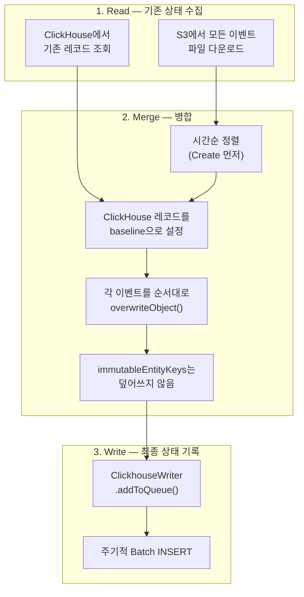
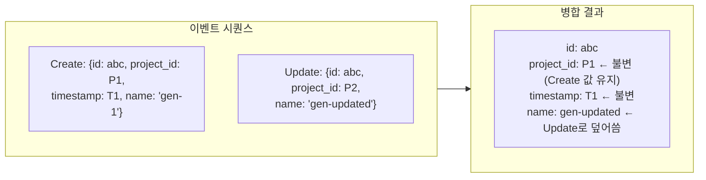
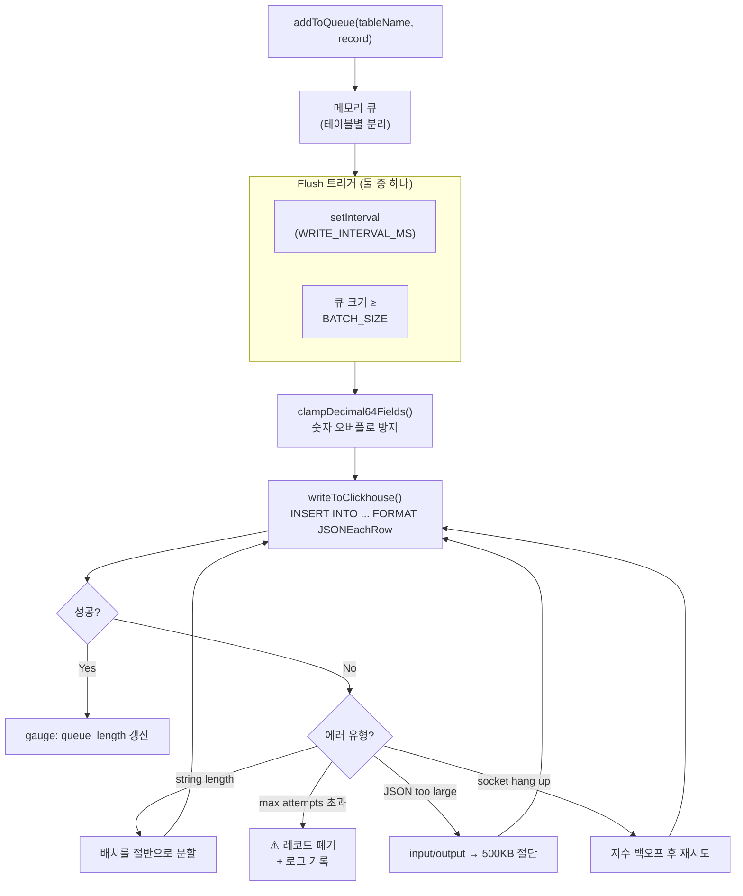
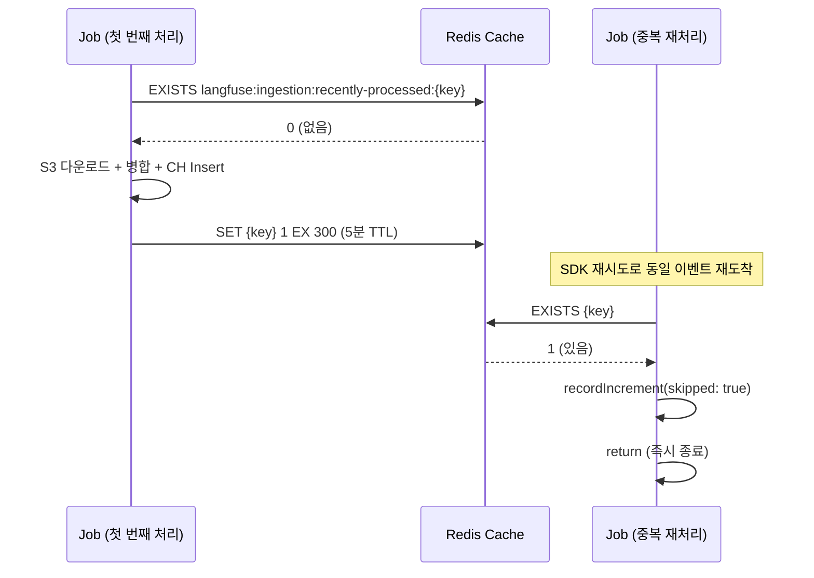
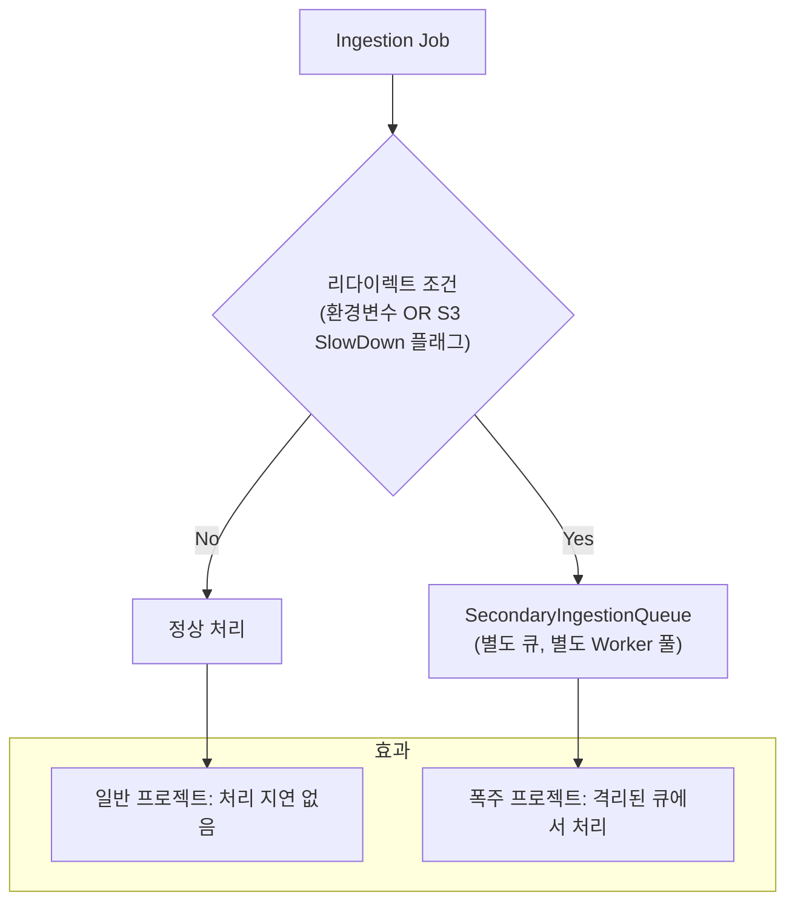

# Chapter 4. 워커와 이벤트 병합: 최종 일관성의 구현

> *"Set clickhouse first as this is the baseline for immutable fields."*
> — IngestionService/index.ts L926

---

## 4.1 설계 질문

**동일 엔티티(Trace, Observation)에 대해 SDK가 Create와 Update를 시간차를 두고 보낼 때, 최종적으로 ClickHouse에 정확한 상태를 기록하려면 어떻게 해야 하는가?**

이 질문이 어려운 이유:
- ClickHouse에는 `UPDATE` 문이 없다 (있으나 매우 비쌈)
- 같은 엔티티에 대한 이벤트가 여러 S3 파일에 분산될 수 있다
- Worker가 여러 개일 때 같은 엔티티를 동시에 처리할 수 있다

## 4.2 Langfuse의 답: Read-Merge-Write 패턴

🔗 [`IngestionService/index.ts` L273-285](file:///Users/dhsshin/Documents/LLMOps/langfuse/worker/src/services/IngestionService/index.ts#L273-L285)



### 왜 Read-Merge-Write인가? 대안 비교

| 접근 | 동작 | 장점 | 단점 |
|---|---|---|---|
| **매 이벤트마다 INSERT** | Create, Update 각각 별도 행 | 단순 | ReplacingMergeTree의 merge 부하 폭증 |
| **ALTER TABLE UPDATE** | ClickHouse의 Mutation 사용 | 의미적으로 명확 | Part 전체 재작성 — 극도로 느림 |
| **Read-Merge-Write** ✅ | 앱에서 병합 후 최종 상태만 INSERT | Merge 부하 최소 | 앱 복잡도 증가, 동시성 관리 필요 |

## 4.3 Immutable Keys — 첫 번째 값을 영원히 보존

🔗 [`IngestionService/index.ts` L86-135](file:///Users/dhsshin/Documents/LLMOps/langfuse/worker/src/services/IngestionService/index.ts#L86-L135)

```typescript
const immutableEntityKeys = {
  traces:       ["id", "project_id", "timestamp", "created_at", "environment"],
  scores:       ["id", "project_id", "timestamp", "trace_id", "created_at", "environment"],
  observations: ["id", "project_id", "trace_id", "start_time", "created_at", "environment"],
};
```



> **보안적 의미**: `project_id`가 불변이므로, 악의적인 Update로 다른 프로젝트에 데이터를 주입하는 공격이 원천 차단된다.

## 4.4 ClickhouseWriter — 메모리 버퍼의 운명

🔗 [`ClickhouseWriter/index.ts`](file:///Users/dhsshin/Documents/LLMOps/langfuse/worker/src/services/ClickhouseWriter/index.ts)



### 에러 복구 전략의 철학

| 에러 | 전략 | 철학 |
|---|---|---|
| 네트워크 일시 장애 | 지수 백오프 재시도 | 일시적 문제는 기다리면 해결 |
| 단일 레코드 과대 | 필드 절단 (500KB) | **불완전한 데이터 > 데이터 없음** |
| 배치 전체 과대 | 이분 분할 후 재시도 | 문제의 레코드를 격리 |
| 모든 재시도 실패 | 폐기 + 로그 | 무한 루프 방지, 운영자에게 알림 |

> **핵심 판단**: Langfuse는 "불완전한 데이터가 없는 데이터보다 낫다"는 철학을 따른다. 프롬프트가 500KB를 초과하면 잘라서라도 기록한다.

## 4.5 중복 방지 — Redis Seen Event Cache

🔗 [`ingestionQueue.ts` L84-106](file:///Users/dhsshin/Documents/LLMOps/langfuse/worker/src/queues/ingestionQueue.ts#L84-L106)



**왜 5분인가?**

| TTL | 장점 | 단점 |
|---|---|---|
| 1분 | Redis 메모리 절약 | 지연된 재시도를 놓칠 수 있음 |
| **5분** ✅ | SDK의 일반적 재시도 윈도우 커버 | 적정 메모리 사용 |
| 60분 | 거의 모든 중복 차단 | Redis 메모리 폭증 |

## 4.6 Secondary Queue — Noisy Neighbor 격리

🔗 [`ingestionQueue.ts` L108-133](file:///Users/dhsshin/Documents/LLMOps/langfuse/worker/src/queues/ingestionQueue.ts#L108-L133)



> **사내 활용**: 특정 팀의 LLM 앱이 갑자기 트래픽을 폭증시킬 때, 해당 프로젝트 ID를 `LANGFUSE_SECONDARY_INGESTION_QUEUE_ENABLED_PROJECT_IDS`에 추가하여 다른 팀에 영향을 주지 않도록 격리할 수 있다.

---

## 이 챕터의 핵심 인사이트

1. **Read-Merge-Write는 ClickHouse의 UPDATE 비용을 우회하는 핵심 패턴**
2. **Immutable Keys는 보안과 데이터 무결성의 이중 역할**을 한다
3. **"불완전한 데이터 > 없는 데이터"**가 에러 복구 전략의 기본 철학
4. **5분 TTL의 Redis 캐시가 SDK 재시도에 의한 중복을 O(0.1ms)에 차단**

---

| 방향 | 문서 |
|---|---|
| ⬅️ 이전 | [Ch.3 수집 파이프라인](./ch03-ingestion-pipeline.md) |
| ➡️ 다음 | [Ch.5 ClickHouse 데이터 엔지니어링](./ch05-clickhouse-engineering.md) |
| 🏠 백서 색인 | [WHITEPAPER.md](../WHITEPAPER.md) |
