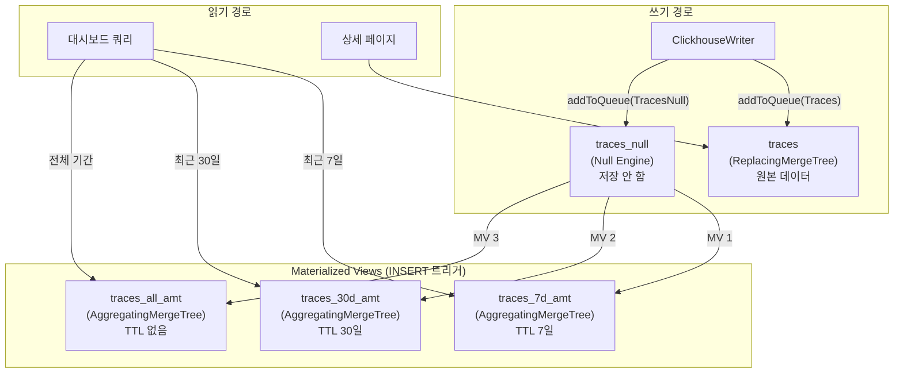
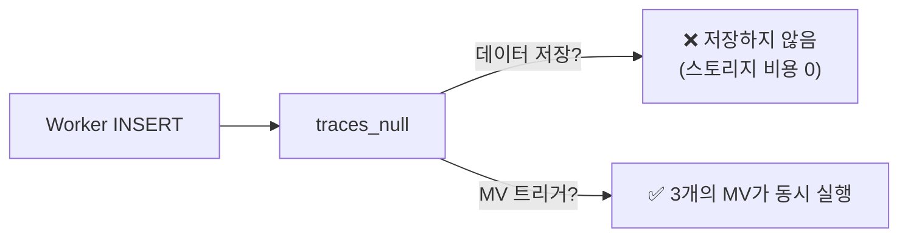
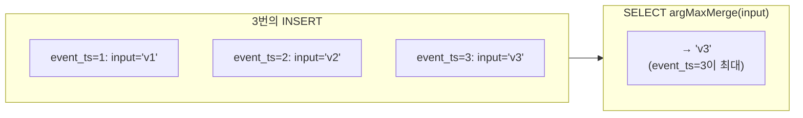
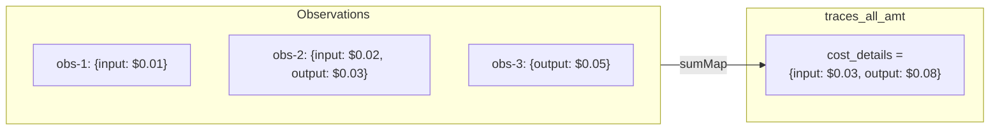
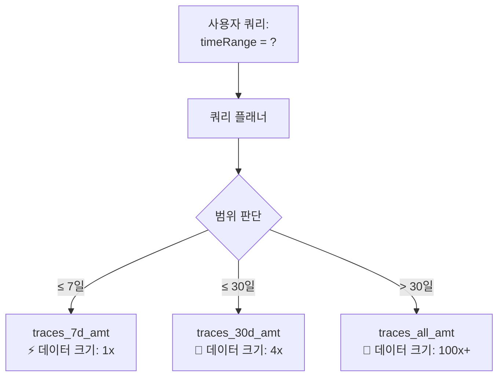
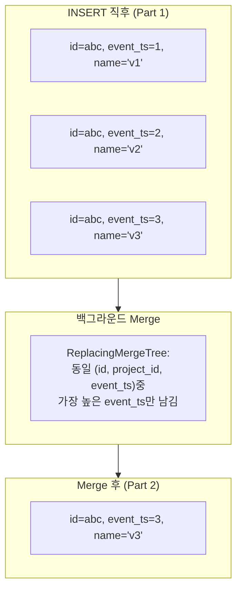

# Chapter 5. ClickHouse 데이터 엔지니어링

> *"Null Engine triggers are free — they store nothing but fan out to all downstream views."*

---

## 5.1 설계 질문

**대시보드의 "최근 7일 트레이스 목록"과 "전체 기간 비용 합계"를 동시에 밀리초 단위로 응답하려면, 같은 데이터를 어떻게 다르게 저장해야 하는가?**

## 5.2 Langfuse의 답: Null → MV → AMT 트리거 패턴



### 왜 이런 구조인가?

| 질문 | 단순한 답 | Langfuse의 답 | 왜? |
|---|---|---|---|
| 원본이 필요할 때 | traces 테이블 직접 쿼리 | ✅ 동일 | 상세 페이지에서만 사용 |
| 목록/집계가 필요할 때 | traces 테이블에서 GROUP BY | AMT 뷰에서 사전 집계된 값 조회 | **10TB 테이블의 full scan을 피함** |
| 7일/30일/전체 | WHERE 조건으로 분리 | 별도 테이블 (TTL로 크기 제한) | **작은 테이블 = 빠른 쿼리** |

### Null Engine의 역할



> Null Engine은 **"1회 INSERT로 3개 테이블에 동시 분기"**를 가능하게 하는 트릭이다. 데이터를 물리적으로 보관하지 않으므로 스토리지 비용이 0이다.

## 5.3 AggregatingMergeTree 집계함수 해부

각 컬럼이 어떤 집계 함수를 사용하는지, 그리고 **왜 그 함수인지**를 분석한다.

| 함수 | 적용 컬럼 | 동작 | 왜 이 함수? |
|---|---|---|---|
| `any` | name, user_id, session_id | NULL 아닌 첫 번째 값 | Create 이벤트의 값을 보존 |
| `min` | timestamp, created_at | 최솟값 | "이 Trace가 시작된 시각" |
| `max` | updated_at | 최댓값 | "마지막으로 수정된 시각" |
| `argMax(val, ts)` | input, output, bookmarked | ts가 최대인 val | "가장 최신 내용" |
| `sumMap` | cost_details, usage_details | Map 키별 합산 | "총 비용 = 모든 Observation 비용 합" |
| `maxMap` | metadata | Map 키별 최신값 | "최신 메타데이터 유지" |
| `groupUniqArrayArray` | tags, score_ids | 유니크 배열 | "중복 없는 태그 목록" |

### `argMax` — UPDATE를 대체하는 핵심 함수



> ClickHouse에서 `UPDATE traces SET input='v3' WHERE id='abc'`는 Part 전체를 재작성한다. 반면 `argMax(input, event_ts)`는 새 행을 INSERT하기만 하면 되고, 쿼리 시점에 자동으로 최신값을 반환한다. **쓰기 비용 O(1), 읽기 비용 약간 증가** — 분석 워크로드에서 압도적으로 유리하다.

### `sumMap` — Observation 비용의 자동 합산



> 개별 Observation의 비용이 Trace 레벨에서 자동으로 합산된다. 대시보드에서 "이 Trace의 총 비용"을 보여줄 때 별도의 GROUP BY 쿼리가 필요 없다.

## 5.4 TTL 기반 쿼리 라우팅



| 테이블 | TTL | 스토리지 (상대) | 쿼리 응답 (상대) |
|---|---|---|---|
| `traces_7d_amt` | 7일 | 1x | 1x (최고속) |
| `traces_30d_amt` | 30일 | ~4x | ~3x |
| `traces_all_amt` | ∞ | ~100x+ | ~10x+ |

### 사내 커스터마이징

```sql
-- TTL을 14일, 90일로 변경하는 예시 (ClickHouse ALTER)
ALTER TABLE traces_7d_amt
  MODIFY TTL toDate(start_time) + INTERVAL 14 DAY;

ALTER TABLE traces_30d_amt
  MODIFY TTL toDate(start_time) + INTERVAL 90 DAY;
```

> **주의**: TTL을 늘리면 스토리지 비용과 쿼리 시간이 비례하여 증가한다. 사내 데이터 보존 정책과 쿼리 SLA를 함께 고려해야 한다.

## 5.5 ReplacingMergeTree — 원본 테이블의 동작

원본 테이블(`traces`, `observations`, `scores`)은 `ReplacingMergeTree`를 사용한다.



> **FINAL 키워드**: Merge가 아직 완료되지 않았을 때 정확한 결과를 얻으려면 `SELECT ... FINAL`을 사용해야 한다. Langfuse는 상세 페이지 쿼리에서 이를 적용한다.

---

## 이 챕터의 핵심 인사이트

1. **Null Engine은 "무료 팬아웃"** — 1회 INSERT로 3개 AMT 테이블에 동시 분기
2. **argMax가 UPDATE를 대체한다** — 쓰기는 Append-only, 읽기 시 자동으로 최신값
3. **TTL 기반 테이블 분리가 쿼리 성능을 10배 이상 차별화**
4. **sumMap이 개별 Observation 비용을 Trace 레벨로 자동 합산**

---

| 방향 | 문서 |
|---|---|
| ⬅️ 이전 | [Ch.4 워커와 이벤트 병합](./ch04-worker-and-merge.md) |
| ➡️ 다음 | [Ch.6 쿼리 경로와 타입 안전성](./ch06-query-path.md) |
| 🏠 백서 색인 | [WHITEPAPER.md](../WHITEPAPER.md) |
