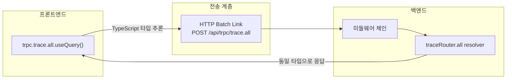
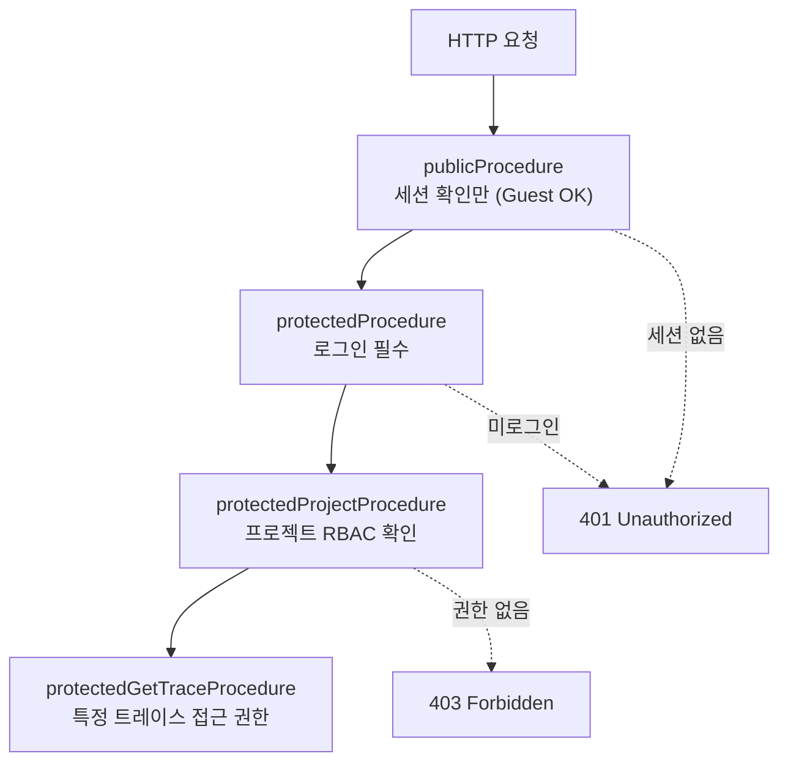
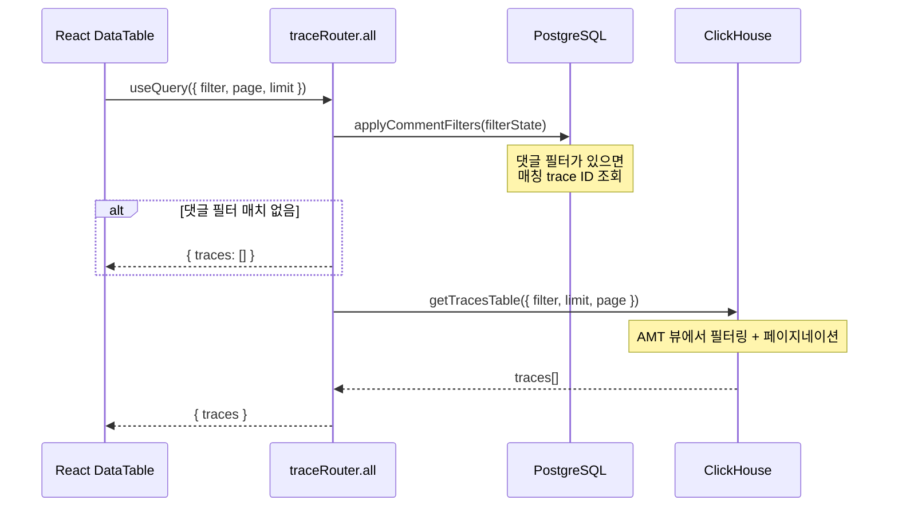
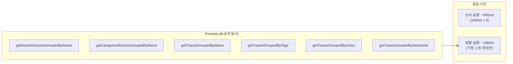
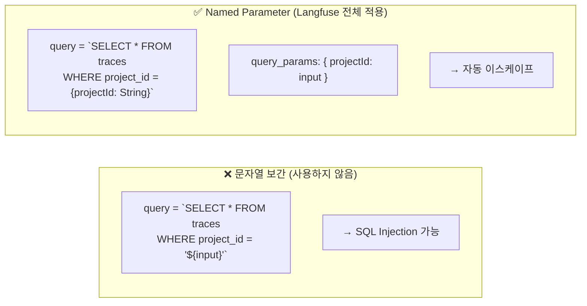

# Chapter 6. 쿼리 경로와 타입 안전성

> *"6개의 독립 ClickHouse 쿼리를 한 번에 실행하여 가장 느린 쿼리의 응답 시간만큼만 대기한다."*

---

## 6.1 설계 질문

**프론트엔드(React)와 백엔드(Next.js) 사이에서 타입 안전성을 보장하면서, PostgreSQL과 ClickHouse를 동시에 조회하는 복잡한 쿼리를 어떻게 관리하는가?**

## 6.2 Langfuse의 답: tRPC — End-to-End 타입 안전성

**왜 REST가 아닌 tRPC인가?**

| 기준 | REST API | tRPC |
|---|---|---|
| 타입 안전성 | 수동 (OpenAPI → codegen) | **자동** (서버 타입이 클라이언트에 전파) |
| 스키마 변경 시 | 클라이언트가 깨져도 컴파일 타임에 모름 | **컴파일 에러로 즉시 감지** |
| Batch 요청 | 직접 구현 필요 | 빌트인 HTTP Batch Link |
| 외부 클라이언트 지원 | ✅ 표준 HTTP | ❌ (내부 전용) |

> Langfuse의 판단: **대시보드 UI는 내부 전용**이므로 tRPC로 타입 안전성을 극대화하고, **SDK용 Public API는 REST로** 유지하여 언어 중립성을 보장한다.

## 6.3 미들웨어 체인 — 보안 계층

🔗 [`web/src/server/api/trpc.ts`](file:///Users/dhsshin/Documents/LLMOps/langfuse/web/src/server/api/trpc.ts)

| 계층 | 체크 대상 | 실패 시 |
|---|---|---|
| `publicProcedure` | ctx.session 존재 여부 | Guest 허용 (일부 읽기 전용 뷰) |
| `protectedProcedure` | `ctx.session.user` 확인 | 401 반환 |
| `protectedProjectProcedure` | `ProjectMembership` + Role | 403 반환 |
| `protectedGetTraceProcedure` | ClickHouse에서 Trace 존재 확인 | 404 반환 |

## 6.4 병렬 쿼리 패턴 — PostgreSQL + ClickHouse 합성

🔗 [`traces.ts` L125-152](file:///Users/dhsshin/Documents/LLMOps/langfuse/web/src/server/api/routers/traces.ts#L125-L152)

### `filterOptions` — 6개 동시 쿼리의 위력

🔗 [`traces.ts` L262-331](file:///Users/dhsshin/Documents/LLMOps/langfuse/web/src/server/api/routers/traces.ts#L262-L331)

> 성능 이득: **6배 빠른 필터 옵션 로딩**

## 6.5 ClickHouse SQL Injection 방어 — Parameter Binding

---

## 이 챕터의 핵심 인사이트

1. **tRPC = 내부 UI용, REST = 외부 SDK용** — 각각의 장점을 취함
2. **미들웨어 체인이 4단계 보안 계층**을 형성
3. **Promise.all로 6배 빠른 필터 옵션 로딩**
4. **Named Parameter Binding으로 SQL Injection 원천 차단**

---

| 방향 | 문서 |
|---|---|
| ⬅️ 이전 | [Ch.5 ClickHouse 엔지니어링](./ch05-clickhouse-engineering.md) |
| ➡️ 다음 | [Ch.7 인증 아키텍처](./ch07-authentication.md) |
| 🏠 백서 색인 | [WHITEPAPER.md](../WHITEPAPER.md) |
