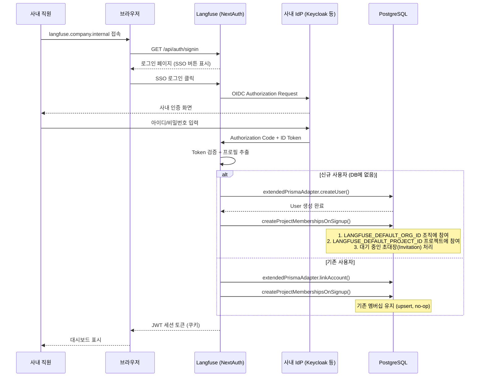
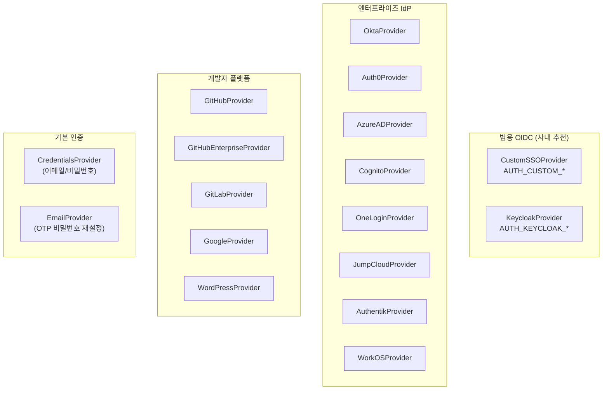
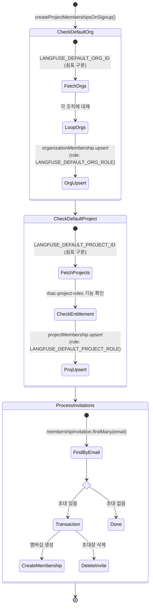
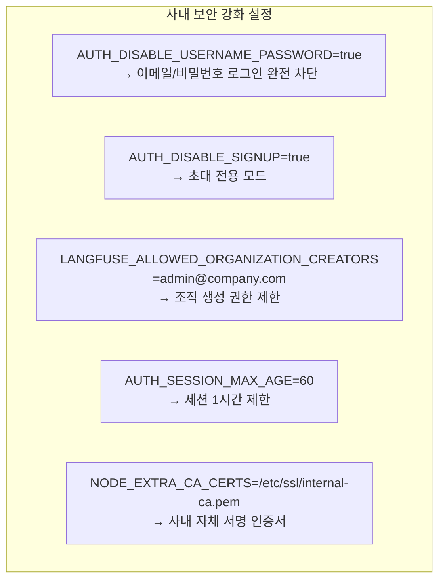

# Chapter 7. 인증 아키텍처와 사내 SSO 연동

> *"16 built-in providers, all activated by environment variables alone."*

---

## 7.1 설계 질문

**다양한 IdP(OIDC, SAML, OAuth2)를 지원하면서, 첫 로그인 시 사용자를 올바른 프로젝트에 자동으로 배치하려면 어떻게 해야 하는가?**

## 7.2 인증 아키텍처 전체 흐름

🔗 [`web/src/server/auth.ts`](file:///Users/dhsshin/Documents/LLMOps/langfuse/web/src/server/auth.ts)



## 7.3 16개 빌트인 Provider — 환경변수 기반 활성화

🔗 [`auth.ts` L89-607](file:///Users/dhsshin/Documents/LLMOps/langfuse/web/src/server/auth.ts#L89-L607)



### 사내 연동 — 최소 설정 가이드

**CustomSSOProvider** (가장 범용적):

```bash
# .env
AUTH_CUSTOM_CLIENT_ID=langfuse-internal
AUTH_CUSTOM_CLIENT_SECRET=$(vault kv get secret/langfuse/oidc)
AUTH_CUSTOM_ISSUER=https://sso.company.internal/realms/main
AUTH_CUSTOM_NAME="사내 SSO"

# 선택사항
AUTH_CUSTOM_SCOPE="openid email profile groups"
AUTH_CUSTOM_ALLOW_ACCOUNT_LINKING=true
AUTH_DISABLE_USERNAME_PASSWORD=true   # SSO 강제
```

**Keycloak 전용** (더 세밀한 제어):

```bash
AUTH_KEYCLOAK_CLIENT_ID=langfuse
AUTH_KEYCLOAK_CLIENT_SECRET=...
AUTH_KEYCLOAK_ISSUER=https://keycloak.company.internal/realms/main
AUTH_KEYCLOAK_SCOPE="openid email profile"
```

## 7.4 자동 프로비저닝 — 첫 로그인 시 멤버십 부여

🔗 [`createProjectMembershipsOnSignup.ts`](file:///Users/dhsshin/Documents/LLMOps/langfuse/web/src/features/auth/lib/createProjectMembershipsOnSignup.ts#L9-L239)



| 환경변수 | 기본값 | 동작 |
|---|---|---|
| `LANGFUSE_DEFAULT_ORG_ID` | — | 쉼표로 구분된 조직 ID 목록, 신규 사용자 자동 참여 |
| `LANGFUSE_DEFAULT_ORG_ROLE` | `VIEWER` | 자동 부여 역할 (ADMIN, MEMBER, VIEWER) |
| `LANGFUSE_DEFAULT_PROJECT_ID` | — | 쉼표로 구분된 프로젝트 ID 목록 |
| `LANGFUSE_DEFAULT_PROJECT_ROLE` | `VIEWER` | 자동 부여 역할 |

## 7.5 보안 강화 옵션



### Keycloak 호환성 패치

🔗 [`auth.ts` L645-649](file:///Users/dhsshin/Documents/LLMOps/langfuse/web/src/server/auth.ts#L645-L649)

```typescript
if (data.provider.endsWith("keycloak")) {
  delete data["refresh_expires_in"];     // NextAuth 스키마에 없는 필드
  delete data["not-before-policy"];      // NextAuth 스키마에 없는 필드
}
```

> Keycloak이 반환하는 비표준 필드가 NextAuth의 Prisma Adapter와 충돌하는 알려진 이슈([#7655](https://github.com/nextauthjs/next-auth/issues/7655))를 Langfuse가 자체적으로 우회한다.

---

## 이 챕터의 핵심 인사이트

1. **환경변수만으로 16개 SSO Provider 활성화** — 코드 수정 불필요
2. **자동 프로비저닝이 "첫 로그인 = 즉시 대시보드"**를 가능하게 함
3. **Keycloak 호환성 패치가 이미 내장**되어 있으므로 별도 작업 불필요
4. **`AUTH_DISABLE_USERNAME_PASSWORD=true`로 SSO 강제**가 가장 중요한 보안 설정

---

| 방향 | 문서 |
|---|---|
| ⬅️ 이전 | [Ch.6 쿼리 경로](./ch06-query-path.md) |
| ➡️ 다음 | [Ch.8 비용 산정 엔진](./ch08-cost-engine.md) |
| 🏠 백서 색인 | [WHITEPAPER.md](../WHITEPAPER.md) |
