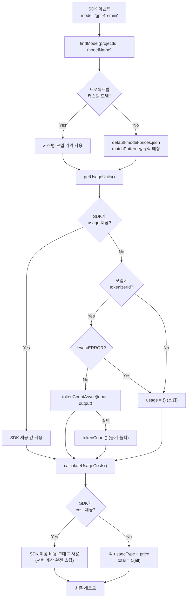
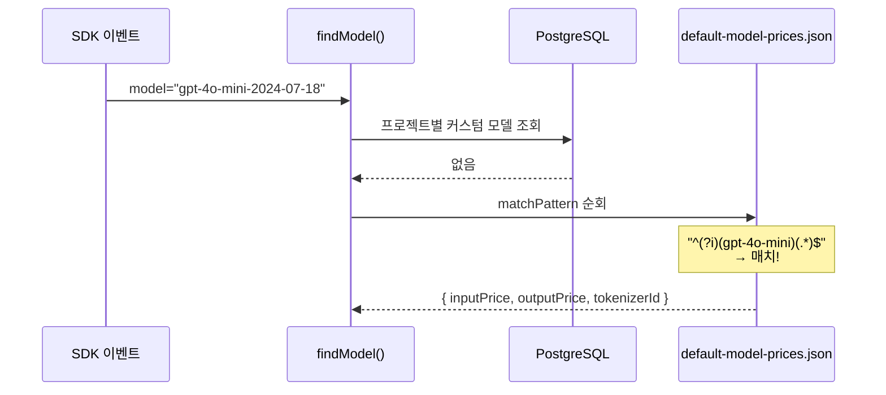
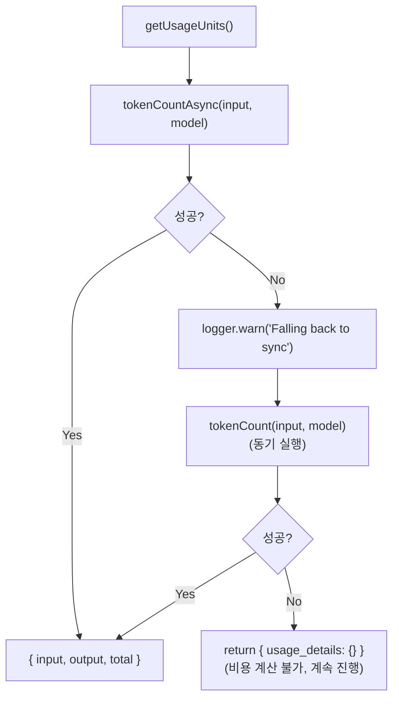

# Chapter 8. 비용 산정 엔진

> *"If user has provided any cost point, do not calculate any other cost points."*
> — IngestionService.calculateUsageCosts() L1298

---

## 8.1 설계 질문

**SDK가 모델 이름만 보내도 비용을 자동 계산하고, 사내 프라이빗 모델의 커스텀 가격도 지원하려면 어떻게 해야 하는가?**

## 8.2 비용 산정 전체 파이프라인

🔗 [`IngestionService/index.ts` L1054-1140](file:///Users/dhsshin/Documents/LLMOps/langfuse/worker/src/services/IngestionService/index.ts#L1054-L1140)



## 8.3 우선순위 규칙 — SDK가 최고 권한

| 우선순위 | 소스 | 동작 |
|---|---|---|
| 1 (최고) | SDK `provided_cost_details` | 서버 계산을 **완전히 건너뜀** |
| 2 | SDK `provided_usage_details` + 서버 가격 | 토큰 수는 SDK, 가격은 서버 |
| 3 | 서버 토크나이저 + 서버 가격 | 양쪽 모두 서버가 계산 |
| 4 (최저) | 없음 | `cost_details = {}` |

> **사내 활용**: 사내 LLM의 비용을 별도 과금 시스템에서 계산하는 경우, SDK에서 `cost_details`를 직접 주입하면 Langfuse 서버의 가격 계산을 완전히 우회할 수 있다.

## 8.4 모델 매칭 — matchPattern 정규식

🔗 [`default-model-prices.json`](file:///Users/dhsshin/Documents/LLMOps/langfuse/worker/src/constants/default-model-prices.json)



### 사내 모델 추가 방법

```json
{
  "modelName": "sllm-internal-v2",
  "matchPattern": "^(?i)(sllm-internal-v2)(.*)$",
  "inputPrice": 0.00015,
  "outputPrice": 0.0006,
  "totalPrice": null,
  "unit": "TOKENS",
  "tokenizerId": "cl100k_base",
  "startDate": "2026-01-01T00:00:00Z"
}
```

| 필드 | 설명 | 주의사항 |
|---|---|---|
| `matchPattern` | SDK의 model 필드를 매칭하는 정규식 | `(?i)` = 대소문자 무시 |
| `inputPrice` / `outputPrice` | **토큰 1개당** USD 가격 | OpenAI는 "per 1M tokens"으로 표시하므로 변환 필요 |
| `tokenizerId` | 토크나이저 식별자 | 사내 모델이 tiktoken 호환이면 `cl100k_base` 등 사용 |
| `startDate` | 가격 적용 시작일 | 동일 모델의 가격 변동 이력 관리 |

## 8.5 토크나이저 폴백 전략

🔗 [`IngestionService/index.ts` L1174-1264](file:///Users/dhsshin/Documents/LLMOps/langfuse/worker/src/services/IngestionService/index.ts#L1174-L1264)



> **Fail-open 철학 재등장**: 토크나이저가 실패해도 이벤트 수집은 중단하지 않는다. 비용 정보 없이라도 Trace/Observation 데이터는 보존한다.

---

## 이 챕터의 핵심 인사이트

1. **SDK 제공 비용이 최고 우선** — 사내 과금 시스템과의 통합 가능
2. **`default-model-prices.json`에 사내 모델을 추가하는 것만으로 비용 추적 가능**
3. **비동기 → 동기 → 폐기의 3단계 폴백**이 토크나이저 장애를 흡수
4. **`matchPattern`의 정규식이 모델 버전 변동을 자동 흡수**

---

| 방향 | 문서 |
|---|---|
| ⬅️ 이전 | [Ch.7 인증 아키텍처](./ch07-authentication.md) |
| ➡️ 다음 | [Ch.9 운영 가이드](./ch09-operations.md) |
| 🏠 백서 색인 | [WHITEPAPER.md](../WHITEPAPER.md) |
