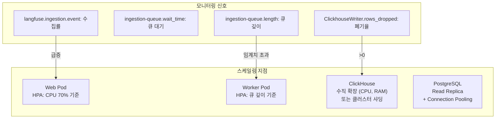
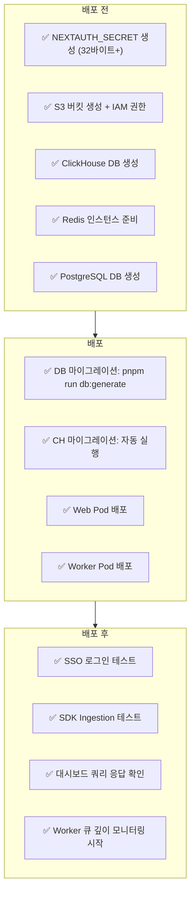

# Chapter 9. 운영 가이드와 튜닝

> *"Treat cost and operational simplicity as architectural constraints."*
> — ARCHITECTURE_PRINCIPLES.md

---

## 9.1 환경변수 전체 맵

### 인프라 연결

| 환경변수 | 필수 | 설명 |
|---|---|---|
| `DATABASE_URL` | ✅ | PostgreSQL 연결 문자열 |
| `CLICKHOUSE_URL` | ✅ | ClickHouse HTTP 엔드포인트 |
| `REDIS_CONNECTION_STRING` | ✅ | Redis 연결 문자열 |
| `LANGFUSE_S3_EVENT_UPLOAD_BUCKET` | ✅ | S3/MinIO 버킷 |
| `LANGFUSE_S3_EVENT_UPLOAD_ENDPOINT` | — | MinIO 등 사내 스토리지 주소 |
| `LANGFUSE_S3_EVENT_UPLOAD_FORCE_PATH_STYLE` | — | MinIO 시 `true` |
| `LANGFUSE_S3_EVENT_UPLOAD_REGION` | — | AWS 리전 |
| `LANGFUSE_S3_EVENT_UPLOAD_SSE` | — | 서버측 암호화 (`aws:kms`) |

### 인증

| 환경변수 | 필수 | 설명 |
|---|---|---|
| `NEXTAUTH_URL` | ✅ | Langfuse 외부 접근 URL |
| `NEXTAUTH_SECRET` | ✅ | JWT 서명 키 (32바이트+) |
| `AUTH_CUSTOM_CLIENT_ID` | SSO시 | OIDC Client ID |
| `AUTH_CUSTOM_CLIENT_SECRET` | SSO시 | OIDC Client Secret |
| `AUTH_CUSTOM_ISSUER` | SSO시 | IdP Issuer URL |
| `AUTH_CUSTOM_NAME` | SSO시 | 로그인 버튼 텍스트 |
| `AUTH_DISABLE_USERNAME_PASSWORD` | — | `true` = SSO 강제 |
| `AUTH_DISABLE_SIGNUP` | — | `true` = 초대 전용 |
| `AUTH_SESSION_MAX_AGE` | — | 세션 만료 (분) |
| `NODE_EXTRA_CA_CERTS` | — | 사내 CA 인증서 경로 |

### 성능 튜닝

| 환경변수 | 기본값 | 설명 | 트레이드오프 |
|---|---|---|---|
| `LANGFUSE_INGESTION_QUEUE_DELAY_MS` | 5000 | 큐 딜레이 | ↑ 순서보장 ↓ 실시간성 |
| `LANGFUSE_S3_CONCURRENT_READS` | — | S3 병렬 다운로드 | ↑ 처리량 ↑ 네트워크 부하 |
| `LANGFUSE_INGESTION_CLICKHOUSE_WRITE_BATCH_SIZE` | — | CH Batch 크기 | ↑ 처리량 ↑ 메모리 |
| `LANGFUSE_INGESTION_CLICKHOUSE_WRITE_INTERVAL_MS` | — | CH Flush 주기 | ↓ 지연 ↑ 소규모 Insert |
| `LANGFUSE_INGESTION_CLICKHOUSE_MAX_ATTEMPTS` | — | 재시도 횟수 | ↑ 복구율 ↓ 처리 속도 |

### 기능 플래그

| 환경변수 | 기본값 | 설명 |
|---|---|---|
| `LANGFUSE_ENABLE_BLOB_STORAGE_FILE_LOG` | `false` | S3 메타 로그 기록 |
| `LANGFUSE_ENABLE_REDIS_SEEN_EVENT_CACHE` | `false` | 중복 방지 캐시 |
| `LANGFUSE_SECONDARY_INGESTION_QUEUE_ENABLED_PROJECT_IDS` | — | Secondary Queue 프로젝트 |
| `LANGFUSE_EXPERIMENT_INSERT_INTO_EVENTS_TABLE` | `false` | events_full 이중 기록 |

## 9.2 수평 확장 전략



### Worker 스케일링 기준

| 메트릭 | 정상 | 경고 | 위험 |
|---|---|---|---|
| `ingestion-queue.length` | < 1,000 | 1,000~10,000 | > 10,000 |
| `ingestion-queue.wait_time` | < 5s | 5~30s | > 30s |
| `rows_dropped` | 0 | > 0 | 지속적 > 0 |

## 9.3 Kubernetes 배포 체크리스트



### Worker `terminationGracePeriodSeconds`

```yaml
# worker deployment.yaml
spec:
  terminationGracePeriodSeconds: 60  # ClickhouseWriter flush 완료 대기
  containers:
    - name: worker
      lifecycle:
        preStop:
          exec:
            command: ["sh", "-c", "sleep 30"]  # flush 시간 확보
```

> **핵심**: Worker의 `shutdown()` 메서드는 `flushAll(true)`를 호출하여 메모리 버퍼의 모든 레코드를 ClickHouse에 기록한다. `terminationGracePeriodSeconds`가 너무 짧으면 데이터 유실이 발생할 수 있다.

## 9.4 ClickHouse TTL 커스터마이징

```sql
-- 사내 데이터 보존 정책에 맞게 조정
ALTER TABLE traces_7d_amt
  MODIFY TTL toDate(start_time) + INTERVAL 14 DAY;

ALTER TABLE traces_30d_amt
  MODIFY TTL toDate(start_time) + INTERVAL 90 DAY;

-- traces_all_amt는 TTL 없음 (영구 보존)
-- 영구 보존이 부담이면:
ALTER TABLE traces_all_amt
  MODIFY TTL toDate(start_time) + INTERVAL 365 DAY;
```

## 9.5 백서 전체 요약 — 설계 결정 매트릭스

| # | 설계 결정 | 대안 | 선택 이유 | 대가 |
|---|---|---|---|---|
| 1 | Wide Event 모델 | Metrics + Logs + Traces | 사전 정의 없이 모든 질문 가능 | 레코드당 크기 증가 |
| 2 | ClickHouse | PostgreSQL, Elasticsearch | 컬럼형 집계 성능, 압축률 | UPDATE 비쌈 → 앱 병합 필요 |
| 3 | 비동기 3단계 수집 | 동기 직접 쓰기 | 가용성, 데이터 보존 | S3 + Redis + Worker 운영 필요 |
| 4 | Fail-open Rate Limiting | Fail-closed | 데이터 수집 > DDoS 방어 | 일시적 과부하 가능 |
| 5 | Read-Merge-Write | ALTER TABLE UPDATE | ClickHouse 특성에 최적 | 앱 복잡도 증가 |
| 6 | Null Engine 팬아웃 | 3번 INSERT | 1회 INSERT = 3개 뷰 | 추가 테이블 관리 |
| 7 | tRPC (내부) + REST (외부) | REST only | 내부 타입 안전성 극대화 | 2개 API 계층 운영 |
| 8 | SDK 비용 우선 규칙 | 서버 계산 강제 | 사내 과금 시스템 통합 가능 | 일관성 의존을 SDK에 위임 |

---

| 방향 | 문서 |
|---|---|
| ⬅️ 이전 | [Ch.8 비용 산정 엔진](./ch08-cost-engine.md) |
| 🏠 백서 색인 | [WHITEPAPER.md](../WHITEPAPER.md) |
