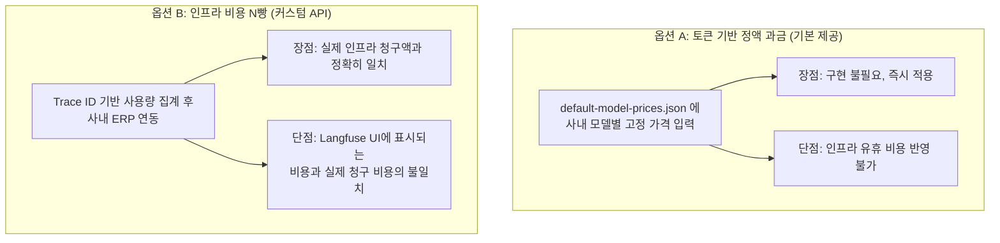
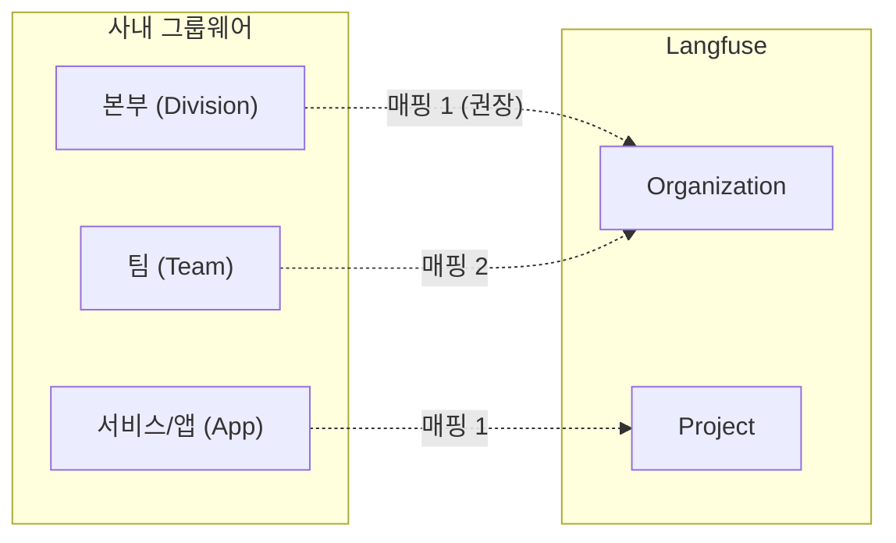

# Chapter 10. 사내 도입을 위한 미결 결정 사항 및 로드맵

> *"Architecture is about keeping options open as long as possible."*

---

## 10.1 개요

오픈소스 Langfuse를 사내 전사 Observability 플랫폼으로 도입하기 위한 기반 분석은 Chapter 9까지 완료되었다. 하지만 실제 프로덕션 환경에 배포하고 운영하기 위해서는, 사내 인프라 환경과 보안(컴플라이언스) 규정에 맞춘 몇 가지 주요한 정책적/기술적 결정이 남아 있다. 

이 챕터는 **"아직 결정되지 않은 사항(Open Decisions)"**들을 정리하고, 각 대안의 트레이드오프와 향후 커스터마이징 로드맵을 제시한다.

## 10.2 ClickHouse 배포 아키텍처: 단일 노드 vs 클러스터

Langfuse는 `packages/shared/clickhouse/migrations/` 폴더 하위에 `unclustered`와 `clustered` 두 가지 마이그레이션 경로를 모두 제공한다.

### 대안 비교

| 기준 | Unclustered (단일 노드) | Clustered (다중 노드) |
|---|---|---|
| **복잡도** | 낮음 (ClickHouse + 볼륨) | 높음 (ClickHouse Keeper / Zookeeper 필수) |
| **가용성** | 노드 다운 시 수집 지연 | **고가용성 (ReplicatedMergeTree)** |
| **쓰기 처리량** | 스토리지 IOPS에 종속 | **샤딩 (Distributed Table)으로 수평 확장** |
| **운영 비용** | 낮음 | 높음 (최소 3대 이상의 쿼럼 노드 필요) |

### 의사 결정 가이드 (로드맵)
1. **초기 도입 (Phase 1)**: `Unclustered`로 시작한다. Langfuse의 Worker 구조는 ClickHouse가 일시 다운되더라도 S3와 Redis 큐에 이벤트를 보존하므로, 단일 노드의 장애가 데이터 유실로 직결되지 않는다.
2. **확장 (Phase 2)**: 일일 Trace 수집량이 1천만 건을 초과하거나, 대시보드 집계 쿼리의 99p 응답 시간이 3초를 초과할 때 `Clustered` 마이그레이션을 검토한다.

## 10.3 비용 청구 (Chargeback) 정밀도 고도화

사내 프라이빗 LLM을 제공하면서 부서별로 비용을 청구(Chargeback)하려면, 모델의 추론(Inference) 비용 산출 방식을 결정해야 한다.

### 대안 비교

### 의사 결정 가이드 (로드맵)
- **결정 방향**: Langfuse의 대시보드 비용(옵션 A)은 **"개발자의 프롬프트 최적화를 위한 참고 지표"**로만 사용한다. 실제 재무적 청구(옵션 B)는 월말에 ClickHouse 데이터를 사내 ERP로 배치(Batch) 추출하여 정산하는 이원화 정책을 채택하는 것이 가장 현실적이다.

## 10.4 데이터 보존 주기 (Retention) 및 마스킹

LLM 프롬프트와 응답(Observation payload)에는 사내 기밀이나 개인식별정보(PII)가 포함될 가능성이 매우 높다.

### 대안 비교

| 전략 | 설명 | 트레이드오프 |
|---|---|---|
| **TTL 일괄 삭제** | 90일 경과 시 Trace/Observation 전체 삭제 | 가장 안전하지만, 장기 트렌드 분석 불가 |
| **페이로드 분리 삭제** | 메타데이터(토큰, 레이턴시)는 영구 보존, 페이로드(`input`, `output`)만 `NULL`로 업데이트 | ClickHouse에서 UPDATE 비용 발생 |
| **SDK 마스킹** | 수집 전 단계(SDK)에서 정규식/AI로 PII를 마스킹한 뒤 전송 | 안전하고 데이터 영구 보존 가능, 구현 복잡 |

### 의사 결정 가이드 (로드맵)
- Chapter 5에서 보았듯, ClickHouse의 `ReplacingMergeTree`에 UPDATE를 가하는 것은 비효율적이다.
- **가장 좋은 접근**: `traces_all_amt` 등 통계/집계용 뷰는 TTL 없이 영구 보존하되, 원본 `observations` 테이블에는 90일 TTL을 적용하여 프롬프트 전문이 자동으로 파기되도록 설정한다. 이렇게 하면 "90일 이전의 상세 프롬프트는 볼 수 없지만, 월별 비용 및 토큰 사용량 트렌드는 영원히 남는" 이상적인 상태를 만들 수 있다.

## 10.5 어드민 권한 및 사내 조직도 연동

현재 Langfuse는 개별 `Project`와 이를 그룹핑하는 `Organization` 모델을 지원한다. 이를 사내 조직 구조에 어떻게 매핑할지가 관건이다.

### 의사 결정 가이드 (로드맵)
- 사내의 OIDC 연동 시(`auth.ts`의 CustomSSOProvider), 로그인 사용자의 `groups` 클레임을 파싱하여 자동으로 `Organization`을 생성하거나 사용자를 맵핑하는 로직(`createProjectMembershipsOnSignup.ts`) 확장이 필요하다.
- **수퍼 어드민(System Admin)**: 사내 운영팀을 위한 Langfuse 전체 인스턴스 관리 백오피스는 현재 Langfuse 오픈소스 버전에 미약하다. DB를 직접 조회하는 대시보드(Redash, Metabase 등)를 별도로 구축하여 운영 모니터링에 활용하는 것을 권장한다.

---

## 10.6 최종 요약 및 Next Steps

Langfuse 사내 도입을 위해 엔지니어링 파트에서 바로 착수해야 할 Action Item은 다음과 같다.

1. **[인프라]** S3(MinIO 호환), Redis, PostgreSQL, ClickHouse(Unclustered) 프로비저닝
2. **[코드]** `auth.ts`의 `CustomSSOProvider`에 사내 Keycloak/OIDC 설정 적용
3. **[코드]** `default-model-prices.json`에 사내 프라이빗 모델 패턴 추가
4. **[인프라]** Kubernetes에 Web Pod, Worker Pod 배포 (Worker는 `terminationGracePeriodSeconds` 여유 확보)
5. **[운영]** ClickHouse 원본 테이블 TTL 적용 및 사내 ERP 비용 추출 배치 스크립트 작성

이 백서가 여러분의 성공적인 Langfuse 도입 및 관측 가능성 플랫폼 구축에 흔들리지 않는 나침반이 되기를 바랍니다.

*(끝)*

---

| 방향 | 문서 |
|---|---|
| ⬅️ 이전 | [Ch.9 운영 가이드](./ch09-operations.md) |
| 🏠 백서 색인 | [WHITEPAPER.md](../WHITEPAPER.md) |
