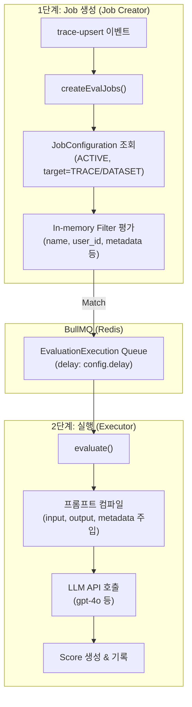
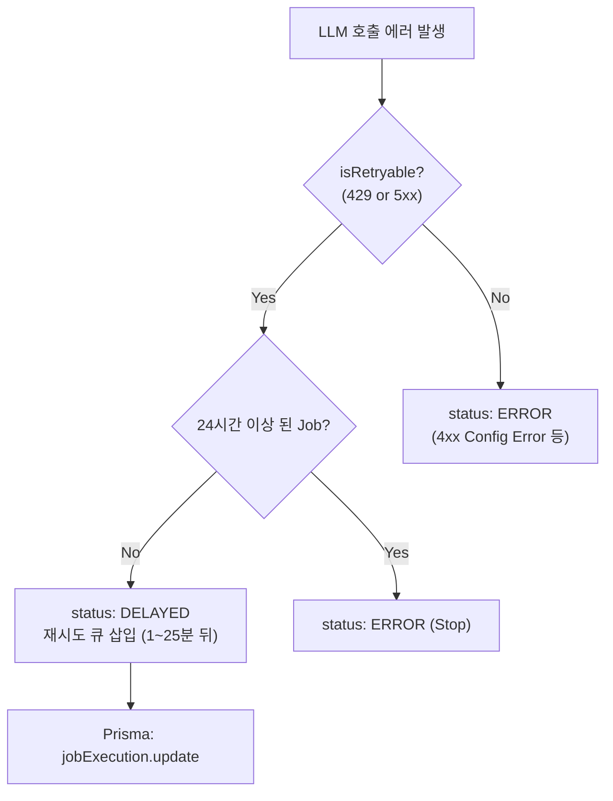

# Chapter 11. LLM-as-a-Judge와 비동기 평가 워커

> *"The 'E' in LLMOps stands for Evaluation, and it happens where the data lives."*

---

## 11.1 설계 질문

**수집되는 수만 건의 트레이스에 대해 실시간으로 품질 평가(Score)를 내리면서도, 외부 LLM API의 레이턴시와 Rate Limit이 전체 수집 파이프라인의 가용성을 해치지 않게 하려면 어떻게 해야 하는가?**

## 11.2 Langfuse의 답: 2단계 비동기 평가 파이프라인

Langfuse의 평가는 단순히 점수를 기록하는 것이 아니라, 특정 조건(Filter)에 맞는 트레이스를 찾아 자동으로 LLM에게 채점을 맡기는 **"LLM-as-a-Judge"**를 지향한다. 이를 위해 워커는 2단계 큐 구조를 가진다.



## 11.3 무한 루프 방지 — "langfuse-" 환경 필터링

평가 결과(Score) 자체가 다시 트레이스로 수집될 때, 이 트레이스가 다시 평가를 유도하여 무한 루프가 발생하는 것을 방지해야 한다.

🔗 [`evalService.ts` L221-247](file:///Users/dhsshin/Documents/LLMOps/langfuse/worker/src/features/evaluation/evalService.ts#L221-L247)

```typescript
if (
  sourceEventType === "trace-upsert" &&
  event.traceEnvironment?.startsWith("langfuse")
) {
  logger.debug("Skipping eval job creation for internal Langfuse trace");
  return;
}
```

> **아키텍처 가드레일**: Langfuse 내부에서 생성되는 모든 트레이스(평가 실행 등)는 `langfuse-` 접두사가 붙은 환경 변수를 사용하도록 강제된다. `createEvalJobs`는 이 환경의 트레이스를 무조건 건너뛰어 시스템 자원 고갈을 방지한다.

## 11.4 LLM Rate Limit 에러 복구 전략

외부 LLM API 호출은 429(Rate Limit)나 5xx 에러가 빈번하다. Langfuse 워커는 이를 단순 실패로 처리하지 않고 정교하게 관리한다.

🔗 [`evalQueue.ts` L178-239](file:///Users/dhsshin/Documents/LLMOps/langfuse/worker/src/queues/evalQueue.ts#L178-L239)



| 상태 | 의미 | 대응 |
|---|---|---|
| **DELAYED** | 일시적 외부 에러 (429/5xx) | 지수 백오프 기반 재시도 (최대 24시간) |
| **ERROR** | 영구적 에러 (잘못된 API Key, 프롬프트 문법 오류) | 즉시 중단, 대시보드에 에러 메시지 표시 |

## 11.5 Secondary Queue — Noisy Neighbor 격리

특정 프로젝트가 대량의 평가 Job을 쏟아낼 때 다른 프로젝트의 평가가 지연되는 것을 방지하기 위해, 특정 프로젝트 ID를 별도 워커 그룹으로 리다이렉트할 수 있다.

🔗 [`evalQueue.ts` L131-157](file:///Users/dhsshin/Documents/LLMOps/langfuse/worker/src/queues/evalQueue.ts#L131-L157)

```typescript
if (enableRedirectToSecondaryQueue) {
  const projectId = job.data.payload.projectId;
  if (projectIdsToRedirectToSecondaryQueue.includes(projectId)) {
    await secondaryQueue.add(
      QueueName.EvaluationExecutionSecondaryQueue,
      job.data,
    );
    return;
  }
}
```

## 11.6 사내 Judge LLM 커스터마이징 포인트

사내에 배포된 자체 LLM(예: Llama-3-70B-Instruct)을 Judge로 사용하려면 다음을 고려해야 한다.

1. **모델 정의**: `default-model-prices.json`에 사내 모델 엔드포인트와 매칭 패턴을 추가한다.
2. **토크나이저**: 사내 모델의 토크나이저가 표준(tiktoken 등)과 다를 경우 `evalRuntime.ts`에서 커스텀 토크나이저 로직을 삽입한다.
3. **환경 변수**: `LANGFUSE_SECONDARY_EVAL_EXECUTION_QUEUE_ENABLED_PROJECT_IDS`를 활용하여 사내 모델을 대량으로 사용하는 프로젝트를 격리 운영한다.

---

## 이 챕터의 핵심 인사이트

1. **2단계 큐 분리**: 수집 워커(`trace-upsert`)와 평가 워커(`eval-execution`)를 분리하여 서로의 가용성을 보호한다.
2. **Deterministic Trace ID**: 재시도되는 평가 Job들은 `createW3CTraceId`를 통해 동일한 Trace ID를 유지하여 디버깅을 용이하게 한다.
3. **Fail-safe Loop Prevention**: "langfuse-" 환경 필터링으로 무한 루프를 원천 차단한다.
4. **Resilient Retry**: 일시적 외부 API 에러에 대해 24시간 동안 끈질기게 재시도한다.

---

| 방향 | 문서 |
|---|---|
| ⬅️ 이전 | [Ch.10 로드맵](./ch10-open-decisions-and-roadmap.md) |
| ➡️ 다음 | [Ch.12 프롬프트 매니지먼트](./ch12-prompt-management.md) |
| 🏠 백서 색인 | [WHITEPAPER.md](../WHITEPAPER.md) |
