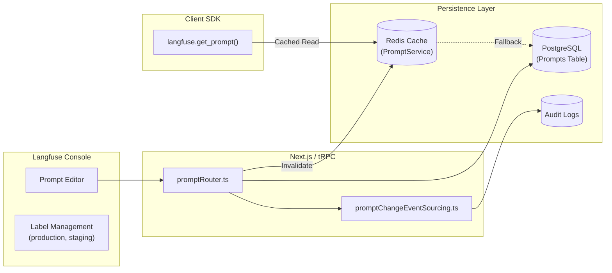

# Chapter 12. 프롬프트 레지스트리와 이벤트 소싱

> *"Prompts are code. Manage them with the same rigor as your software."*

---

## 12.1 설계 질문

**애플리케이션 코드에 하드코딩된 프롬프트를 어떻게 중앙 집중식으로 관리하고, 코드 배포 없이 프롬프트만 안전하게 업데이트(A/B 테스트, 버저닝)하며, 해당 프롬프트가 실제 성능(Score)에 미친 영향을 어떻게 추적할 것인가?**

## 12.2 Langfuse의 답: Prompt Registry & Event Sourcing

Langfuse는 단순히 프롬프트를 저장하는 DB가 아니라, 상태 관리와 변경 이력 추적이 가능한 **프롬프트 레지스트리**를 제공한다.

### 12.2.1 아키텍처 다이어그램



## 12.3 핵심 메커니즘 해부

### 12.3.1 논리적 버저닝과 레이블링 (Labels)

Langfuse는 프롬프트를 `id`가 아닌 `name`과 `version`의 조합으로 관리한다. 특히 `production`, `staging` 같은 **레이블(Label)**을 통해 코드 변경 없이 런타임에 프롬프트를 스위칭한다.

🔗 [`promptRouter.ts` L750-776](file:///Users/dhsshin/Documents/LLMOps/langfuse/web/src/features/prompts/server/routers/promptRouter.ts#L750-L776)

- **Latest Label**: 새로운 버전이 생성되면 자동으로 `latest` 레이블이 부여된다.
- **Protected Labels**: Admin 권한이 필요한 레이블(예: `production`)을 설정하여 운영 환경의 안정성을 확보한다.

### 12.3.2 이벤트 소싱과 감사 로그 (Audit Logs)

모든 프롬프트 변경은 `promptChangeEventSourcing`을 통해 기록된다. 이는 누가, 언제, 무엇을 바꿨는지에 대한 완전한 감사 추적(Audit Trail)을 보장한다.

🔗 [`promptRouter.ts` L336-345](file:///Users/dhsshin/Documents/LLMOps/langfuse/web/src/features/prompts/server/routers/promptRouter.ts#L336-L345)

```typescript
await auditLog(
  {
    session: ctx.session,
    resourceType: "prompt",
    resourceId: prompt.id,
    action: "create",
    after: prompt,
  },
  ctx.prisma,
);
```

### 12.3.3 고성능 조회를 위한 PromptService & Redis

SDK에서 프롬프트를 가져올 때 매번 DB를 조회하는 것은 레이턴시 문제를 야기한다. `PromptService`는 Redis를 활용하여 수 밀리초 이내에 프롬프트를 반환하며, 변경 시에만 캐시를 무효화(Invalidate)한다.

## 12.4 프롬프트와 트레이스의 연결 (Linking)

프롬프트 레지스트리의 진정한 가치는 **"추적 가능성"**에 있다.

1. **Prompt Compilation**: SDK는 프롬프트를 가져올 때 현재 트레이스의 변수들을 바인딩한다.
2. **Back-link**: 수집된 트레이스(Observation)에는 사용된 프롬프트의 `name`과 `version`이 기록된다.
3. **Analytics**: 특정 프롬프트 버전별로 평균 토큰 사용량, 지연 시간, 사용자 만족도(Score)를 비교 분석할 수 있다.

🔗 [`promptRouter.ts` L250-275](file:///Users/dhsshin/Documents/LLMOps/langfuse/web/src/features/prompts/server/routers/promptRouter.ts#L250-L275) 에서 프롬프트별 메트릭 조회 로직을 확인할 수 있다.

## 12.5 사내 도입 시 운영 정책 제안

1. **폴더 구조 활용**: 프롬프트 이름을 `project/feature/prompt-name` 식으로 네이밍하여 권한 및 관리 단위를 분리한다.
2. **CI/CD 연동**: 프롬프트 업데이트를 코드 배포와 동기화하고 싶다면, Langfuse API를 사용하여 배포 파이프라인에서 레이블을 스위칭하도록 구성한다.
3. **Private LLM 바인딩**: 사내 모델에 특화된 프롬프트 템플릿(예: Llama-3 전용 스페셜 토큰 포함)을 레지스트리에 저장하여 관리한다.

---

## 이 챕터의 핵심 인사이트

1. **상태 기반 관리**: 프롬프트는 정적인 텍스트가 아니라 레이블에 의해 생명주기가 관리되는 상태 객체다.
2. **성능과 일관성**: Redis 캐싱을 통해 런타임 성능을 확보하면서도, 트랜잭션 기반의 캐시 무효화로 데이터 일관성을 유지한다.
3. **분석의 기틀**: 모든 프롬프트 사용 기록이 트레이스와 결합되어 실질적인 비즈니스 가치(성능 비교)를 창출한다.

---

| 방향 | 문서 |
|---|---|
| ⬅️ 이전 | [Ch.11 평가 워커](./ch11-evaluations.md) |
| ➡️ 다음 | [Ch.13 OTEL & 마스킹](./ch13-otel-and-masking.md) |
| 🏠 백서 색인 | [WHITEPAPER.md](../WHITEPAPER.md) |
