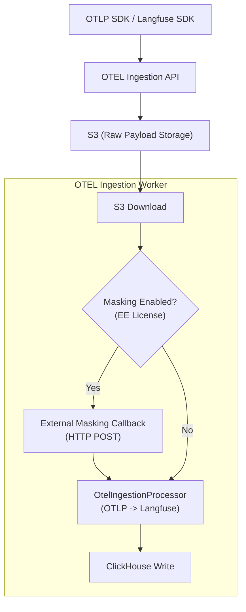

# Chapter 13. OTEL 연동과 데이터 마스킹 (EE)

> *"Security is not a feature, it's the foundation of LLM observability."*

---

## 13.1 설계 질문

**표준 OpenTelemetry(OTLP) 데이터를 어떻게 LLM 특화 스키마로 변환하며, 사내 보안 정책(PII)에 따라 민감한 LLM 입출력을 저장 직전에 마스킹(Masking)할 수 있는 안전한 파이프라인을 어떻게 구축할 것인가?**

## 13.2 Langfuse의 답: OTLP Processor & Ingestion Masking

Langfuse는 표준 OTLP를 수용하면서도, 엔터프라이즈 환경에서 필수적인 **데이터 익명화(Masking)** 기능을 Ingestion 파이프라인 최상단에 배치한다.

### 13.2.1 데이터 흐름도



## 13.3 OTLP to Langfuse 매핑 원리

OTLP의 제너릭한 Span 구조를 Langfuse의 `Trace`, `Observation`으로 변환하는 핵심 로직은 `OtelIngestionProcessor`에 담겨 있다.

🔗 [`otelIngestionQueue.ts` L294-323](file:///Users/dhsshin/Documents/LLMOps/langfuse/worker/src/queues/otelIngestionQueue.ts#L294-L323)

- **Trace Mapping**: OTLP의 `trace_id`를 Langfuse의 `trace_id`로 직접 매핑한다.
- **Observation Type**: Span의 속성(Attributes)을 분석하여 `GENERATION`, `SPAN`, `EVENT` 타입을 결정한다.
- **Direct Write Optimization**: 최신 SDK 헤더를 감지하여 staging 테이블을 거치지 않고 직접 `events` 테이블로 쓰는 최적화 경로를 제공한다.

## 13.4 엔터프라이즈 데이터 마스킹 (EE)

사내 PII(개인식별정보) 보호를 위해, Langfuse는 저장 직전에 외부 API를 호출하여 데이터를 변조할 수 있는 인터페이스를 제공한다.

🔗 [`applyIngestionMasking.ts` L145-216](file:///Users/dhsshin/Documents/LLMOps/langfuse/packages/shared/src/server/ee/ingestionMasking/applyIngestionMasking.ts#L145-L216)

### 13.4.1 Fail-closed vs Fail-open

마스킹 외부 호출 실패 시의 동작 방식은 프로젝트 안정성과 보안 사이의 트레이드오프를 결정한다.

```typescript
if (config.failClosed) {
  // Fail-closed: 마스킹 실패 시 데이터를 유실(Drop)시키더라도 보안을 우선함
  return { success: false, data, error: lastError };
}
// Fail-open: 마스킹 실패 시 원본 데이터를 저장하여 가용성을 우선함
return { success: true, data, masked: false };
```

> **사내 도입 팁**: 금융권이나 의료계 등 보안이 극도로 중요한 환경에서는 `LANGFUSE_INGESTION_MASKING_CALLBACK_FAIL_CLOSED=true` 설정을 강력히 권장한다.

### 13.4.2 마스킹 콜백 인터페이스

사내 보안 팀에서 구현해야 할 콜백 엔드포인트의 요건은 다음과 같다:
1. **POST 요청**: 원본 JSON 페이로드를 수신한다.
2. **PII 탐지/치환**: 이메일, 전화번호 등을 `[MASKED]` 등으로 치환한다.
3. **타임아웃**: 워커 가용성을 위해 수백 ms 이내에 응답해야 한다.

## 13.5 운영 시나리오: 마스킹 실패 복구

마스킹 콜백 서버가 일시적으로 다운되어 `Fail-closed` 상태로 데이터가 유실되었을 경우:
1. 워커 로그에서 `fileKey`를 확인한다.
2. S3 버킷의 해당 `fileKey` 경로에는 원본 OTLP 페이로드가 남아 있다.
3. 콜백 서버 복구 후, `replayIngestionEventsV2` 스크립트를 사용하여 S3의 원본 데이터를 다시 인제스션할 수 있다.

---

## 이 챕터의 핵심 인사이트

1. **표준의 수용**: OTLP를 지원함으로써 기존 OTEL 생태계 도구들과의 완벽한 호환성을 제공한다.
2. **보안의 계층화**: DB 저장 직전(`Ingestion Layer`)에서 마스킹을 수행하여, ClickHouse 내부에는 어떠한 PII도 저장되지 않도록 설계했다.
3. **복구 가능성**: 수집 파이프라인에서 S3를 버퍼로 활용함으로써, 필터링이나 마스킹 실패 시에도 원본 데이터를 기반으로 사후 복구가 가능하다.

---

| 방향 | 문서 |
|---|---|
| ⬅️ 이전 | [Ch.12 프롬프트 매니지먼트](./ch12-prompt-management.md) |
| ➡️ 다음 | [심화 분석을 마치며...](../WHITEPAPER.md) |
| 🏠 백서 색인 | [WHITEPAPER.md](../WHITEPAPER.md) |
