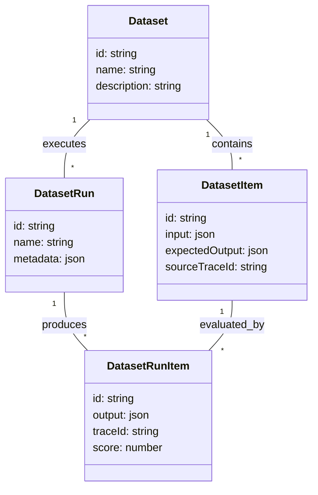

# Chapter 14. 데이터셋 관리와 파인튜닝 파이프라인

> *"Datasets are the bridge between monitoring today and improving tomorrow."*

---

## 14.1 설계 질문

**수집된 수백만 개의 트레이스 중 '골든셋(Golden Set)'을 어떻게 선별하고, 이를 기반으로 새로운 모델 버전을 벤치마킹하거나 사내 모델 파인튜닝을 위해 데이터를 어떻게 효율적으로 추출할 것인가?**

## 14.2 Langfuse의 답: 4계층 데이터셋 모델

Langfuse는 트레이스 데이터를 독립적인 평가 단위인 **데이터셋**으로 격리하여 관리한다.

## 14.3 핵심 메커니즘 해부

### 14.3.1 Trace-to-Dataset Promotion (데이터 승격)

사용자는 대시보드에서 특정 트레이스를 선택하여 데이터셋의 아이템으로 "승격"할 수 있다. 이때 트레이스의 `input`과 `output`은 데이터셋 아이템의 기준점(Baseline)이 된다.

🔗 [`service.ts` L58-93](file:///Users/dhsshin/Documents/LLMOps/langfuse/web/src/features/datasets/server/service.ts#L58-L93)

### 14.3.2 데이터셋 런(Run)과 메트릭 집계

새로운 프롬프트나 모델을 테스트할 때, 데이터셋의 모든 아이템에 대해 새로운 실행을 수행하고 이를 `DatasetRun`으로 기록한다.

- **성능 비교**: `getRunItemsByRunIdOrItemId` 함수는 각 실행 아이템에 대해 지연 시간(Latency), 비용(Cost), 그리고 평가 점수(Scores)를 실시간으로 집계하여 비교한다.
- **Recursive Metrics**: 관측된 모든 하위 Observation의 메트릭을 재귀적으로 합산하여 전체 실행의 정확한 비용을 계산한다.

🔗 [`service.ts` L129-140](file:///Users/dhsshin/Documents/LLMOps/langfuse/web/src/features/datasets/server/service.ts#L129-L140)

## 14.4 파인튜닝을 위한 Batch Export

데이터셋에 모인 양질의 데이터를 사내 모델 학습에 활용하기 위해, Langfuse는 대규모 엑스포트 기능을 제공한다.

1. **포맷팅**: OpenAI, Anthropic 등 표준 파인튜닝 포맷으로 데이터를 변환한다.
2. **비동기 처리**: `batchExport.ts`는 수천 건 이상의 데이터를 백그라운드 워커를 통해 S3로 직접 업로드하며, 완료 시 사용자에게 알림을 보낸다.
3. **필터링**: 특정 점수 이상(예: satisfaction > 0.8)의 데이터만 선별하여 학습 데이터의 품질을 보장한다.

## 14.5 사내 도입 시 활용 전략

1. **골든셋 구축**: 상담 봇의 경우, 상담원이 '최고'라고 평가한 트레이스들을 주기적으로 데이터셋으로 승격시켜 품질 기준점을 만든다.
2. **회귀 테스트(Regression Test)**: 프롬프트 수정 시마다 기존 데이터셋 런과 비교하여 성능 저하 여부를 자동으로 판별한다.
3. **Private Model Fine-tuning**: 사내 보안 가이드에 따라 마스킹된 트레이스 데이터셋을 추출하여 내부 GPU 팜에서 모델 학습에 활용한다.

---

## 이 챕터의 핵심 인사이트

1. **순환 구조(Closed Loop)**: 모니터링(`Trace`) → 선별(`Dataset`) → 개선(`Fine-tuning`) → 재배포로 이어지는 LLMOps의 선순환 구조를 지원한다.
2. **재귀적 집계**: 복잡한 체인이나 에이전트의 실행 비용을 데이터셋 레벨에서 정확히 합산하여 경제성을 평가한다.
3. **비동기 대용량 처리**: 데이터 추출 시 시스템 부하를 최소화하기 위해 워커 기반의 비동기 엑스포트 전략을 취한다.

---

| 방향 | 문서 |
|---|---|
| ⬅️ 이전 | [Ch.13 OTEL & 마스킹](./ch13-otel-and-masking.md) |
| ➡️ 다음 | [Ch.15 RBAC과 보안](./ch15-rbac-and-security.md) |
| 🏠 백서 색인 | [WHITEPAPER.md](../WHITEPAPER.md) |
