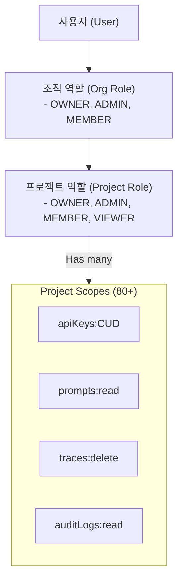

# Chapter 15. 엔터프라이즈 권한 및 RBAC

> *"Isolation is the first step toward security."*

---

## 15.1 설계 질문

**하나의 조직(Organization) 내에서 여러 팀이 독립적으로 프로젝트를 운영하면서도, 특정 팀원에게는 조회 권한만 부여하거나 API Key 생성 권한을 제한하는 등 세밀한 권한 제어를 어떻게 구현할 것인가?**

## 15.2 Langfuse의 답: Scope 기반 RBAC 모델

Langfuse는 **Role(역할)**과 **Scope(범위)**를 분리하여 정의한다. 각 역할은 허용된 Scope의 집합을 가지며, 모든 서버 요청(tRPC)은 실행 전 해당 Scope를 소유하고 있는지 검증받는다.

### 15.2.1 권한 계층 구조



## 15.3 핵심 메커니즘 해부

### 15.3.1 서버측 강제 (Server-side Enforcement)

모든 tRPC 프로시저는 `throwIfNoProjectAccess` 미들웨어를 통해 요청자의 권한을 검증한다.

🔗 [`checkProjectAccess.ts` L28-36](file:///Users/dhsshin/Documents/LLMOps/langfuse/web/src/features/rbac/utils/checkProjectAccess.ts#L28-L36)

```typescript
export const throwIfNoProjectAccess = (p: HasProjectAccessParams) => {
  if (!hasProjectAccess(p))
    throw new TRPCError({
      code: "FORBIDDEN",
      message: "User does not have access to this resource or action",
    });
};
```

- **Enforcement 지점**: API 라우트나 UI 컴포넌트가 아닌, **데이터에 접근하는 최종 관문(Procedure)**에서 검증함으로써 보안 구멍을 원천 차단한다.

### 15.3.2 역할별 Scope 정의

Langfuse는 약 80개의 세부 Scope를 정의하여 역할별로 할당한다.

🔗 [`projectAccessRights.ts` L85-250](file:///Users/dhsshin/Documents/LLMOps/langfuse/web/src/features/rbac/constants/projectAccessRights.ts#L85-L250)

| 역할 | 특징 | 주요 제한 사항 |
|---|---|---|
| **OWNER** | 프로젝트의 모든 권한 소유 | - |
| **ADMIN** | 프로젝트 운영 권한 소유 | 프로젝트 삭제(`project:delete`) 불가 |
| **MEMBER** | 데이터 생성 및 조회 가능 | 멤버 관리, API Key 생성(`apiKeys:CUD`) 불가 |
| **VIEWER** | 읽기 전용 권한 | 모든 CUD(Create, Update, Delete) 행위 불가 |

## 15.4 프로젝트 격리와 API Key 보안

1. **Isolation**: 각 프로젝트는 고유한 `projectId`를 가지며, `prisma` 쿼리 시 항상 `where: { projectId }` 조건이 강제된다. (Multi-tenancy)
2. **API Key Scoping**: SDK가 사용하는 `Secret Key`는 해당 프로젝트 내부로만 권한이 제한된다. 사내 도입 시 프로젝트별로 Key를 발급하여 팀 간 데이터 간섭을 방지한다.
3. **Protected Labels**: 프롬프트 관리 시 `production` 레이블 수정 권한(`promptProtectedLabels:CUD`)을 ADMIN 이상으로 제한하여 운영 사고를 방지한다.

## 15.5 감사 로그 (Audit Logs)

권한 제어의 마지막 단계는 **사후 추적**이다. Langfuse는 주요 변경 사항(프롬프트 수정, 프로젝트 설정 변경 등)에 대해 `auditLog`를 남긴다.

- **기록 대상**: `resourceType`, `resourceId`, `action`, `before`, `after` (변경 전후 데이터)
- **보안 가치**: 사내 보안 팀은 `auditLogs:read` 권한을 통해 시스템 내의 모든 중요 행위를 감사할 수 있다.

---

## 이 챕터의 핵심 인사이트

1. **최소 권한 원칙(Principle of Least Privilege)**: VIEWER부터 OWNER까지 세분화된 역할을 통해 필요한 만큼의 권한만 부여한다.
2. **Procedure-level Security**: UI가 아닌 API 수준에서 강력한 RBAC을 강제하여 우회 경로를 차단한다.
3. **감사 가능성**: 모든 권한 행사가 로그로 남음으로써 사내 거버넌스 요건을 충족한다.

---

| 방향 | 문서 |
|---|---|
| ⬅️ 이전 | [Ch.14 데이터셋 파이프라인](./ch14-datasets-and-fine-tuning.md) |
| ➡️ 다음 | [Ch.16 자동화와 외부 연동](./ch16-automations-and-webhooks.md) |
| 🏠 백서 색인 | [WHITEPAPER.md](../WHITEPAPER.md) |
