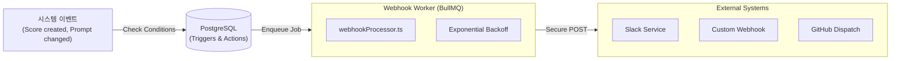

# Chapter 16. 실시간 자동화와 외부 연동

> *"Close the loop between observation and action."*

---

## 16.1 설계 질문

**특정 조건(예: 낮은 점수, 특정 태그 발생)이 충족되었을 때, 어떻게 실시간으로 외부 시스템(Slack, PagerDuty, 사내 대시보드)에 데이터를 전송하며, 외부 엔드포인트의 장애가 Langfuse 전체 시스템에 영향을 주지 않게 설계할 것인가?**

## 16.2 Langfuse의 답: 비동기 자동화 엔진 (Automations)

Langfuse는 트리거-액션 모델을 기반으로 한 자동화 엔진을 BullMQ를 통해 비동기적으로 실행한다.

### 16.2.1 아키텍처 다이어그램

## 16.3 핵심 메커니즘 해부

### 16.3.1 보안 전송 파이프라인 (Secure Transport)

사내 시스템과 연동할 때 보안은 필수적이다. `executeHttpAction`은 다음과 같은 보안 계층을 제공한다.

1. **Payload Signing**: `x-langfuse-signature` 헤더를 통해 전송된 데이터가 Langfuse에서 온 것임을 검증한다. (HMAC-SHA256)
2. **URL Whitelisting**: `LANGFUSE_WEBHOOK_WHITELIST` 설정을 통해 허용된 IP/도메인으로만 전송되도록 제한한다.
3. **Secure Redirects**: 악의적인 리다이렉트를 방지하기 위해 `fetchWithSecureRedirects`를 사용한다.

🔗 [`webhooks.ts` L173-182](file:///Users/dhsshin/Documents/LLMOps/langfuse/worker/src/queues/webhooks.ts#L173-L182)

### 16.3.2 장애 복원력 (Resilience)

외부 서버의 응답이 느리거나 장애가 발생했을 때 Langfuse는 스스로를 보호한다.

- **비동기 격리**: 모든 웹훅 호출은 메인 인제스션이나 API 서버와 분리된 전용 워커에서 실행된다.
- **Auto-Disable**: 연속으로 4회 이상 실패할 경우, 해당 자동화 트리거를 자동으로 `INACTIVE` 상태로 전환하여 불필요한 큐 부하를 방지한다.

🔗 [`webhooks.ts` L286-301](file:///Users/dhsshin/Documents/LLMOps/langfuse/worker/src/queues/webhooks.ts#L286-L301)

## 16.4 주요 연동 사례

### 16.4.1 Slack 알림
- **Trigger**: `score.created` (사용자 부정 피드백 발생 시)
- **Action**: `SlackMessageBuilder`를 통해 포맷팅된 메시지를 개발팀 채널로 전송하여 즉각적인 대응을 유도한다.

### 16.4.2 GitHub Dispatch (CI/CD 연동)
- **Trigger**: `prompt.updated` (프롬프트 버전 변경 시)
- **Action**: GitHub Workflow를 트리거하여 자동으로 통합 테스트를 실행하거나 배포 파이프라인을 가동한다.

🔗 [`webhooks.ts` L505-513](file:///Users/dhsshin/Documents/LLMOps/langfuse/worker/src/queues/webhooks.ts#L505-L513)

## 16.5 사내 도입 시 활용 가이드

1. **내부 모니터링 연동**: 사내 모니터링 시스템(예: Datadog, Grafana)의 웹훅 엔드포인트로 Langfuse 이벤트를 쏴서 통합 대시보드를 구축한다.
2. **Alerting**: 특정 모델의 비용이 급증하거나 에러율이 임계치를 넘을 때 PagerDuty 등과 연동하여 장애 전파 속도를 높인다.
3. **비밀번호 관리**: 웹훅 헤더에 포함되는 인증 토큰은 DB에 암호화되어 저장되며, 실행 직전에만 `decrypt()` 되어 사용된다.

---

## 이 챕터의 핵심 인사이트

1. **비동기적 연결**: 외부 시스템과의 의존성을 큐로 격리하여 시스템 전체의 안정성을 확보한다.
2. **안전한 스트리밍**: 서명과 화이트리스트를 통해 신뢰할 수 있는 데이터 전송 경로를 제공한다.
3. **지능형 회로 차단**: 반복적인 외부 장애에 대해 트리거를 자동 차단함으로써 자원 낭비를 막는다.

---

| 방향 | 문서 |
|---|---|
| ⬅️ 이전 | [Ch.15 RBAC과 보안](./ch15-rbac-and-security.md) |
| ➡️ 다음 | [Ch.17 SDK 내부 설계](./ch17-sdk-internal-architecture.md) |
| 🏠 백서 색인 | [WHITEPAPER.md](../WHITEPAPER.md) |
