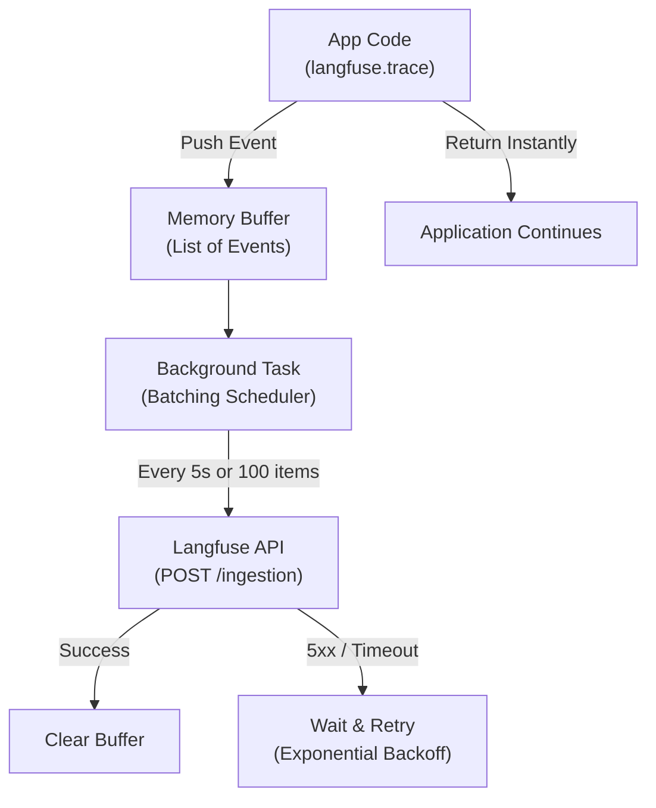

# Chapter 17. 클라이언트 SDK 내부 설계와 가용성 철학

> *"Your application should never wait for observability."*

---

## 17.1 설계 질문

**네트워크가 불안정하거나 Langfuse 서버가 일시적으로 느려질 때, 어떻게 애플리케이션의 지연 시간(Latency)에 영향을 주지 않으면서 데이터를 수집하며, 최악의 경우(장기 장애)에도 애플리케이션이 정상 작동하도록 보장할 것인가?**

## 17.2 Langfuse의 답: 비동기 배칭과 Fail-open SDK

Langfuse SDK는 애플리케이션의 메인 루프를 방해하지 않도록 **비동기 메모리 버퍼링**과 **Fail-open** 정책을 기본으로 한다.

### 17.2.1 SDK 내부 흐름도

## 17.3 핵심 설계 원칙

### 17.3.1 비블로킹 I/O (Non-blocking)

- **Fire-and-forget**: `langfuse.trace()` 호출은 이벤트를 내부 메모리 큐에 넣고 즉시 제어권을 애플리케이션에 반환한다. 실제 HTTP 요청은 별도의 백그라운드 스레드(Python)나 비동기 태스크(JS)에서 처리된다.
- **Batching**: 매번 이벤트를 보내는 대신, 일정 시간(기본 5초) 혹은 일정 개수(기본 100개)가 쌓일 때까지 기다렸다가 단일 HTTP 요청으로 묶어서 보낸다. 이는 네트워크 오버헤드를 극적으로 줄인다.

### 17.3.2 Fail-open (가용성 우선 정책)

- **최악의 시나리오**: Langfuse 서버가 완전히 다운되었거나 네트워크가 끊겼을 때, SDK는 애플리케이션의 에러를 발생시키지 않는다.
- **Graceful Degradation**: 데이터 전송 실패는 로컬 로그에만 남기고, 애플리케이션의 비즈니스 로직은 중단 없이 계속 실행된다. "관측 가능성 도구가 서비스를 죽여서는 안 된다"는 철학이 반영되어 있다.

### 17.3.3 로컬 재시도 (Local Retries)

- 서버로부터 5xx 에러나 타임아웃을 받으면, SDK는 지수 백오프(Exponential Backoff)를 적용하여 재시도한다.
- **메모리 한도**: 메모리 버퍼가 너무 커지는 것을 방지하기 위해 최대 큐 사이즈를 설정할 수 있으며, 한도를 넘으면 가장 오래된 데이터부터 삭제(Drop)하여 애플리케이션의 OOM을 방지한다.

## 17.4 데이터 무결성을 위한 Flush

애플리케이션이 종료될 때(예: Lambda 실행 종료, 프로세스 종료), 메모리에 남은 이벤트를 확실히 전송하기 위해 `langfuse.flush()` 메서드를 제공한다.

- **Sync Flush**: 종료 직전 모든 버퍼를 비우고 서버의 응답을 기다린다.
- **Serverless 최적화**: AWS Lambda와 같은 환경에서는 매 요청 마지막에 `flush()`를 호출하여 이벤트 유실을 방지하는 가이드를 제공한다.

## 17.5 사내 도입 시 SDK 설정 가이드

1. **내부 엔드포인트 지정**: `LANGFUSE_HOST`를 사내에 구축된 Langfuse 서버 주소로 설정한다.
2. **타임아웃 튜닝**: 사내 네트워크 환경에 맞춰 `LANGFUSE_TIMEOUT`을 조정한다.
3. **마스킹 연동**: SDK 수준에서 민감 정보를 마스킹하고 싶다면, `masking` 콜백 함수를 SDK 설정 시 등록하여 서버로 보내기 전에 데이터를 변조한다.

---

## 이 챕터의 핵심 인사이트

1. **애플리케이션 보호**: SDK는 앱의 성능과 안정성에 영향을 주지 않도록 설계된 '저간섭(Low-overhead)' 도구다.
2. **효율적 전송**: 배칭과 압축을 통해 대규모 트래픽 환경에서도 네트워크 부하를 최소화한다.
3. **탄력적 복구**: 일시적인 장애를 SDK 수준의 재시도로 흡수하여 데이터 유실을 최소화한다.

---

| 방향 | 문서 |
|---|---|
| ⬅️ 이전 | [Ch.16 자동화와 외부 연동](./ch16-automations-and-webhooks.md) |
| ➡️ 다음 | [백서를 마치며...](../WHITEPAPER.md) |
| 🏠 백서 색인 | [WHITEPAPER.md](../WHITEPAPER.md) |
