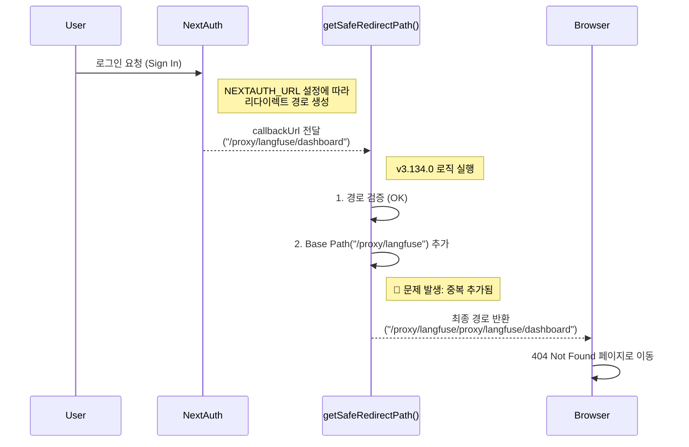

# Langfuse Base Path 중복 이슈 기술 분석 리포트

## 1. 이슈 개요
*   **증상**: `NEXT_PUBLIC_BASE_PATH`가 설정된 환경(예: `/proxy/langfuse`)에서 로그인 후 리다이렉트 시, Base Path가 중복되어 경로가 생성됨.
*   **영향 버전**: v3.134.0 (Regression).
*   **관련 파일**: `web/src/utils/redirect.ts`

## 2. 발생 메커니즘 상세 분석

이 이슈는 **NextAuth**가 생성한 경로와 **Langfuse**의 새로운 리다이렉트 유틸리티 간의 상호작용에서 발생합니다.

### 설정 환경
*   `NEXT_PUBLIC_BASE_PATH`: `/proxy/langfuse`
*   `NEXTAUTH_URL`: `http://localhost:3000/proxy/langfuse`

### URL 처리 흐름 (Flow)



### 구체적인 URL 변환 예시

| 단계 | 값 | 설명 |
| :--- | :--- | :--- |
| **1. 입력 (Input)** | `/proxy/langfuse/dashboard` | NextAuth가 `NEXTAUTH_URL`을 참고하여 생성한 올바른 콜백 URL입니다. 이미 Base Path가 포함되어 있습니다. |
| **2. 설정값** | `/proxy/langfuse` | `NEXT_PUBLIC_BASE_PATH` 환경변수 값입니다. |
| **3. v3.134.0 로직** | `basePath + input` | 입력값 앞에 무조건 Base Path를 붙입니다. |
| **4. 결과 (Output)** | `/proxy/langfuse/proxy/langfuse/dashboard` | **중복 발생!** 경로가 잘못 생성되었습니다. |

## 3. 원인 코드 분석

`web/src/utils/redirect.ts`의 `getSafeRedirectPath` 함수가 원인입니다.

```typescript
// v3.134.0 (문제 코드)
export function getSafeRedirectPath(targetPath: string | undefined | null): string {
  const basePath = env.NEXT_PUBLIC_BASE_PATH ?? "";
  // ... (유효성 검사 생략) ...
  
  // ❌ 문제점: targetPath가 이미 basePath를 포함하고 있는지 확인하지 않음
  return basePath + trimmed; 
}
```

## 4. 변경 배경 (Rationale)
*   **보안 강화**: "Untrusted URL redirection" 취약점 해결을 위해 도입되었습니다.
*   **의도**: Base Path가 없는 경로(예: `/dashboard`)가 들어왔을 때 자동으로 Base Path를 붙여주려는 의도였으나, 이미 포함된 경우를 고려하지 못했습니다.

## 5. 해결 방안 (Solution)

입력된 경로가 이미 Base Path로 시작하는지 확인하는 로직을 추가합니다.

```typescript
// 수정된 코드
export function getSafeRedirectPath(targetPath: string | undefined | null): string {
  const basePath = env.NEXT_PUBLIC_BASE_PATH ?? "";
  // ... (유효성 검사 생략) ...

  // ✅ 수정: 이미 Base Path가 포함되어 있다면 그대로 반환
  if (basePath && trimmed.startsWith(basePath)) {
    return trimmed;
  }

  return basePath + trimmed;
}
```

이 수정을 통해:
1.  `/dashboard` 입력 시 → `/proxy/langfuse/dashboard` (정상 추가)
2.  `/proxy/langfuse/dashboard` 입력 시 → `/proxy/langfuse/dashboard` (중복 방지)

두 경우 모두 올바르게 처리됩니다.
